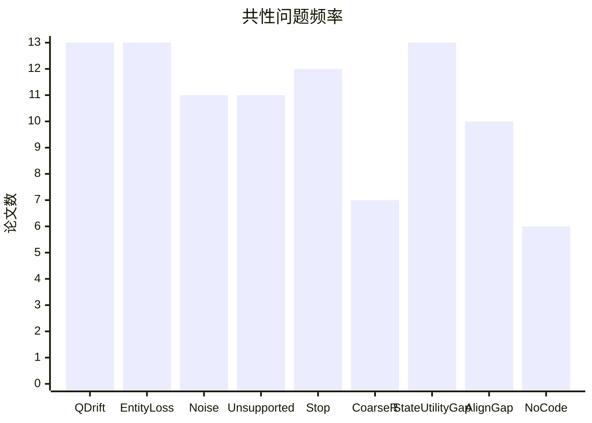
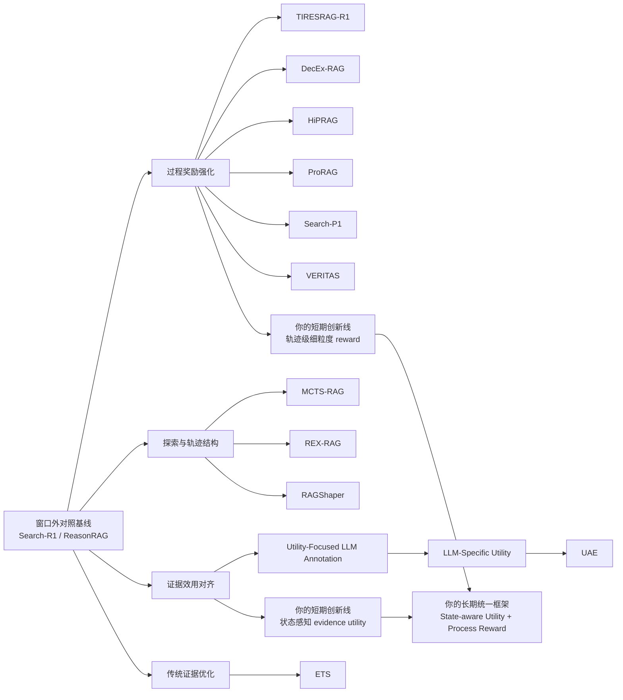

# 过去一年复杂问答 Agentic RAG 研究综述与选题建议

## Executive Summary

过去 12 个月，该方向的高质量工作已从“结果奖励驱动的 Agentic RAG”快速转向“细粒度过程奖励、证据效用对齐、轨迹忠实性控制”三条主线。共筛出 13 篇代表作。结论明确：细粒度过程奖励已有进展，但**状态感知证据效用**几乎空白；**query drift、entity loss、检索噪声、未支撑中间结论、停搜决策**仍是共性瓶颈。这直接指向你最值得做的两条创新线：**状态感知 evidence utility** 与 **轨迹级细粒度 reward**。 citeturn39search0turn15search5turn22search10turn36academia16turn23search9turn40search1

## 检索范围与筛选口径

本报告严格采用“当前日期 2026-05-24 向前 12 个月”的时间窗，主检索来源为 ACL Anthology、OpenReview、arXiv 与作者/项目官方 GitHub。主表仅保留**已发表或具有明确影响力的预印本**，并优先保留同时覆盖下列至少一项的论文：复杂问答、多步检索推理、过程奖励、证据效用、retriever–LLM 对齐、公开代码。ReasonRAG 与 Search-R1 被作为窗口外对照基线处理：ReasonRAG 发布于 2025-05-20，略早于本检索窗口，但它对“query generation、evidence extraction、answer generation 的过程级奖励”给出了直接先验，因此仍在后文谱系图与分析中作为参照。 citeturn39search0turn39search8turn15search5turn22search10turn25search1turn30search0

## 论文汇总表

> 说明：
> “与 ReasonRAG 的相似问题”字段为**本报告基于论文方法与实验设定的诊断性归纳**；若论文未明确说明，则标“未说明”。
> “是否解决状态感知证据效用或细粒度过程奖励”按照 **Yes / Partial / No** 记录，其中 **Partial** 表示只覆盖其一，或只做静态/离线近似而未形成在线状态感知闭环。

| Title | Authors | Venue/Archive | Date | Link | Category | 核心方法要点 | 主要实验数据集与指标 | 是否公开代码 | 与 ReasonRAG 的相似问题 | 是否解决状态感知证据效用或细粒度过程奖励 | 优缺点简评 | 对我研究的启发 |
|---|---|---|---|---|---|---|---|---|---|---|---|---|
| MCTS-RAG: Enhancing Retrieval-Augmented Generation with Monte Carlo Tree Search | Yunhai Hu, Yilun Zhao, Chen Zhao, Arman Cohan | Findings of EMNLP 2025 | 2025-11 | 论文页；代码仓库 citeturn9search4turn9search0turn14search11 | Agentic RAG | 将检索与推理联合进 MCTS； 通过树搜索反复模拟候选 reasoning path； 让小模型依靠更强 test-time search 获得显著提升。 | ComplexWebQA、GPQA、FoolMeTwice；主报 Answer Accuracy。 citeturn14search0turn14search8 | Yes | query drift 未显式约束； entity-bridge 保真未建模； 中间结论缺少证据蕴含校验； 停搜规则依赖启发式树搜索。 | Partial | **优**：检索-推理耦合强；小模型收益显著。 **缺**：计算成本高；过程监督不细；对噪声检索与错误中间状态缺少显式控制。 | 把树搜索从“答案扩展”改成“证据增量价值估计”； 把停搜与预算控制从启发式改成学习型价值函数。 |
| From Sufficiency to Reflection: Reinforcement-Guided Thinking Quality in Retrieval-Augmented Reasoning for LLMs | Jie He, Victor Gutierrez Basulto, Jeff Z. Pan | arXiv | 2025-07 | 论文页；代码仓库 citeturn13search4turn13search0 | Process Reward | 明确提出三类失败模式：信息不足、推理错误、答案-推理不一致； 采用 think–retrieve–reflect 流程； 引入 sufficiency / reasoning quality / reflection 多维奖励。 | HotpotQA、2WikiMultiHopQA、MuSiQue、Bamboogle；主报 EM 与 LLM-as-Judge。 citeturn13search1turn13search4 | Yes | query redundancy/drift 仍未直接建模； entity loss 仍未显式约束； 检索停止时机仍无独立价值模型。 | Yes | **优**：失败模式定义清晰；奖励维度对齐真实错误。 **缺**：证据效用仍是离线近似；未建立 retriever–LLM alignment。 | 失败模式 taxonomy 可直接借用到你的中期报告； “sufficiency reward”可升级成“状态感知 evidence utility reward”。 |
| REX-RAG: Reasoning Exploration with Policy Correction in Retrieval-Augmented Generation | Wenhan Jiang, Xinkai Lv, et al. | arXiv / OpenReview | 2025-08 | 论文页；代码仓库 citeturn35search2turn35search7turn5search15 | Agentic RAG | 识别 RL-based RAG 的 dead-end problem； 用 Mixed Sampling Strategy 做探索； 再用 Policy Correction Mechanism 修正探索引入的分布偏移。 | NQ、TriviaQA、PopQA、HotpotQA、2Wiki、MuSiQue、Bamboogle；主报 ACC。 citeturn35search5turn35search11 | Yes | query drift 只靠探索缓解，未做 utility 约束； unsupported intermediate answers 仍可能出现； reward 仍偏 outcome-oriented。 | Partial | **优**：直接命中“死胡同”训练缺陷；跨域泛化强。 **缺**：没有状态级 evidence utility；对 entity loss 与 unsupported steps 缺显式奖惩。 | 你的方法应继承“探索 + 校正”，但把校正对象从 policy 扩展到 evidence state； 可在 REX 式探索之上叠加实体保真奖励。 |
| DecEx-RAG: Boosting Agentic Retrieval-Augmented Generation with Decision and Execution Optimization via Process Supervision | Yongqi Leng, Yikun Lei, Xikai Liu, et al. | EMNLP 2025 Industry | 2025-11 | 论文页；代码仓库 citeturn15search1turn15search5turn15search7 | Process Reward | 将 Agentic RAG 建模成含 decision 与 execution 的 MDP； 做过程级 policy optimization； 引入 pruning strategy，把数据构建效率提升近 6×。 | PopQA、NQ、AmbigQA、HotpotQA、2WikiMultiHopQA、Bamboogle；原文报告平均绝对提升 6.2%。 citeturn15search3turn15search5turn15search12 | Yes | retrieval noise 仍是外部问题，模型只做过程优化； entity loss、unsupported intermediate answers 未做独立奖励； 无 explicit retriever–LLM alignment。 | Yes | **优**：工程可落地；训练效率高；过程监督清晰。 **缺**：过程奖励仍以 decision / execution 为主，缺状态感知证据价值。 | 你可把其 MDP 视角保留，但将 state 定义成“问题—已检证据—中间结论”； 在此基础上定义更细粒度的 evidence utility。 |
| HiPRAG: Hierarchical Process Rewards for Efficient Agentic Retrieval Augmented Generation | Peilin Wu, Mian Zhang, Kun Wan, et al. | ICLR 2026 | 2026-04 | 论文页；代码仓库 citeturn22search10turn22search0turn22search4 | Process Reward | 用 hierarchical process reward 在线判断每一步“该不该搜”； 显式控制 over-search 与 under-search； 在不同 RL 算法、模型家族上均验证泛化性。 | NQ、TriviaQA、PopQA、HotpotQA、2Wiki、MuSiQue、Bamboogle；主报 ACC、过搜率、欠搜率。 citeturn22search1turn10search1 | Yes | query 内容质量本身并未细分监督； entity loss 未约束； 证据效用仍是动作级 necessity，而非状态级 utility。 | Yes | **优**：第一次把“搜/不搜”决策做成层级过程奖励；效率维度很强。 **缺**：没有把“搜什么”与“当前证据缺什么”联动起来。 | 你的研究应在 HiPRAG 上补全“search necessity → evidence utility”链条； 把“何时搜”扩展到“何时停、搜哪类实体、搜到什么程度”。 |
| RAGShaper: Eliciting Sophisticated Agentic RAG Skills via Automated Data Synthesis | Zhengwei Tao, Bo Li, Jialong Wu, et al. | arXiv | 2026-01 | 论文页 citeturn17search1turn18view0turn19view0 | Agentic RAG | 用 InfoCurator 自动合成带噪多跳检索环境； 构造 Perception/Cognition 两类 adversarial distractors； 强制 teacher 在干扰条件下走出纠错轨迹。 | NQ、PopQA、AmbigQA、Bamboogle；EM/F1。 citeturn19view0 | No | retrieval noise 被显式强化，但 query drift、entity loss、停搜策略仍未形成在线奖励； unsupported intermediate answers 只在 teacher 轨迹层面被间接规避。 | Partial | **优**：高价值数据合成工作；对 noisy retrieval 非常贴近真实。 **缺**：以 SFT 为主；没有在线状态奖励；公开代码未检索到。 | 你完全应复用其“带噪轨迹”思想做训练/评测数据； 将其从“数据合成”推进到“状态效用监督”。 |
| ProRAG: Process-Supervised Reinforcement Learning for Retrieval-Augmented Generation | Zhao Wang, Ziliang Zhao, Zhicheng Dou | arXiv | 2026-01 | 论文页；代码仓库 citeturn5search14turn5search17turn5search6 | Process Reward | 针对“process hallucination”设计 step-level process rewards； 以 PRM-guided warmup + RL 联合训练； 强调整体 reasoning 过程而非只看终答。 | PopQA、HotpotQA、2Wiki、MuSiQue、Bamboogle；EM/F1，Avg F1 49.2。 citeturn21search5turn14search3 | Yes | query drift 仍缺显式惩罚； entity loss 未直接建模； evidence utility 仍偏静态 step reward。 | Yes | **优**：直接瞄准“过程幻觉”；实验表对你最有参考价值。 **缺**：step reward 仍非 belief-state aware；未做 retriever–LLM alignment。 | 这是你最接近的直接对手之一； 你的创新必须从“step reward”升级到“trajectory state reward + evidence utility”。 |
| Search-P1: Path-Centric Reward Shaping for Stable and Efficient Agentic RAG Training | Tianle Xia, Ming Xu, Lingxiang Hu, et al. | ACL 2026 / arXiv | 2026-02 | 论文页 citeturn11search0turn11search1turn12search3 | Process Reward | 把奖励从单步扩展到 path-centric； 用 order-agnostic step coverage + soft scoring 提取失败样本训练信号； 加 Dual-Track Path Scoring 联结 self-consistency 与 reference alignment。 | NQ、TriviaQA、PopQA、HotpotQA、2Wiki、MuSiQue、Bamboogle、AD-QA；ACC。 citeturn16search3turn16search11 | No | query 质量仍通过路径质量间接衡量； 实体桥接/证据粒度不足仍可能被路径高分掩盖； unsupported intermediate answers 未做 strong entailment verification。 | Yes | **优**：失败样本利用充分；路径级 credit assignment 明显增强。 **缺**：reference planner 来自外部 LLM，成本高；代码未检索到。 | 你的工作可把其 path score 进一步拆成“实体覆盖、证据支撑、停止价值”三类子分数； 这非常适合写 AAAI。 |
| Beyond Correctness: Rewarding Faithful Reasoning in Retrieval-Augmented Generation | Zhichao Xu, Zongyu Wu, Yun Zhou, et al. | arXiv | 2025-10 | 论文页 citeturn36academia16turn16search1 | Process Reward | 提出 VERITAS，显式评估 information-think / think-search / think-answer 三类 faithfulness； 把 faithfulness reward 注入 RL； 证明只看 correctness 会造成 CoT unfaithfulness。 | NQ、TriviaQA、PopQA、HotpotQA、2Wiki、MuSiQue、Bamboogle；主报 faithfulness 与 task performance。 citeturn16search10turn16search12 | No | 与 ReasonRAG 相同地点在于都强调 process-level 监督； 仍未把 utility 做成“状态感知证据效用”； 停搜/实体约束仍缺失。 | Yes | **优**：faithfulness 维度最系统；“unsupported intermediate answers”问题界定最贴近你的目标。 **缺**：no official code at检索时；faithfulness 仍未转成显式 retriever 对齐目标。 | 你的实验评价必须引入 faithfulness； AAAI 小论文最强切口就是“faithfulness + state-aware utility”联训。 |
| Utility-Focused LLM Annotation for Retrieval and Retrieval-Augmented Generation | Hengran Zhang, Minghao Tang, Keping Bi, et al. | EMNLP 2025 | 2025-11 | 论文页；代码仓库 citeturn8search4turn8search0 | Evidence Utility | 用 LLM 自动标注文档 utility，替代昂贵人工标注； 提出 summed marginal likelihood 以利用多正例； 强调 retrieval relevance 与 generative utility 不是一回事。 | Retrieval: MS MARCO、BEIR；RAG: MS MARCO QA、NQ、HotpotQA。 citeturn25search1turn25search10 | Yes | 没有多步 state； 无法处理 query drift / premature stop； 中间结论支撑度不在建模范围内。 | Partial | **优**：retriever–LLM alignment 方向明确；可复现性好。 **缺**：utility 还是 query-document 静态概念，不是 trajectory-state 概念。 | 这篇是你“状态感知 evidence utility”工作的直接起点； 你需要把 document utility 扩展成“given current trace, next evidence utility”。 |
| LLM-Specific Utility for Retrieval-Augmented Generation | Hengran Zhang, Keping Bi, Jiafeng Guo, et al. | arXiv | 2025-10 | 论文页 citeturn23search9turn25search6turn24search16 | Evidence Utility | 正式化 LLM-specific utility； 构建四个 LLM 上的 LLM-specific gold utilitarian passages benchmark； 证明“对一个 LLM 有用的证据”不一定对另一个 LLM 有用。 | NQ、TriviaQA、MS MARCO-FQA；评测 utility judgment 与对应 RAG performance。 citeturn23search1turn23search9 | No | 仍是静态 LLM-specific，不是 state-specific； 不含多步搜索控制； 不覆盖 unsupported intermediate answers。 | Partial | **优**：把 utility 从“普适标签”推进到“模型特定标签”。 **缺**：没有走到“过程状态特定标签”；代码未说明。 | 你的核心创新必须从 model-specific 再推进一层：**state-specific utility**； 这是论文缺口最清楚的一步。 |
| Aligning Dense Retrievers with LLM Utility via Distillation | Rajinder Sandhu, Di Mu, Cheng Chang, et al. | arXiv | 2026-04 | 论文页 citeturn40search1turn40search6 | Evidence Utility | 提出 Utility-Aligned Embeddings； 先把 utility offline distill 成 reward model，再把目标 utility 分布蒸馏进 bi-encoder； 实现不依赖 test-time LLM reranking 的 utility-aware dense retrieval。 | QASPER；Recall@1、MAP、Token F1。 citeturn38search0turn38search8 | No | 只解决 retriever–LLM 对齐，不解决多步推理过程； query drift / stop / unsupported steps 均不在范围内。 | Partial | **优**：alignment 做得最工程化；推理时延优势极大。 **缺**：单步文档检索视角；没有 trajectory 管理。 | 你可把 UAE 思想用于“下一跳检索器”训练； 将其从 single-shot distillation 推进到 multi-step state distillation。 |
| Enhancing Retrieval-Augmented Generation via Evidence Tree Search | Hao Sun, Hengyi Cai, Yuchen Li, et al. | ACL 2025 | 2025-07 | 论文页 citeturn30search0turn33view0 | Traditional RAG | 把 evidence retrieval 写成 evidence tree； 用 MCTS 评估 evidence set quality； 再用 value model 与 early-terminating beam search 降低成本。 | LongBench 上的 2WikiMultiHopQA、HotpotQA、MuSiQue、MultiFieldQA、Qasper；EM/F1。 citeturn33view0turn34view0 | No | 强在 evidence selection，弱在完整 agent process； 没有 query refinement / stop policy / state utility； 更像读前 evidence compressor。 | Partial | **优**：多句证据协同建模强；对 retrieval noise 很有效。 **缺**：不是完整 agentic loop；代码与数据“将发布”，检索时未见正式仓库。 | 可把 ETS 嵌入你未来系统作为“局部证据评估器”； 但你的研究必须比 ETS 多出“过程状态控制”。 |

**检索日期**：2026-05-24（Asia/Tokyo）
**主要数据源**：ACL Anthology、OpenReview、arXiv、论文官方 GitHub 页面。 citeturn9search3turn15search1turn22search10turn8search4turn30search0turn39search1

## 对比分析

过去一年，这个领域的研究结构已经非常清晰：第一条线是**RL-based Agentic RAG 的过程奖励增强**，代表作包括 TIRESRAG-R1、DecEx-RAG、HiPRAG、ProRAG、Search-P1、VERITAS；第二条线是**探索/轨迹结构改造**，代表作包括 MCTS-RAG、REX-RAG、RAGShaper；第三条线是**retriever–LLM utility 对齐**，代表作包括 Utility-Focused LLM Annotation、LLM-Specific Utility、UAE；第四条线则是**非完整 agent 回路的证据优化**，如 ETS。整体看，领域已经承认“仅看 final answer correctness 不够”，但**几乎所有工作仍把 evidence utility 建模成静态 query-document 关系，而不是动态 trajectory-state 关系**。 citeturn13search4turn15search5turn22search10turn5search14turn11search0turn36academia16turn35search2turn17search1turn25search1turn23search9turn40search1turn30search0

更具体地说，Process Reward 方向已经明显优于纯 outcome reward：TIRESRAG-R1 直接把失败模式拆开；HiPRAG 把过搜和欠搜显式奖励化；Search-P1 把 credit assignment 从 step 扩展到 path；VERITAS 把 faithful reasoning 评价体系补齐。这个序列说明，**“奖励粒度从答案到步骤，再到路径，再到忠实性维度”** 是既定趋势。另一方面，Evidence Utility 方向虽然看到了 retrieval relevance 与 generative utility 的差距，也开始做 LLM-specific utility 与 distillation，但这些工作全部停在**单步检索**或**静态 utility label**层面，没有进入 Agentic RAG 最关键的“当前已经检到了什么、下一步最缺什么、此时再搜的边际价值是多少”这一级。 citeturn13search4turn22search1turn11search0turn36academia16turn25search1turn23search9turn40search1

这正是你当前选题的核心机会：ReasonRAG 已经证明细粒度过程监督有效，但窗口内后续论文仍然没有把**状态感知证据效用**和**轨迹级过程奖励**统一起来。换句话说，现有方法不是擅长“教模型怎么搜”，就是擅长“教 retriever 找到对 LLM 有用的证据”，但**几乎没有方法同时回答：在第 t 步、给定当前 belief state，什么证据最有用，以及为什么此时应该继续搜或停止搜**。 citeturn39search0turn25search1turn23search9turn40search1turn22search10turn11search0

### 共性问题频率统计

**统计口径**：若论文**未显式解决**或只做了**Partial**覆盖，则记为“存在该问题/缺口”。

| 共性问题 | 频数 / 13 |
|---|---:|
| Query redundancy / drift | 13 |
| Entity loss / bridge entity 未显式保真 | 13 |
| Retrieval noise 敏感 | 11 |
| Unsupported intermediate answers | 11 |
| Premature stop / 停搜价值未建模 | 12 |
| Coarse-grained process reward | 7 |
| State-aware evidence utility 缺失 | 13 |
| Retriever–LLM alignment 缺口 | 10 |
| 代码未公开 | 6 |

频率图给出的结论非常硬：**最普遍且最值得做的缺口不是“再做一个过程奖励”，而是“把证据效用变成状态感知、轨迹感知的函数”**。因为 query drift、entity loss、premature stop 其实都不是独立现象，它们本质上都是**当前状态下 evidence utility 估计错误**的外化表现。该搜时没有搜，是低估 utility；搜偏了，是高估了错误证据的 utility；明明桥接实体还缺失却停止，是停止动作的 utility 估计错误。你的论文主线应直接抓这个共同根因。 citeturn22search1turn11search0turn36academia16turn23search9turn40search1

### 方法谱系图

## 逻辑缺口清单

### 状态感知证据效用没有被定义

现有 utility 工作把“证据是否有用”定义为 query–document 或 LLM–document 的静态关系，没有把当前已检证据、当前中间结论、当前未证实实体一起纳入状态。
**初步解决思路**：把 utility 重写成 \(U(d \mid q, s_t)\)，其中 \(s_t\) 包含已检证据集合、当前中间答案、未闭合实体槽位与剩余预算。

### 查询奖励没有绑定“当前缺口”

多数过程奖励只评价“查得是否必要”或“路径是否合理”，没有评价“这个查询是否正对当前未解决缺口”。
**初步解决思路**：为 query action 加入 gap-targeted reward，奖励命中未闭合实体、未支持命题、未覆盖时间/地点/关系槽位的查询。

### bridge entity 保真没有独立监督

几乎所有多跳方法都默认模型会自己保住桥接实体，但没有显式奖励“正确保留中间实体/关系链”。
**初步解决思路**：在轨迹中抽取 bridge entities，定义 entity coverage reward 与 entity preservation penalty。

### unsupported intermediate answers 没有严格证据蕴含检验

VERITAS 已经最接近这个问题，但主流方法仍然允许“过程看起来合理，证据其实不支撑”的中间结论通过。
**初步解决思路**：对每一步中间结论做 sentence-set entailment 检验；仅在结论被当前证据蕴含时给正向奖励。

### 停搜动作没有被建模为反事实价值决策

很多方法奖励“少搜”或“别乱搜”，但没有问：**如果再搜一步，边际收益是否大于成本**。
**初步解决思路**：给 stop action 定义 counterfactual utility：比较“现在停”与“再搜一步后最优结果”的差值来训练停止价值函数。

### retriever–LLM alignment 仍是单步静态对齐

Utility-Focused、LLM-Specific、UAE 都在做对齐，但没有把多步 agent 的 state 纳入 retriever 训练。
**初步解决思路**：训练 state-conditioned retriever，将 query encoder 输入扩展为 \([q; s_t]\) 或结构化 state summary。

### 奖励生成依赖 LLM-as-Judge，但校准缺失

很多过程奖励来自教师 LLM 或外部 judge，但很少校验 judge 的稳定性、偏置与跨模型一致性。
**初步解决思路**：引入双 judge 一致性过滤、少量人工 spot-check、以及 reward normalization / temperature calibration。

### 数据集对真实 agent 失败模式覆盖不足

公开基准多评终答，少评 query drift、entity loss、unsupported intermediate answers、premature stop。
**初步解决思路**：在复现 AgenticRAGTracer / RAGShaper 思路的同时，自建小规模 failure-labeled dev set，专门标注这四类错误。

## 下一步工作优先级建议

| 优先级 | 时段 | 工作项 | 目标 | 所需资源 | 预期交付物 |
|---|---|---|---|---|---|
| P0 | 立即启动 | 建立论文矩阵与失败模式词典 | 固化“13篇论文 × 9类问题 × 关键实现”矩阵 | GitHub 知识库、Notion式 markdown、1 台日常开发机 | `papers/` 文献卡片、`taxonomy/failed_cases.md`、中期报告文献综述骨架 |
| P1 | 短期 | 复现 2 个代表基线：ProRAG / HiPRAG | 形成可跑通的 process reward 基线 | 1–2 张 24GB+ GPU；公开数据集；检索 API 或本地索引 | 可复现实验日志、统一评测脚本、错误样例集 |
| P2 | 短期 | 重做 ReasonRAG / 你现有 RRG 失败案例标注 | 把 panda case 一类错误系统化，统一成 taxonomy | 人工标注 200–300 条 dev 样本；GitHub issue tracking | `failure_bank.jsonl`，含 query drift / entity loss / unsupported intermediate answers / premature stop 标签 |
| P3 | 短期 | 方向一：State-Aware Evidence Utility | 提出 \(U(d \mid q, s_t)\) 并做离线标注与轻量验证 | 中型开源 LLM 作为 judge；本地向量库；少量人工复核 | AAAI 小论文核心实验一：utility 标注协议、静态/动态对比结果 |
| P4 | 短期 | 方向二：Trajectory-Level Process Reward | 将路径奖励拆成 entity coverage / entailment / stop value 三头奖励 | RL 训练框架、开源策略模型、统一评测脚本 | AAAI 小论文核心实验二：reward ablation、faithfulness 提升、错误频率下降 |
| P5 | 中期报告 | 写成“问题—共性缺口—两条优化线” | 明确研究问题与技术路线 | 现有汇总表、复现实验、失败案例库 | 中期报告初稿、开题/组会汇报 PPT |
| P6 | AAAI 投稿阶段 | 整合两条优化线为一个最小可发表系统 | 完成一篇 focused paper，而不是大而全系统 | 额外 2–4 周实验；表格与图完善；可复现代码清理 | AAAI 论文初稿、匿名代码包、附录 |
| P7 | 长期 | 扩展为硕士论文主系统 | 形成统一框架：state-aware utility + trajectory reward + stop control | 完整训练/评测流水线、更多 benchmark、更多 case study | 硕士论文主体章节、完整开源仓库、对外技术报告 |

**明确建议**：
短期只做两条线，不再扩题。
第一条线做 **状态感知证据效用**；第二条线做 **轨迹级细粒度过程奖励**。
AAAI 小论文只提交这两条线的**统一最小系统**，不要额外再引入新的复杂 agent 组件。
硕士论文再把停搜控制、entity-aware retrieval、judge calibration 作为扩展章节。

## 关键结论与开放问题

结论已经足够明确：

一是，**过程奖励不是空白，但已进入内卷阶段**。继续做“再细一点的过程奖励”本身不构成强创新；只有把奖励和“当前证据状态”绑定起来，创新才成立。 citeturn13search4turn22search10turn11search0turn36academia16

二是，**evidence utility 是真正稀缺的突破口**。窗口内只有少数工作在认真做 utility，但它们全部停在静态、单步、非 agent 状态层面。你的研究方向恰好可以把这条线接到 Agentic RAG。 citeturn25search1turn23search9turn40search1

三是，你的直接研究命题已经可以写成一句非常清楚的话：
**面向复杂问答的 Agentic RAG，多步检索推理的核心瓶颈不是“不会检索”，而是“不会根据当前轨迹状态判断下一条证据的真实效用，也不会把这种效用反馈为细粒度过程奖励”。**
这句话就是你中期报告、AAAI 小论文、硕士论文三者的共同中心。 citeturn39search0turn22search10turn11search0turn25search1turn23search9

开放问题只剩两类：部分预印本未明确最终会议去向，部分论文在检索日未发现官方代码仓库；本报告均按检索当日公开状态记录为 arXiv/No，不做推测。另有少量实验细节在官方摘要页未完全展开，表中已按“未说明”处理。