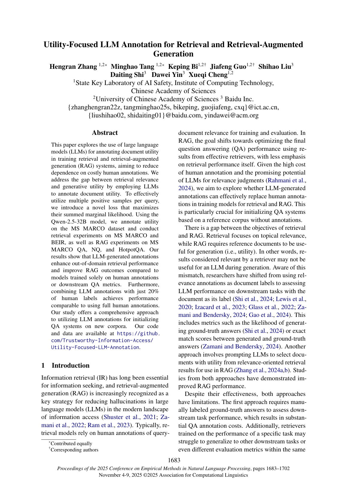

# Utility-Focused LLM Annotation for Retrieval and Retrieval-Augmented Generation

## 0. 阅读结论

- [论文定位] Evidence Utility 起点；用 LLM 标注文档对生成任务的 utility。
- [核心问题] retriever 的 topical relevance 与 RAG 生成端 utility 存在目标错位，相关文档未必有用。
- [对本课题价值] 该文主要映射到 `Evidence Reward / utility annotation`，用于支撑 SAPR-RAG 的问题定义、模块设计或评价协议。
- [阅读判断] 这篇论文不能只当作“相关工作”罗列，应该明确写出它解决了什么、没解决什么，以及 SAPR-RAG 如何沿着它的边界继续推进。

## 1. 核心信息

- Year: 2025
- Venue: EMNLP 2025 Main
- Paper: https://aclanthology.org/2025.emnlp-main.88/
- PDF: https://aclanthology.org/2025.emnlp-main.88.pdf
- Code: https://github.com/Trustworthy-Information-Access/Utility-Focused-LLM-Annotation
- Task: Retrieval, RAG
- Dataset: MS MARCO, BEIR, MS MARCO QA, NQ, HotpotQA
- Backbone: Qwen2.5-32B 用于标注
- Retriever: 检索模型细节待代码确认

## 2. 摘要与问题定义

### 摘要要点

- [论文明确提出] retriever 的 topical relevance 与 RAG 生成端 utility 存在目标错位，相关文档未必有用。
- [论文明确提出] Evidence Utility 起点；用 LLM 标注文档对生成任务的 utility。
- [基于方法/实验设置推断] 该文的核心关注点是 `Evidence Reward / utility annotation`，因此它更适合回答局部过程问题，而不是完整解决 state-aware Agentic RAG 控制。

### 问题定义

这篇论文把问题放在 `Evidence Reward / utility annotation` 这条线上。对本课题来说，关键不是复述其方法名称，而是判断它是否回答了下面三个问题：

1. 当前状态下应该生成什么 query？
2. 当前状态下哪篇 evidence 真正有用？
3. 当前证据是否足以停止并回答？

该文通常只覆盖其中一部分，因此它能成为 SAPR-RAG 的前序工作或对照，而不是完整替代方案。

### 与 ReasonRAG Badcase 的对应

- [本课题 badcase 对齐] ReasonRAG 中的复杂 query、证据 rank 靠后、unsupported intermediate answer、premature stop 等问题，可以用这篇论文的视角重新标注。
- [基于方法/实验设置推断] 若该论文只看路径、faithfulness 或 utility 的某一面，仍需要 SAPR-RAG 把 query、evidence、stop 统一到同一个 reasoning state 下。

## 3. 图表速读

> 图 1：来自原论文或 PDF 抽取图。阅读时重点看它如何组织 `Evidence Reward / utility annotation`：是把推理轨迹展开成树、把 reward 拆到步骤，还是把文档 utility 与 LLM 偏好对齐。对 SAPR-RAG 来说，图中最值得迁移的是状态、动作、奖励或数据构造方式，而不是照搬整套系统。

> 图 2：论文首页或关键页面渲染图，用于快速定位题目、摘要、贡献和实验设置。若图 1 是抽取到的局部图片，图 2 可作为上下文补充。

图片索引：[`images/2025_Utility_Focused_LLM_Annotation/index.md`](images/2025_Utility_Focused_LLM_Annotation/index.md)

## 4. 方法拆解

### 输入输出

- 输入通常包括原始问题、历史推理轨迹、搜索结果或候选文档。
- 输出可能是下一步 query、是否 search/stop、候选 evidence 排序、过程奖励、或完整 reasoning trajectory。
- 对 SAPR-RAG 来说，统一接口应写成：`state s_t = <question, history queries, history evidence, current subquery, intermediate claim, budget>`。

### 核心模块

- 用 LLM 自动标注文档 utility，减少人工标注成本。
- 提出 summed marginal likelihood 以利用多正例。
- 将 utility label 用于训练 retrieval 与 RAG 模型。

### 训练信号或奖励

- [论文明确提出] 该文使用的监督信号服务于自身目标，例如过程奖励、路径价值、utility label、faithfulness reward 或 benchmark label。
- [基于方法/实验设置推断] 这些信号大多没有同时覆盖 Query Reward、Evidence Reward 和 Stop Reward。
- [本课题扩展] SAPR-RAG 应把局部信号统一为：

$$
R(s_t, a_t) = R_q + R_e + R_s + R_f
$$

其中 $R_q$ 评价 query 是否对准信息缺口，$R_e$ 评价证据是否有状态条件下的边际效用，$R_s$ 评价是否应该停止，$R_f$ 评价中间结论是否被证据支撑。

### 推理流程

1. 根据当前问题和历史状态生成或选择下一步动作。
2. 使用检索器、搜索引擎、reward model 或 judge 获得反馈。
3. 更新轨迹状态，并决定继续、修复或停止。
4. 输出最终答案或诊断轨迹质量。

### 与 ReasonRAG 的接口差异

- ReasonRAG 已经有 query generation、evidence extraction、answer generation 的过程监督。
- 该文提供了不同侧面的补充：`Evidence Reward / utility annotation`。
- SAPR-RAG 的差异在于把这些侧面落到同一个 state-aware reward 框架里，而不是只优化单个动作或单个指标。

## 5. 实验设计与结果解读

### 数据集与设置

MS MARCO、BEIR、MS MARCO QA、NQ、HotpotQA 覆盖检索和 RAG 两类任务。

### Baseline 与指标

- 需要重点检查 baseline 是否包含 outcome-only RL、process reward、传统 RAG、search agent 或 utility retriever。
- 若指标只包含 EM/F1/Accuracy，它只能说明最终答案效果；若包含 faithfulness、search count、hop-level diagnosis 或 utility metrics，则更能支撑过程优化结论。
- 对本课题来说，最关键的是把最终答案指标与 trajectory 指标同时报告。

### 主结果解读

- [论文明确提出] 主结果通常证明该文提出的 `Evidence Reward / utility annotation` 方向有效。
- [基于方法/实验设置推断] 如果没有单独报告 query quality、evidence supportiveness 或 stop accuracy，就不能声称它已经解决了 SAPR-RAG 的全部问题。
- [本课题 badcase 对齐] 对 HotpotQA/2Wiki/MuSiQue 这类多跳任务，应该额外看模型是否减少合并多跳 query、错误实体漂移和 evidence=None 后强答。

### 消融与诊断

- 优先看作者是否拆掉 reward、planner、retriever、judge、synthetic data 或 correction module。
- 如果消融只报告最终答案，说明局部机制的因果证据还不够强。
- SAPR-RAG 后续消融应至少包含：去掉 Query Reward、去掉 Evidence Reward、去掉 Stop Reward、去掉 Repair Mechanism。

### 实验严谨性评价

- 优点：该文在其目标问题上提供了可观察指标或有效 baseline。
- 风险：若训练数据、judge prompt、retriever 设置或采样策略不公开，复现时需要先做 B/C 档代码调研。
- 对本课题的要求：不要只引用提升数字，要引用它揭示的问题类型和方法边界。

## 6. 论文贡献、局限与证据强度

### 贡献

- [论文明确提出] Evidence Utility 起点；用 LLM 标注文档对生成任务的 utility。
- [论文明确提出] 它把 `Evidence Reward / utility annotation` 变成可建模、可训练或可诊断的问题。
- [基于方法/实验设置推断] 它推进了 Agentic RAG 从“只看最终答案”向“关注过程质量”的迁移。

### 局限

- utility 主要是 query-document 静态关系。
- 没有多步 history evidence、intermediate answer 和 remaining gap。
- 对 Agentic RAG 的 stop/query decision 没有直接处理。

### 证据强度

- [论文明确提出] 可用于支撑该文自身提出的问题和方法贡献。
- [基于方法/实验设置推断] 可用于支撑 SAPR-RAG 的逻辑缺口，但写论文时必须说明这是跨论文归纳。
- [本课题 badcase 对齐] 与 ReasonRAG 复现中的具体失败现象对应，需要在 `failure_bank.jsonl` 中继续积累样本证据。

## 7. 与本课题的关系

### 对 SAPR-RAG 的启发

- Evidence Reward 的直接文献起点。
- SAPR-RAG 可把 `U(d | q)` 扩展为 `U(d | q, s_t)`。
- 可借鉴 LLM annotation 流程构造 preference 数据。

### 可转化模块

- `Evidence Reward / utility annotation`
- Query Reward：判断 query 是否保留关键实体、避免重复、对准未闭合信息槽。
- Evidence Reward：判断文档是否 relevant、novel、supportive、chain-contributing 且低 noise risk。
- Stop Reward：判断当前 evidence set 是否足以支撑 final answer。

### 与其他论文的关系

- Search-R1 提供 outcome-RL 起点。
- ReasonRAG 证明 process reward 优于 outcome reward。
- VERITAS / ProRAG / DecEx-RAG / HiPRAG 等分别加强 faithfulness、process supervision、decision/execution、search necessity。
- Utility-Focused / LLM-Specific Utility / UAE 证明 relevance 不是 utility，但还没有进入 trajectory-state utility。

## 8. 可复现与代码阅读线索

- 先看 README 中的数据格式、训练入口和 evaluation script。
- 再看 reward / judge / reranker / retriever 相关模块，确认论文中的核心信号如何落到代码。
- 若有官方 checkpoint，优先复现实验表中的一个小数据集结果。
- 若无代码，则至少复现该论文的 prompt schema、评价指标或数据构造思想。

## 9. 可用于写作的中文表述

- 直接证据层：retriever 的 topical relevance 与 RAG 生成端 utility 存在目标错位，相关文档未必有用。
- 谱系定位层：Evidence Utility 起点；用 LLM 标注文档对生成任务的 utility。
- 逻辑缺口层：现有工作虽然推进了 `Evidence Reward / utility annotation`，但仍未系统回答在第 $t$ 步给定当前轨迹状态时，下一条 query、candidate evidence 和 stop action 的边际价值如何统一评估。
- 本课题定位层：SAPR-RAG 试图把这些分散线索统一为 state-aware process reward，用于减少 ReasonRAG 类方法中的 query drift、retrieval noise、unsupported intermediate answer 和 premature stop。

## 10. 后续行动

- 将该论文的核心 failure type 映射到 ReasonRAG badcase 标签。
- 检查官方代码或补充 B/C 档代码调研，确认数据格式和 reward 实现。
- 在 SAPR-RAG 实验中设计一个与该文直接相关的 ablation 或 diagnostic metric。
- 写 related work 时避免泛泛罗列，应突出该文与 SAPR-RAG 的“相同问题、不同粒度、不同状态建模”关系。
