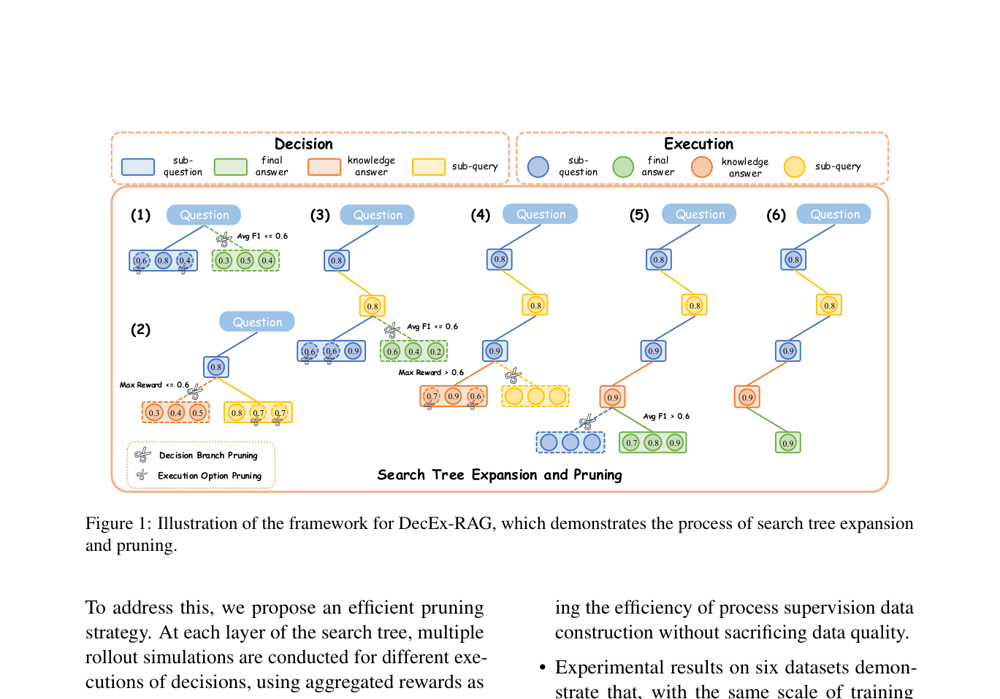
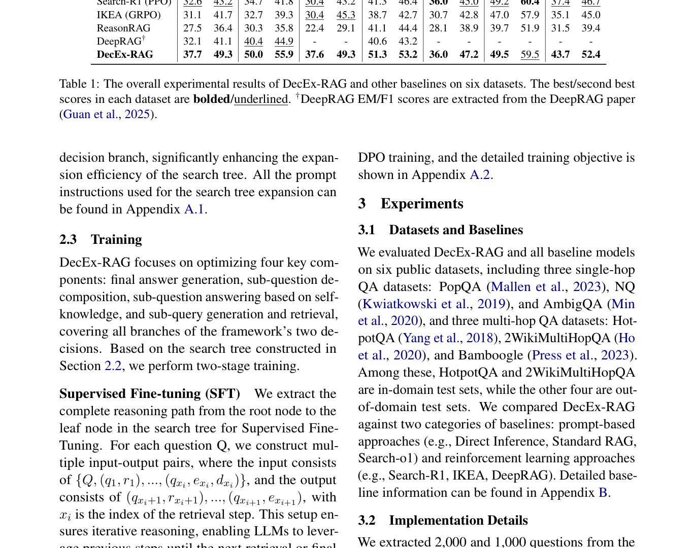
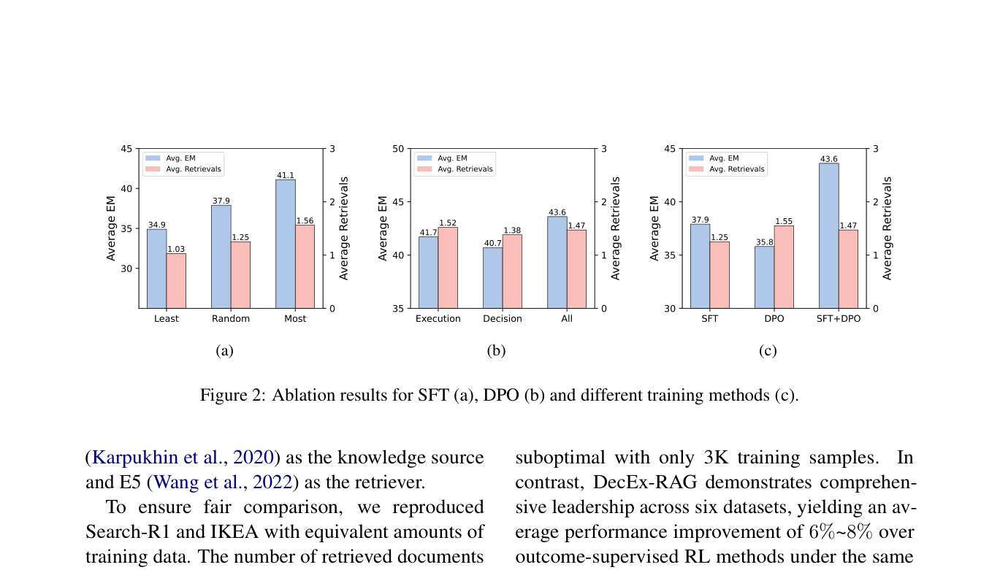
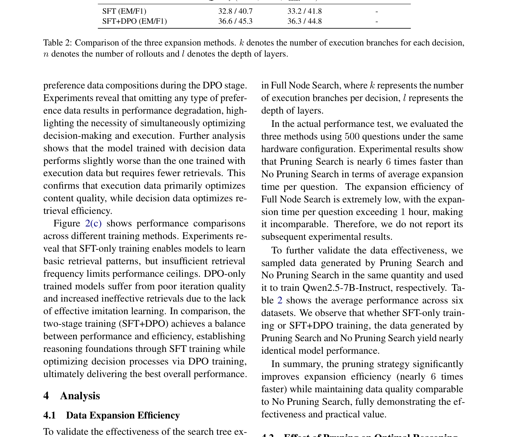

# 关键图表索引：DecEx-RAG: Boosting Agentic Retrieval-Augmented Generation with Decision and Execution Optimization via Process Supervision

- Note: `2025_DecEx_RAG.md`
- PDF: https://aclanthology.org/2025.emnlp-industry.99.pdf
- Total key artifacts: 4

## figure1 - page 2

- File: `figure1_pdfcrop_page02.png`
- Priority: pdf-caption-crop
- Source / matched caption: Figure 1/Fig. 1/FIGURE 1/FIG. 1
- Caption text: (empty)
- Size: 179.9 KB

## table1 - page 4

- File: `table1_pdfcrop_page04.png`
- Priority: pdf-caption-crop
- Source / matched caption: Table 1/TABLE 1
- Caption text: (empty)
- Size: 309.4 KB

## figure2 - page 5

- File: `figure2_pdfcrop_page05.png`
- Priority: pdf-caption-crop
- Source / matched caption: Figure 2/Fig. 2/FIGURE 2/FIG. 2
- Caption text: (empty)
- Size: 111.0 KB

## table2 - page 6

- File: `table2_pdfcrop_page06.png`
- Priority: pdf-caption-crop
- Source / matched caption: Table 2/TABLE 2
- Caption text: (empty)
- Size: 311.9 KB

