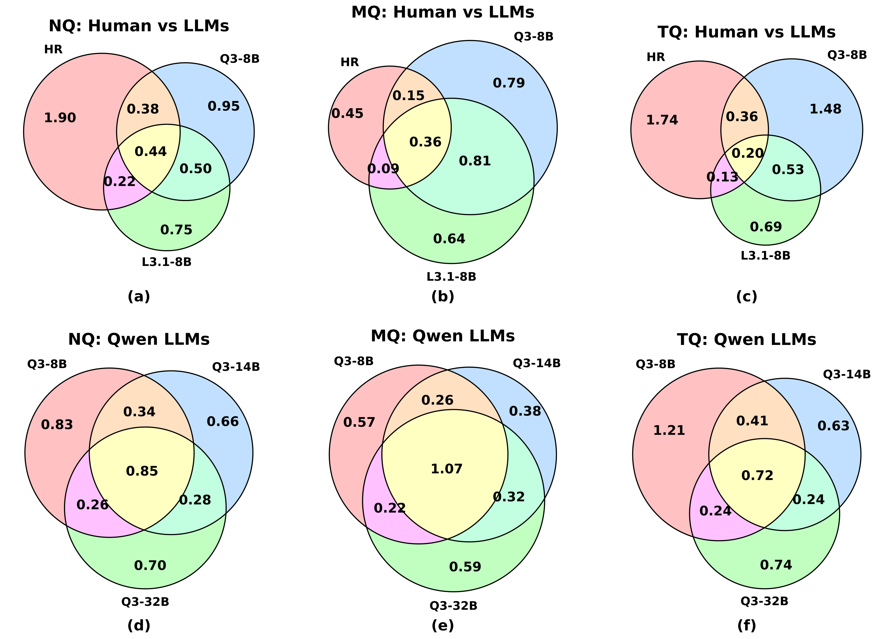
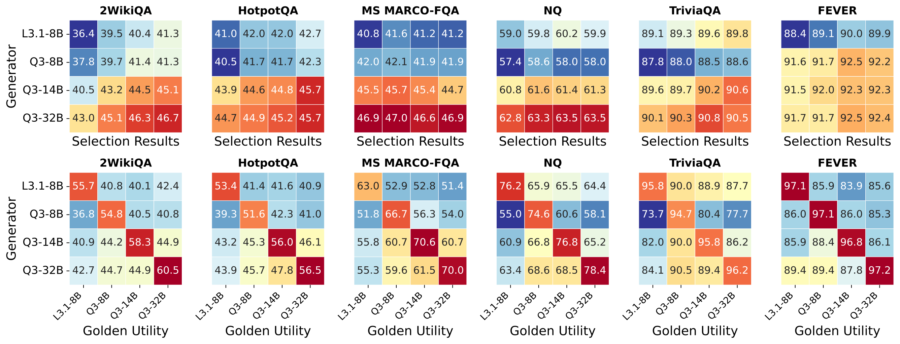
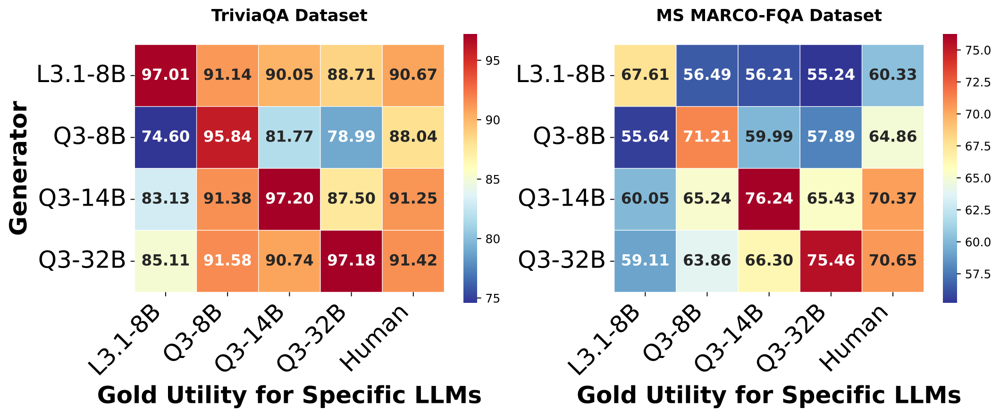
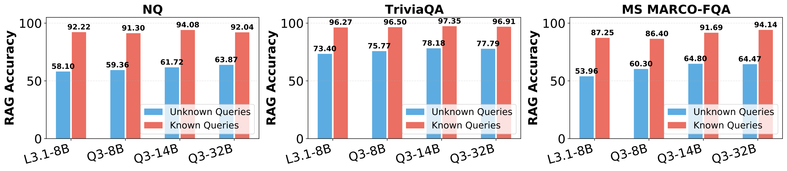
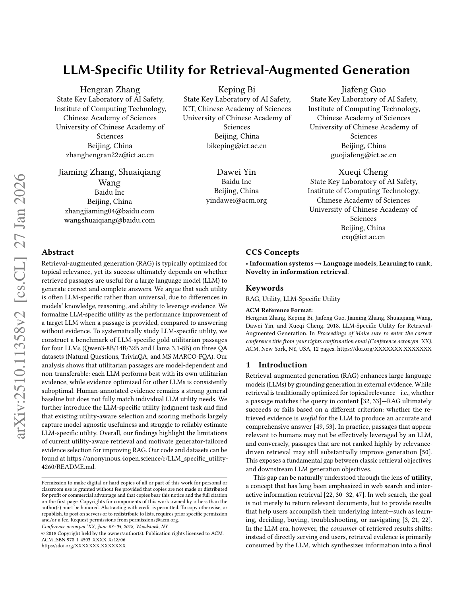
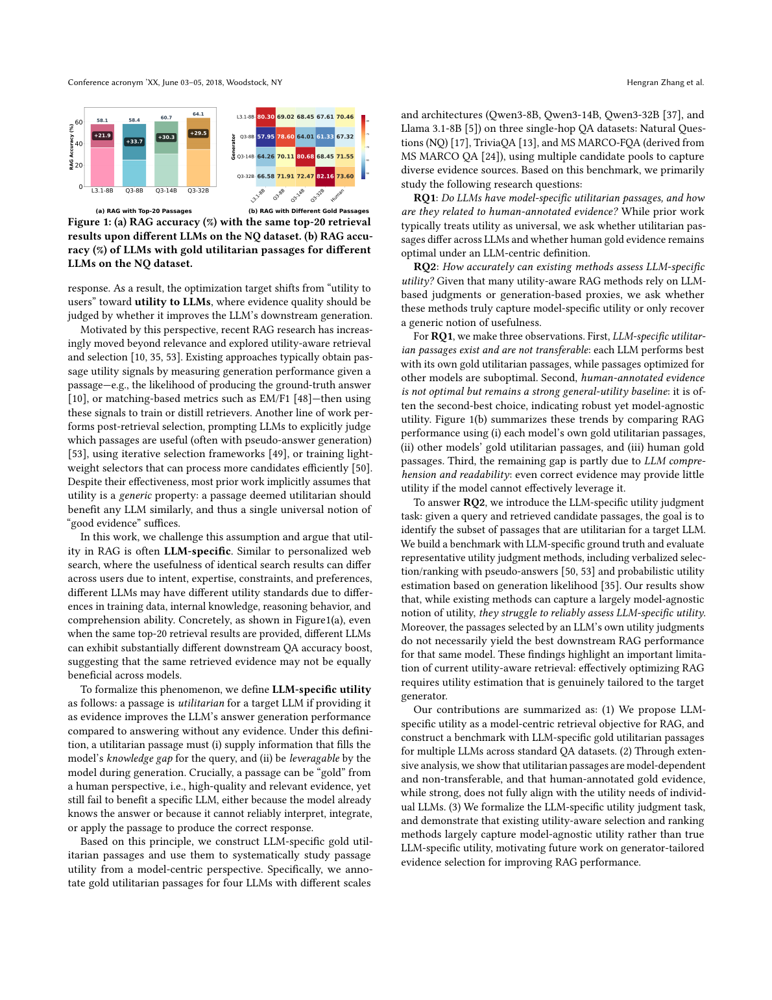

# 图片索引：LLM-Specific Utility: A New Perspective for Retrieval-Augmented Generation

- Note: `2025_LLM_Specific_Utility.md`
- PDF: https://arxiv.org/pdf/2510.11358
- Total images: 6

## source_01_combined_venn_two_rows.png

- Source: arxiv-source
- Note: combined_venn_two_rows.pdf
- Size: 515.1 KB

## source_02_compare_heatmaps_2row6col_final.png

- Source: arxiv-source
- Note: compare_heatmaps_2row6col_final.pdf
- Size: 423.1 KB

## source_03_model_performance_heatmaps.png

- Source: arxiv-source
- Note: model_performance_heatmaps.pdf
- Size: 207.6 KB

## source_04_query_performance.png

- Source: arxiv-source
- Note: query_performance.pdf
- Size: 132.3 KB

## page_01.png

- Source: pdf-page-render
- Note: page 1
- Size: 422.1 KB

## page_02.png

- Source: pdf-page-render
- Note: page 2
- Size: 531.8 KB

