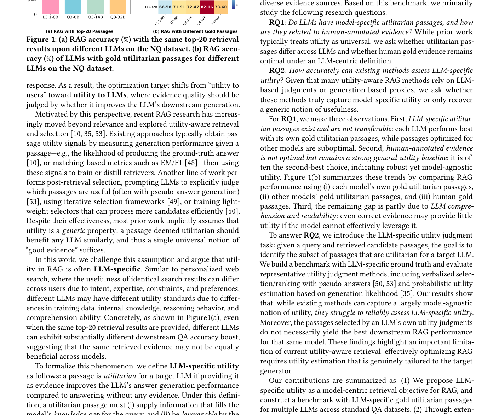
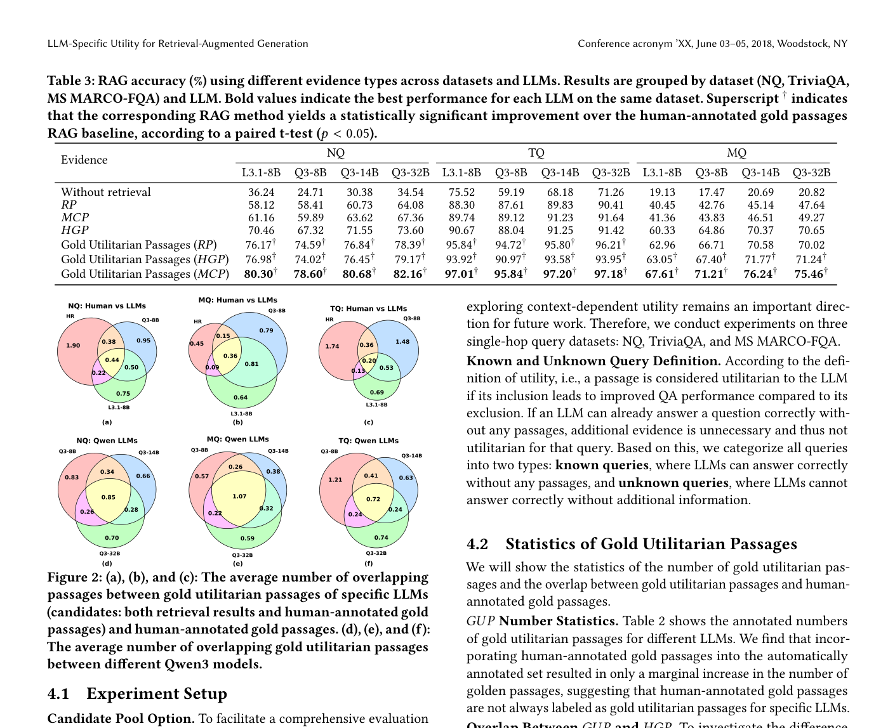

# 关键图表索引：LLM-Specific Utility: A New Perspective for Retrieval-Augmented Generation

- Note: `2025_LLM_Specific_Utility.md`
- PDF: https://arxiv.org/pdf/2510.11358
- Total key artifacts: 4

## figure1 - page 2

- File: `figure1_page02.png`
- Matched caption: Figure 1/Fig. 1/FIGURE 1/FIG. 1
- Size: 551.6 KB

## table1 - page 4

- File: `table1_page04.png`
- Matched caption: Table 1/TABLE 1
- Size: 450.3 KB

## table2 - page 4

- File: `table2_page04.png`
- Matched caption: Table 2/TABLE 2
- Size: 450.3 KB

## figure2 - page 5

- File: `figure2_page05.png`
- Matched caption: Figure 2/Fig. 2/FIGURE 2/FIG. 2
- Size: 397.2 KB

