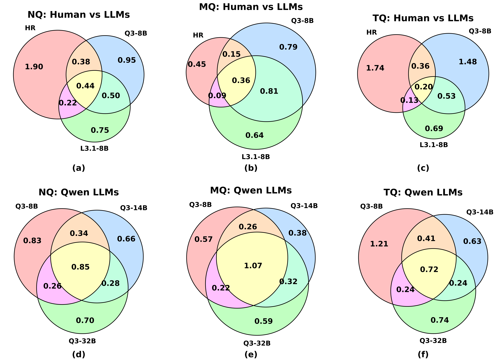
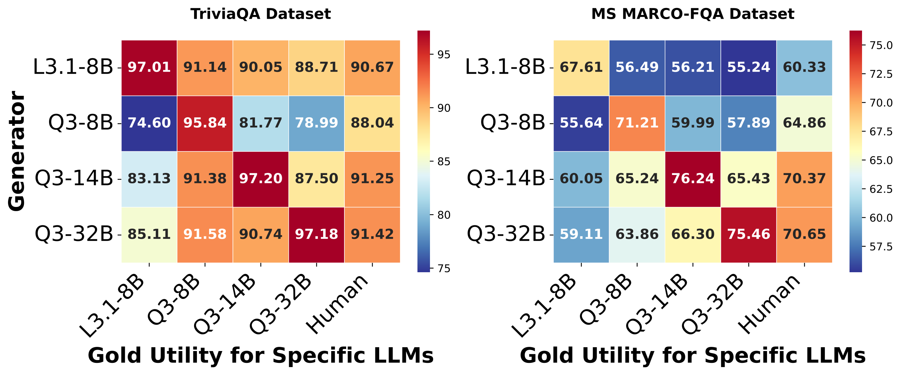
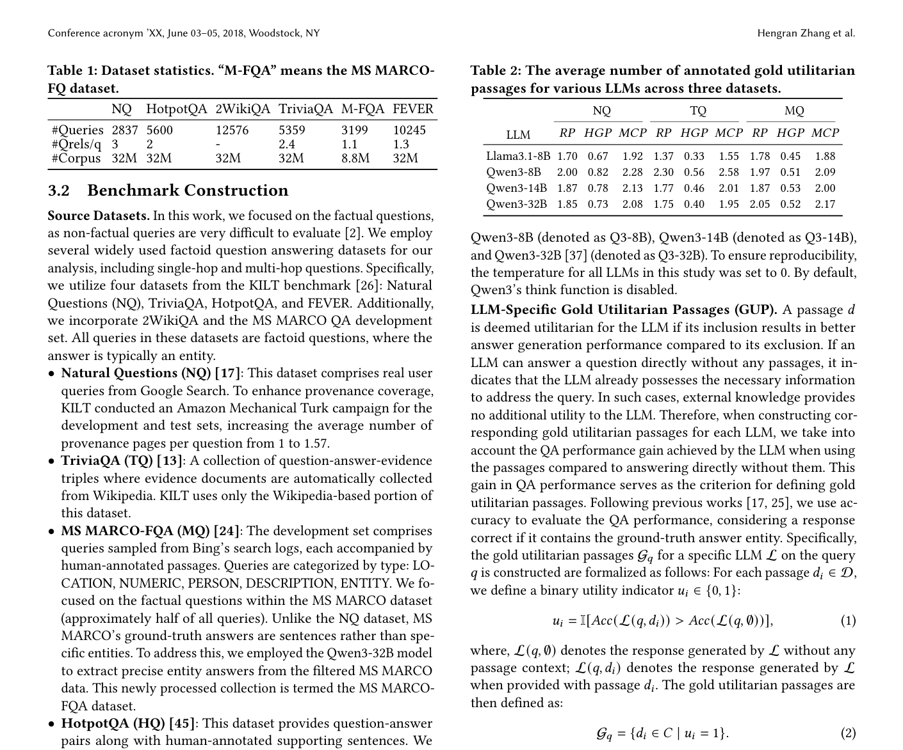

# 关键图表索引：LLM-Specific Utility: A New Perspective for Retrieval-Augmented Generation

- Note: `2025_LLM_Specific_Utility.md`
- PDF: https://arxiv.org/pdf/2510.11358
- Total key artifacts: 4

## figure1 - page source

- File: `figure1_source_combined_venn_two_rows.png`
- Priority: arxiv-source
- Source / matched caption: arXiv source: images/combined_venn_two_rows.pdf
- Caption text: (a), (b), and (c): The average number of overlapping passages between gold utilitarian passages of specific LLMs (candidates: both retrieval results and human-annotated gold passages) and human-annotated gold passages. (d), (e), and (f): Th
- Size: 646.4 KB

## figure2 - page source

- File: `figure2_source_model_performance_heatmaps.png`
- Priority: arxiv-source
- Source / matched caption: arXiv source: images/model_performance_heatmaps.pdf
- Caption text: RAG accuracy (\%) of LLMs with gold utilitarian passages (where the candidate set is $MCP$) from different LLMs. The results on the NQ dataset are shown in Figure \ref{fig:utility_relevance} (b).
- Size: 253.8 KB

## table1 - page 4

- File: `table1_pdfcrop_page04.png`
- Priority: pdf-caption-crop
- Source / matched caption: Table 1/TABLE 1
- Caption text: (empty)
- Size: 450.3 KB

## table2 - page 4

- File: `table2_pdfcrop_page04.png`
- Priority: pdf-caption-crop
- Source / matched caption: Table 2/TABLE 2
- Caption text: (empty)
- Size: 450.3 KB

