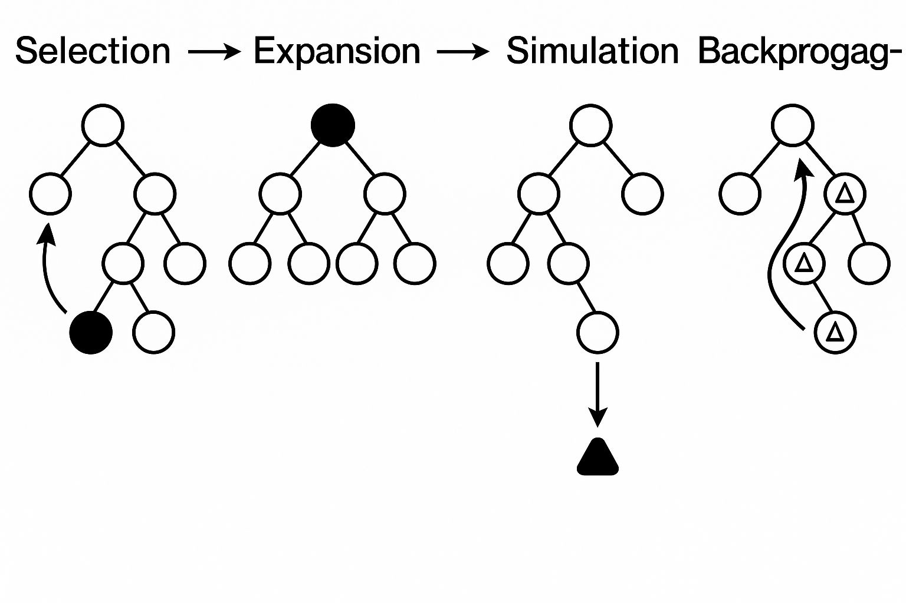
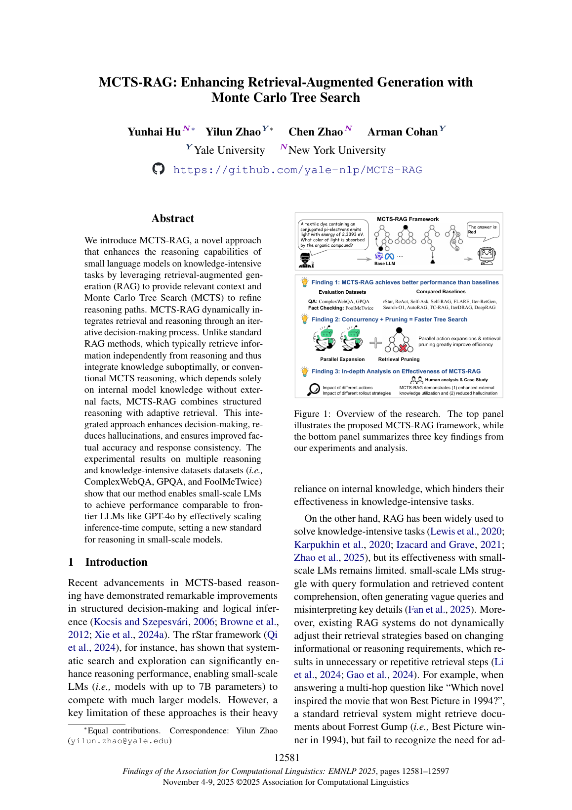
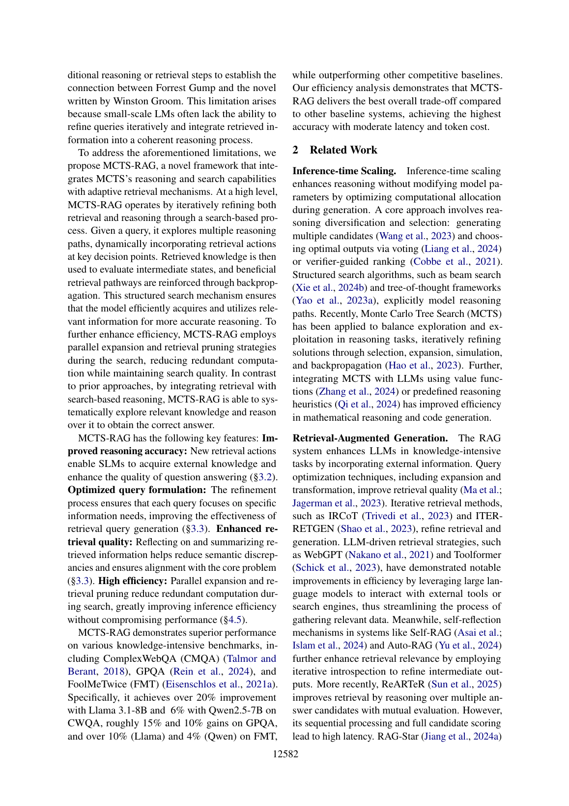

# 图片索引：MCTS-RAG: Enhancing Retrieval-Augmented Generation with Monte Carlo Tree Search

- Note: `2025_MCTS_RAG.md`
- PDF: https://aclanthology.org/2025.findings-emnlp.672.pdf
- Total images: 6

## pdf_p01_01.jpeg

- Source: pdf-extraction
- Note: page 1
- Size: 103.5 KB

## pdf_p01_08.jpeg

- Source: pdf-extraction
- Note: page 1
- Size: 14.2 KB

## pdf_p01_09.jpeg

- Source: pdf-extraction
- Note: page 1
- Size: 17.6 KB

## pdf_p01_10.jpeg

- Source: pdf-extraction
- Note: page 1
- Size: 83.0 KB

## page_01.png

- Source: pdf-page-render
- Note: page 1
- Size: 403.6 KB

## page_02.png

- Source: pdf-page-render
- Note: page 2
- Size: 501.3 KB

