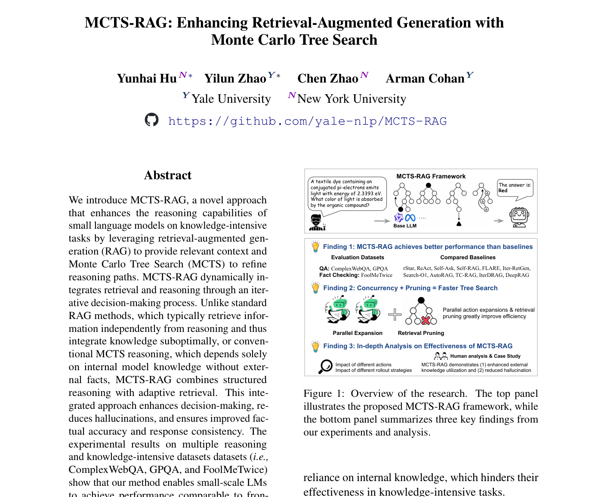
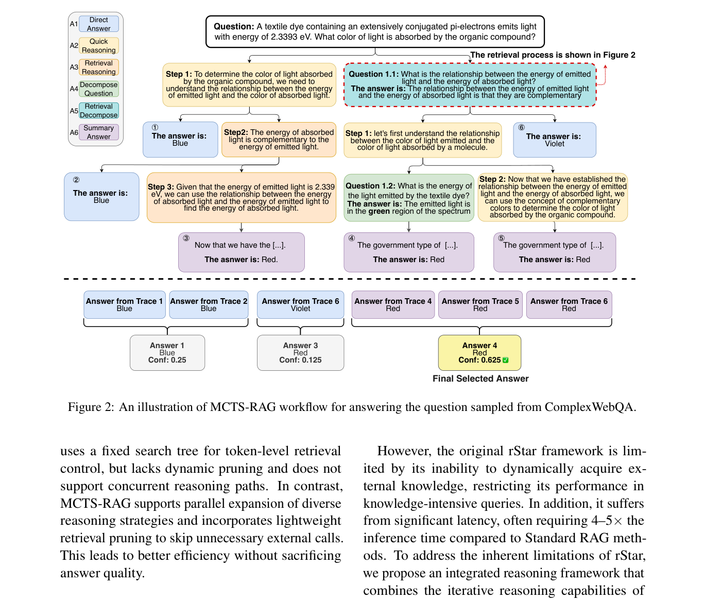
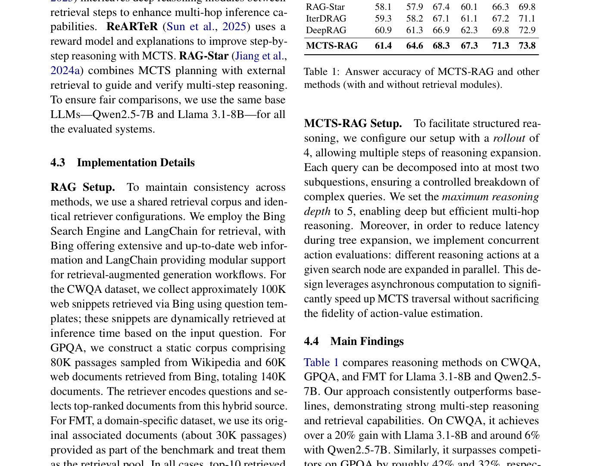
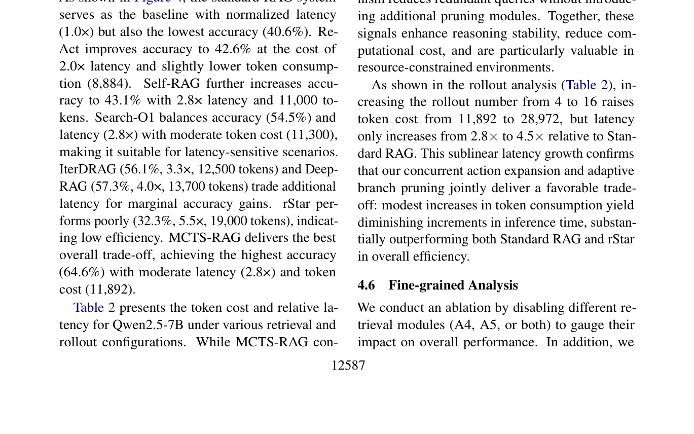

# 关键图表索引：MCTS-RAG: Enhancing Retrieval-Augmented Generation with Monte Carlo Tree Search

- Note: `2025_MCTS_RAG.md`
- PDF: https://aclanthology.org/2025.findings-emnlp.672.pdf
- Total key artifacts: 4

## figure1 - page 1

- File: `figure1_page01.png`
- Matched caption: Figure 1/Fig. 1/FIGURE 1/FIG. 1
- Size: 297.8 KB

## figure2 - page 3

- File: `figure2_page03.png`
- Matched caption: Figure 2/Fig. 2/FIGURE 2/FIG. 2
- Size: 297.0 KB

## table1 - page 6

- File: `table1_page06.png`
- Matched caption: Table 1/TABLE 1
- Size: 345.8 KB

## table2 - page 7

- File: `table2_page07.png`
- Matched caption: Table 2/TABLE 2
- Size: 225.1 KB

