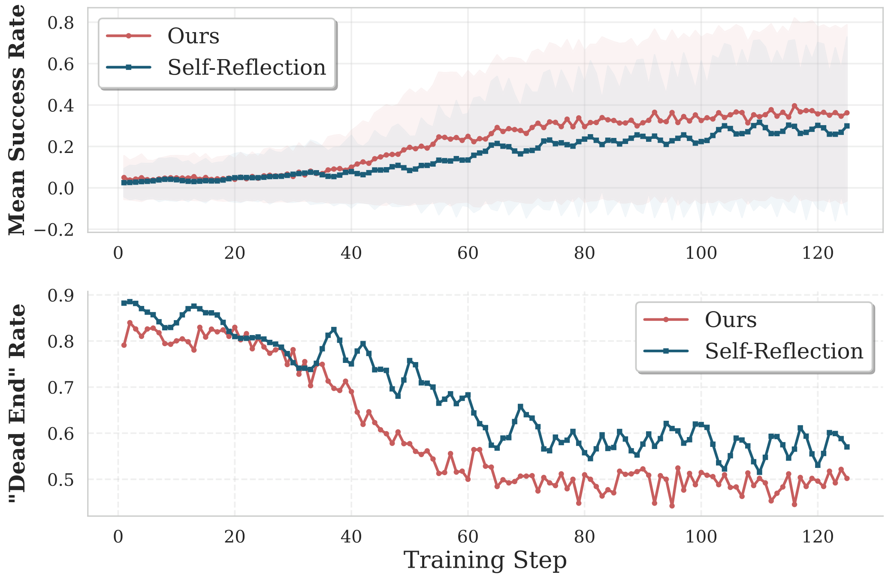
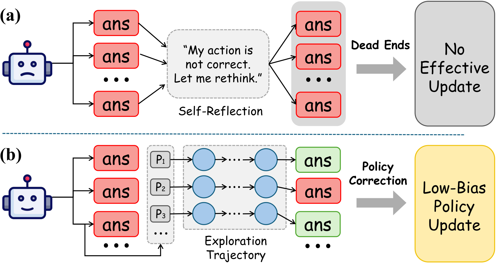
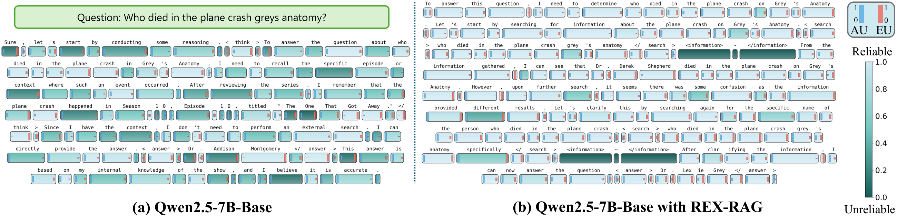
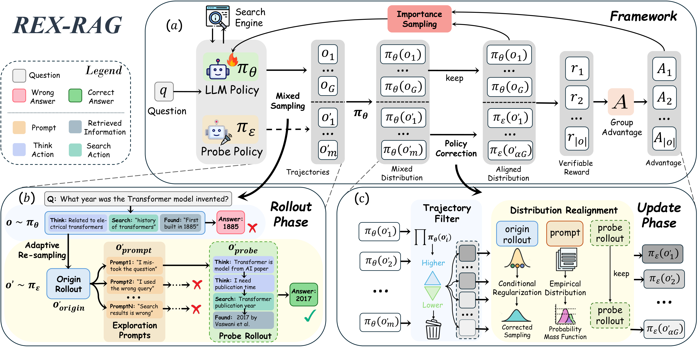
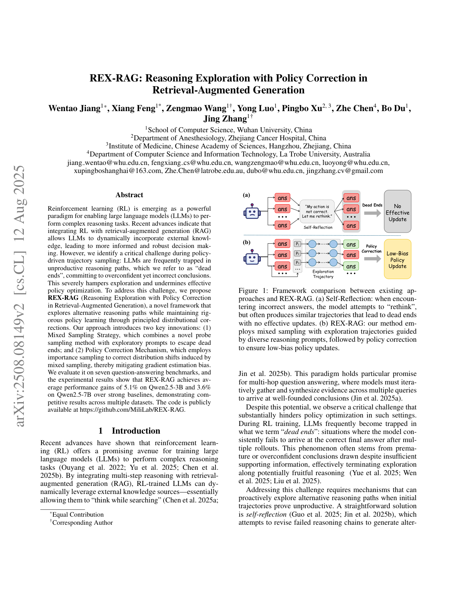
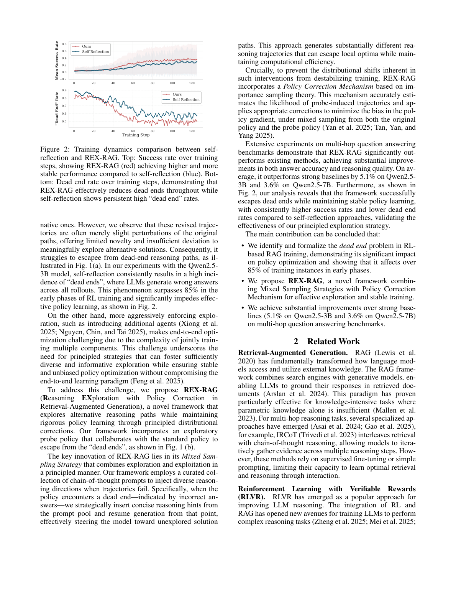

# 图片索引：REX-RAG: Reasoning Exploration with Policy Correction in Retrieval-Augmented Generation

- Note: `2025_REX_RAG.md`
- PDF: https://arxiv.org/pdf/2508.08149
- Total images: 6

## source_01_motivation2.png

- Source: arxiv-source
- Note: motivation2.pdf
- Size: 247.3 KB

## source_02_motivation.png

- Source: arxiv-source
- Note: motivation.pdf
- Size: 230.9 KB

## source_03_case_study.png

- Source: arxiv-source
- Note: case_study.pdf
- Size: 638.9 KB

## source_04_framework-v3.png

- Source: arxiv-source
- Note: framework-v3.pdf
- Size: 896.8 KB

## page_01.png

- Source: pdf-page-render
- Note: page 1
- Size: 406.9 KB

## page_02.png

- Source: pdf-page-render
- Note: page 2
- Size: 483.7 KB

