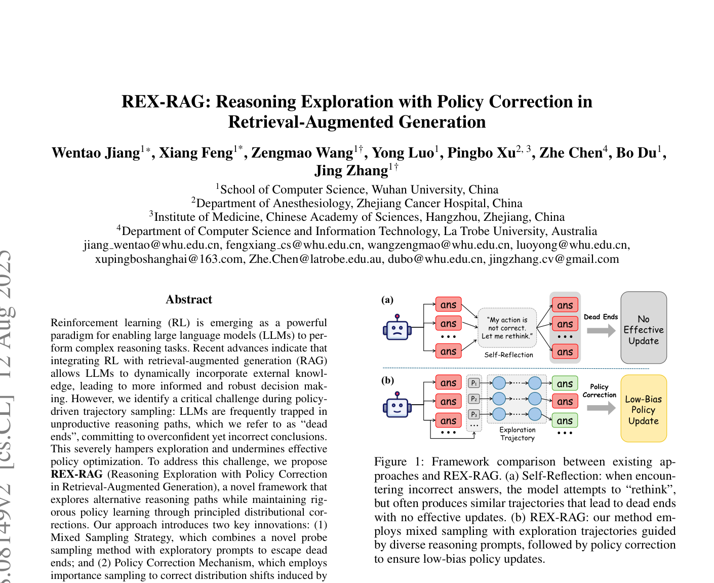
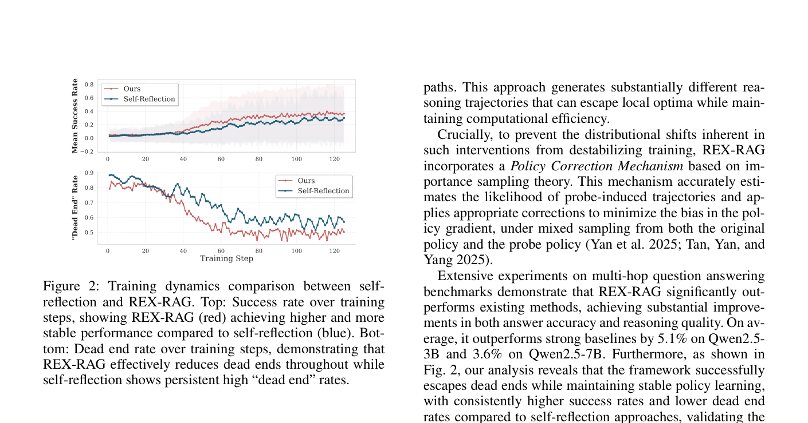
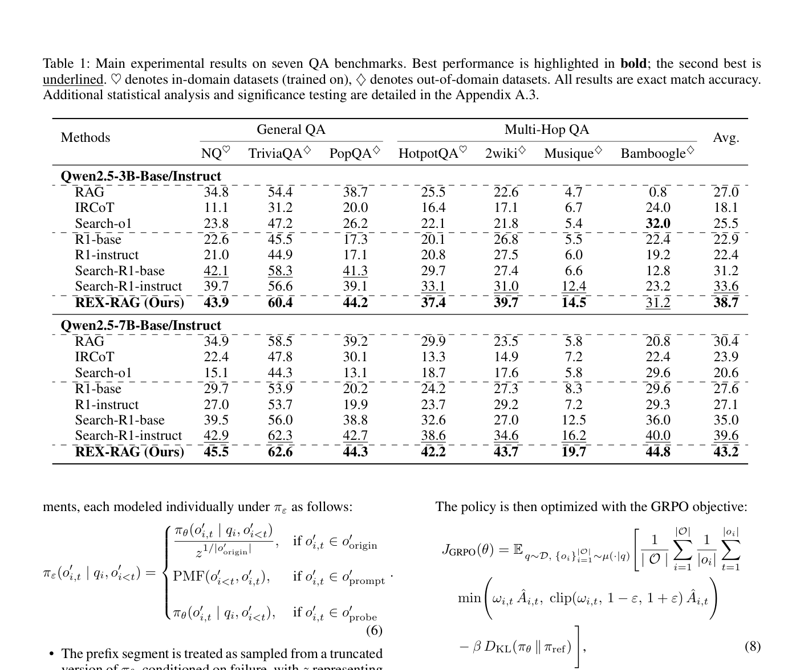
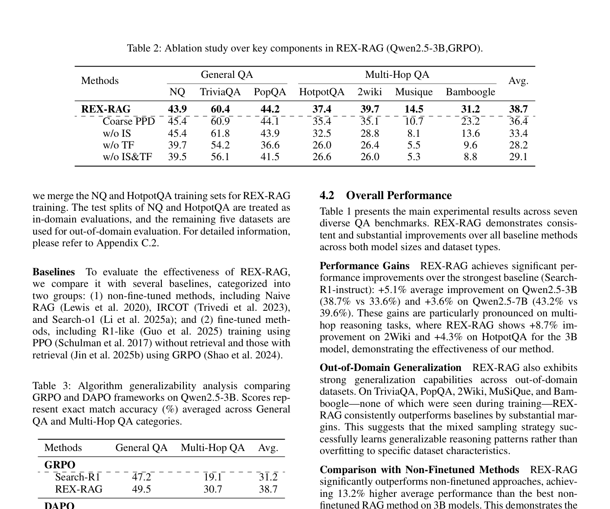

# 关键图表索引：REX-RAG: Reasoning Exploration with Policy Correction in Retrieval-Augmented Generation

- Note: `2025_REX_RAG.md`
- PDF: https://arxiv.org/pdf/2508.08149
- Total key artifacts: 4

## figure1 - page 1

- File: `figure1_page01.png`
- Matched caption: Figure 1/Fig. 1/FIGURE 1/FIG. 1
- Size: 327.2 KB

## figure2 - page 2

- File: `figure2_page02.png`
- Matched caption: Figure 2/Fig. 2/FIGURE 2/FIG. 2
- Size: 229.0 KB

## table1 - page 5

- File: `table1_page05.png`
- Matched caption: Table 1/TABLE 1
- Size: 214.9 KB

## table2 - page 6

- File: `table2_page06.png`
- Matched caption: Table 2/TABLE 2
- Size: 323.5 KB

