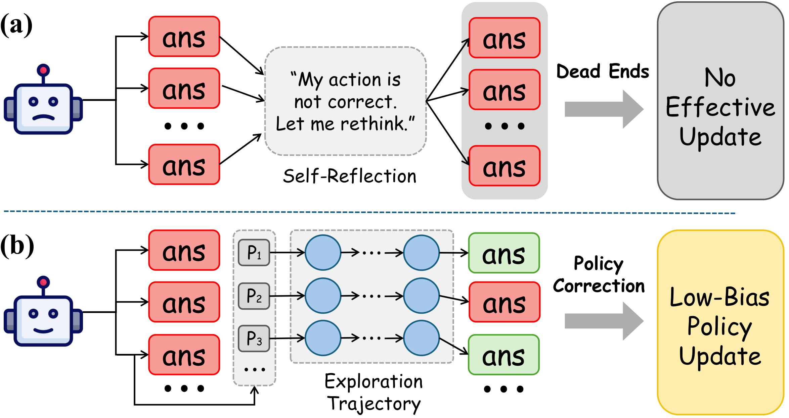
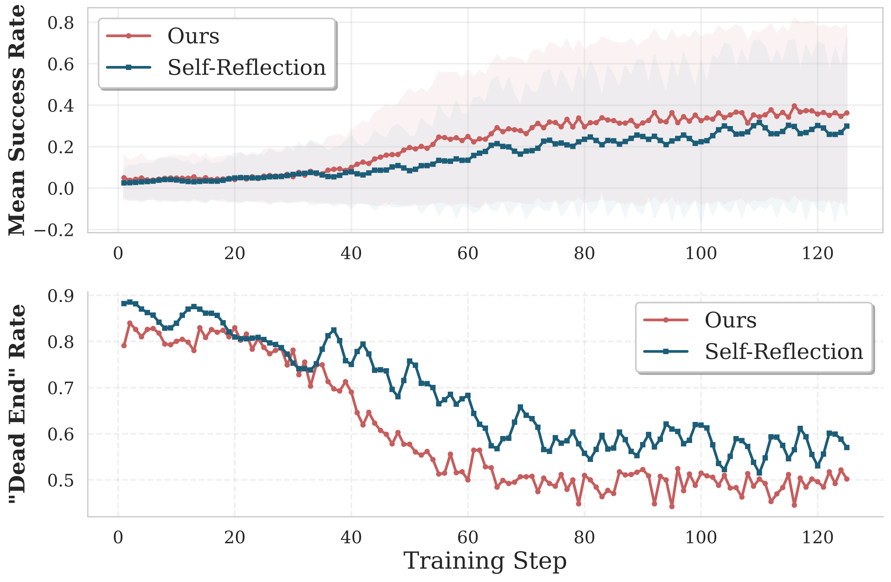

# 关键图表索引：REX-RAG: Reasoning Exploration with Policy Correction in Retrieval-Augmented Generation

- Note: `2025_REX_RAG.md`
- PDF: https://arxiv.org/pdf/2508.08149
- Total key artifacts: 4

## figure1 - page source

- File: `figure1_source_motivation.png`
- Priority: arxiv-source
- Source / matched caption: arXiv source: figures/motivation.pdf
- Caption text: Framework comparison between existing approaches and REX-RAG. (a) Self-Reflection: when encountering incorrect answers, the model attempts to ``rethink", but often produces similar trajectories that lead to dead ends with no effective updat
- Size: 289.8 KB

## figure2 - page source

- File: `figure2_source_motivation2.png`
- Priority: arxiv-source
- Source / matched caption: arXiv source: figures/motivation2.pdf
- Caption text: Training dynamics comparison between self-reflection and REX-RAG. Top: Success rate over training steps, showing REX-RAG (red) achieving higher and more stable performance compared to self-reflection (blue). Bottom: Dead end rate over train
- Size: 311.3 KB

## table1 - page 5

- File: `table1_pdfcrop_page05.png`
- Priority: pdf-caption-crop
- Source / matched caption: Table 1/TABLE 1
- Caption text: (empty)
- Size: 214.9 KB

## table2 - page 6

- File: `table2_pdfcrop_page06.png`
- Priority: pdf-caption-crop
- Source / matched caption: Table 2/TABLE 2
- Caption text: (empty)
- Size: 323.5 KB

