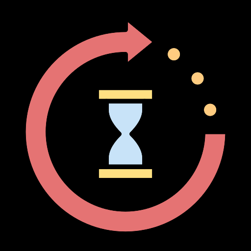
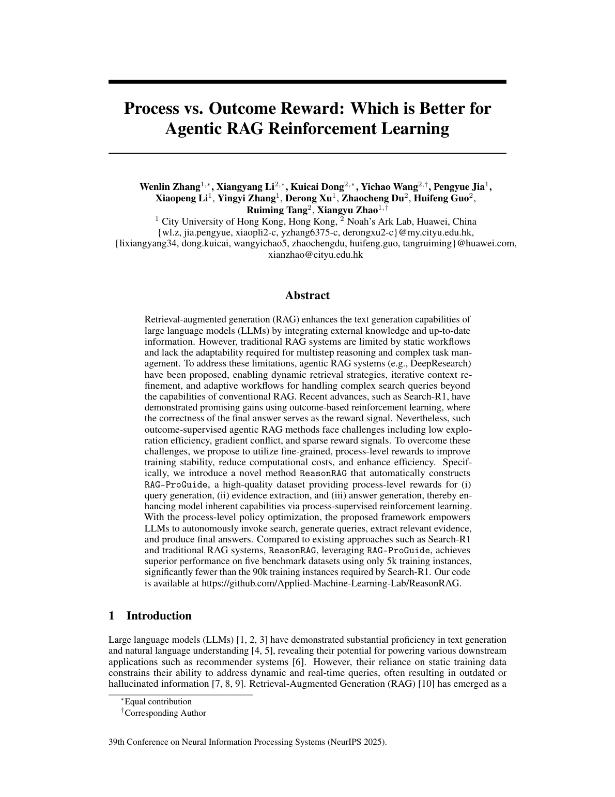
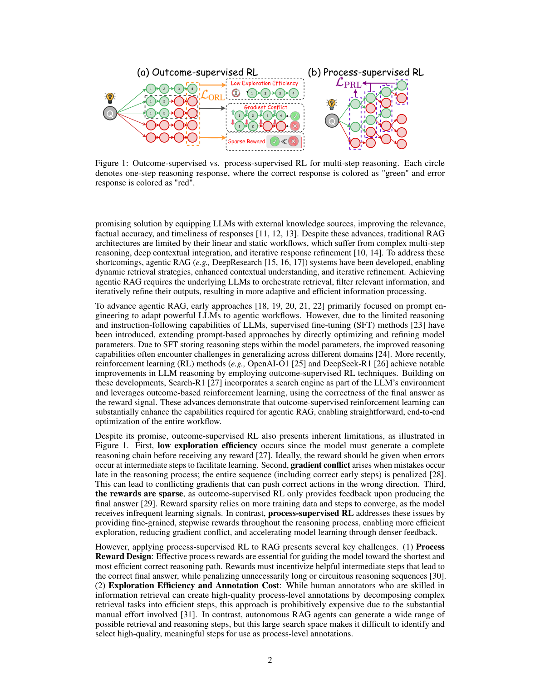

# 图片索引：Process vs. Outcome Reward: Which is Better for Agentic RAG Reinforcement Learning

- Note: `2025_ReasonRAG.md`
- PDF: https://openreview.net/pdf?id=h3LlJ6Bh4S
- Total images: 6

## pdf_p02_02.png

- Source: pdf-extraction
- Note: page 2
- Size: 8.7 KB

## pdf_p02_03.png

- Source: pdf-extraction
- Note: page 2
- Size: 14.9 KB

## pdf_p02_04.png

- Source: pdf-extraction
- Note: page 2
- Size: 13.3 KB

## pdf_p02_05.png

- Source: pdf-extraction
- Note: page 2
- Size: 15.2 KB

## page_01.png

- Source: pdf-page-render
- Note: page 1
- Size: 276.7 KB

## page_02.png

- Source: pdf-page-render
- Note: page 2
- Size: 398.6 KB

