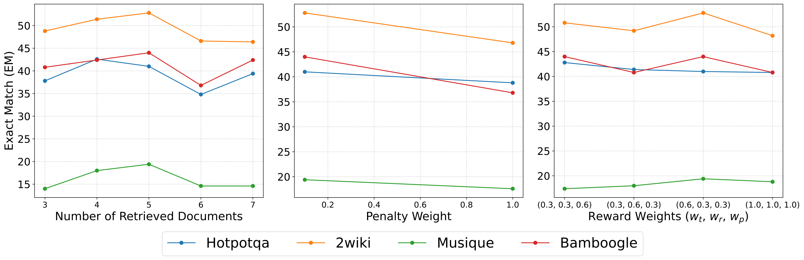
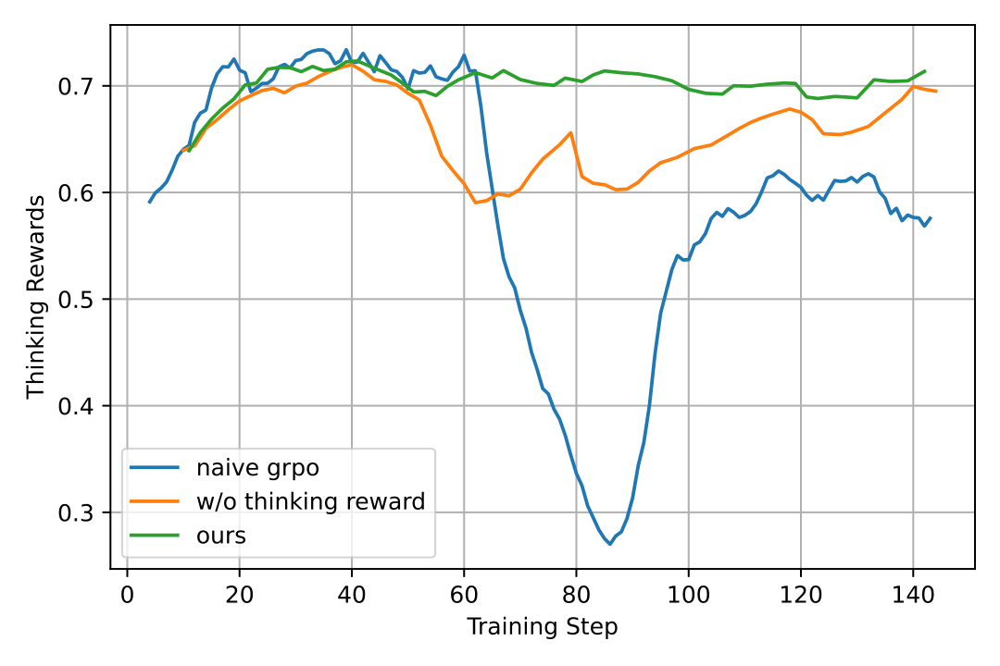
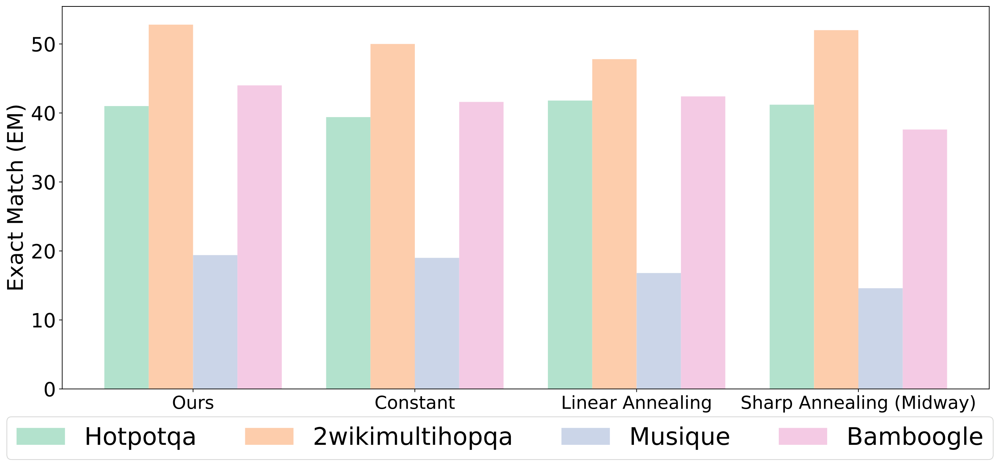
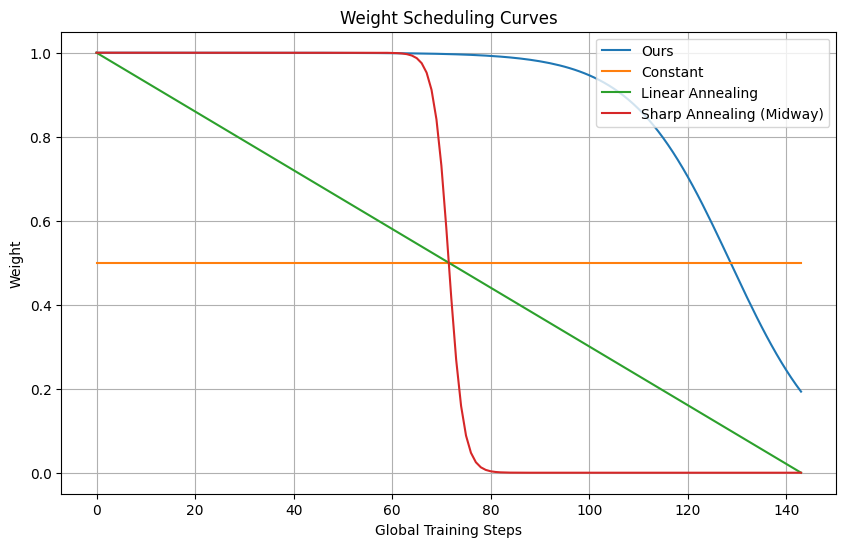
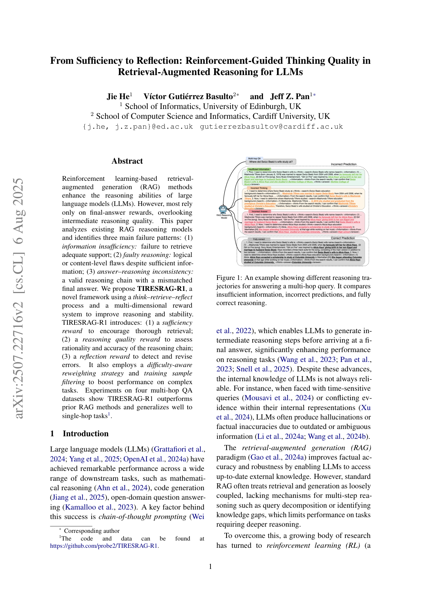
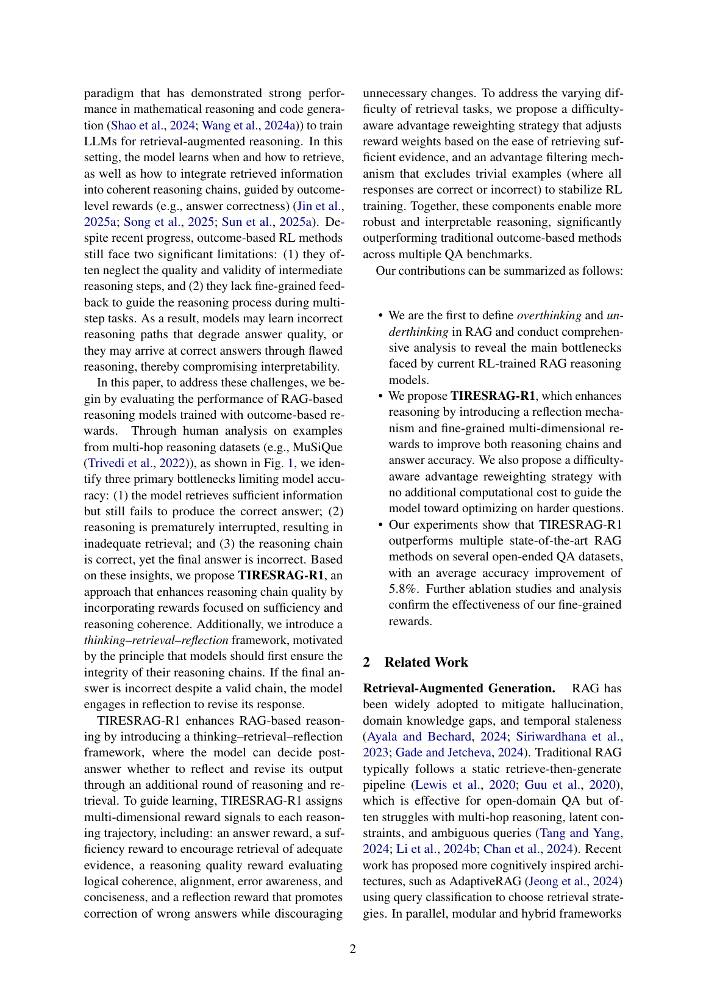

# 图片索引：From Sufficiency to Reflection: Reinforcement-Guided Thinking Quality in Retrieval-Augmented Reasoning for LLMs

- Note: `2025_TIRESRAG_R1.md`
- PDF: https://arxiv.org/pdf/2507.22716
- Total images: 6

## source_01_hyperparameter.png

- Source: arxiv-source
- Note: hyperparameter.pdf
- Size: 254.0 KB

## source_02_thinking_reward.png

- Source: arxiv-source
- Note: thinking_reward.pdf
- Size: 75.3 KB

## source_03_annealing.png

- Source: arxiv-source
- Note: annealing.pdf
- Size: 129.4 KB

## source_04_linear.png

- Source: arxiv-source
- Note: linear.png
- Size: 52.7 KB

## page_01.png

- Source: pdf-page-render
- Note: page 1
- Size: 508.4 KB

## page_02.png

- Source: pdf-page-render
- Note: page 2
- Size: 459.5 KB

