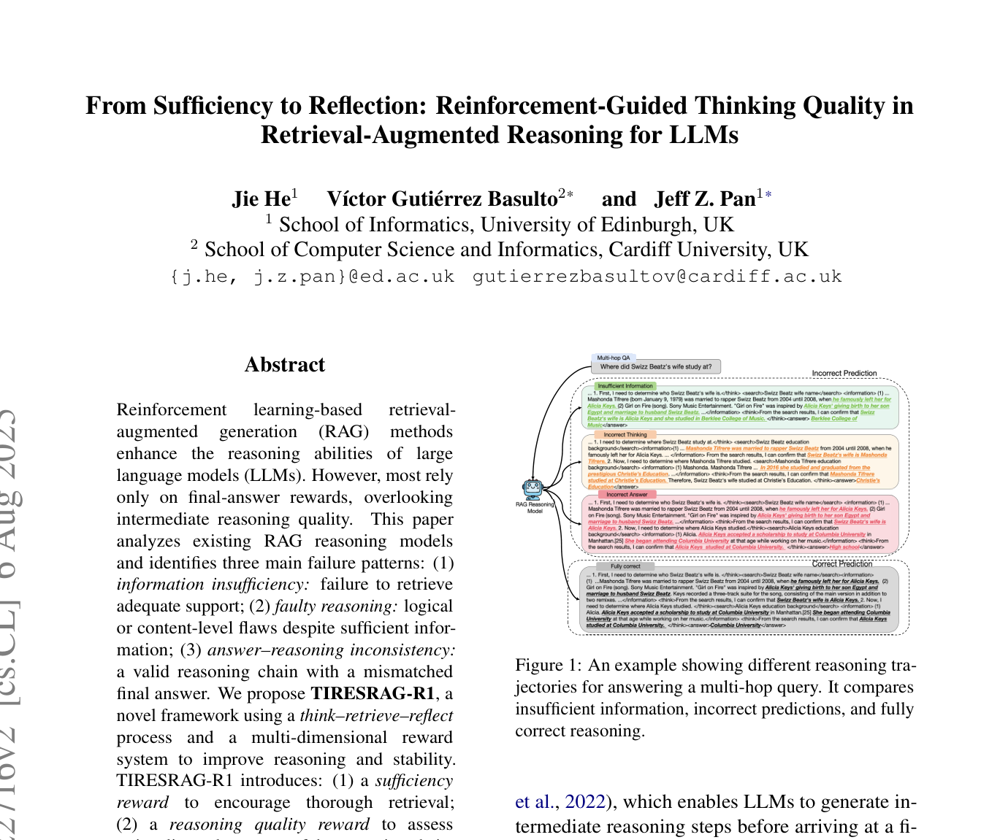
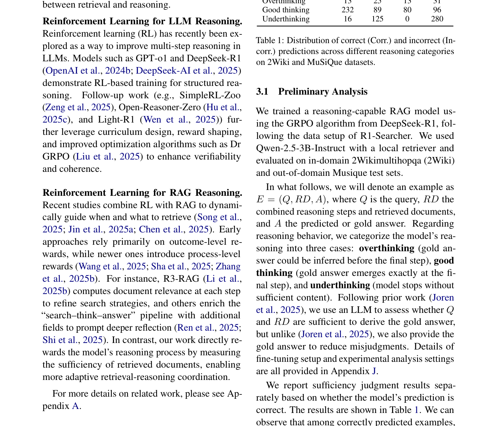
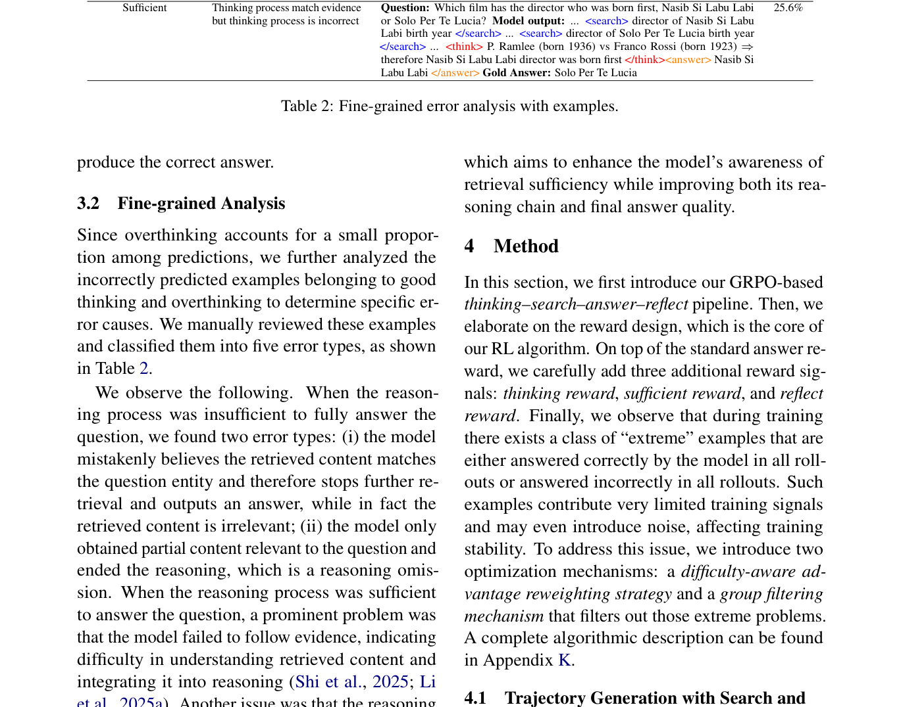
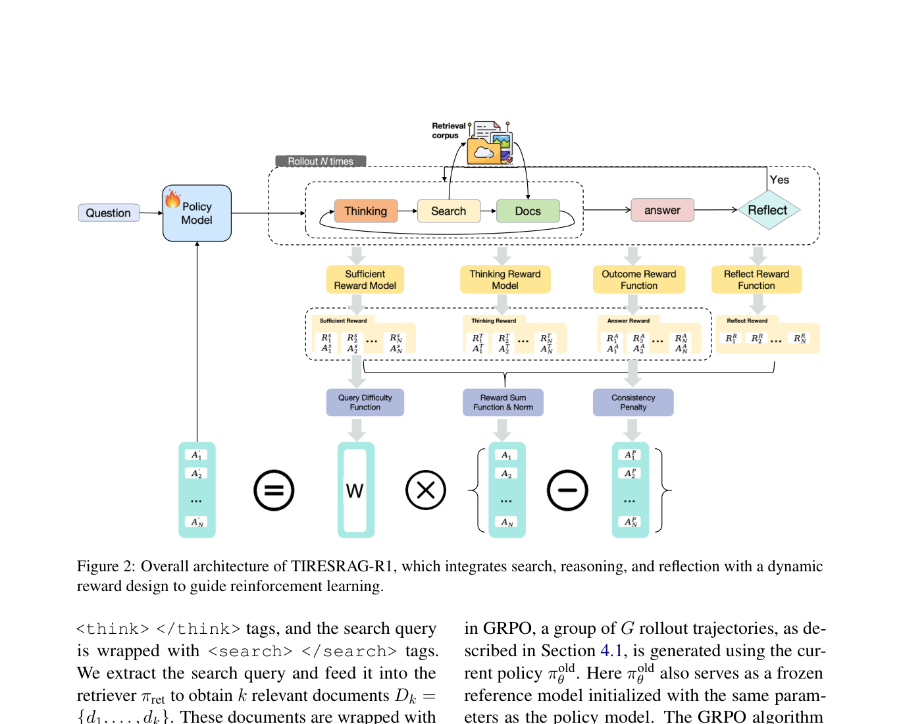

# 关键图表索引：From Sufficiency to Reflection: Reinforcement-Guided Thinking Quality in Retrieval-Augmented Reasoning for LLMs

- Note: `2025_TIRESRAG_R1.md`
- PDF: https://arxiv.org/pdf/2507.22716
- Total key artifacts: 4

## figure1 - page 1

- File: `figure1_page01.png`
- Matched caption: Figure 1/Fig. 1/FIGURE 1/FIG. 1
- Size: 435.6 KB

## table1 - page 3

- File: `table1_page03.png`
- Matched caption: Table 1/TABLE 1
- Size: 384.5 KB

## table2 - page 4

- File: `table2_page04.png`
- Matched caption: Table 2/TABLE 2
- Size: 296.5 KB

## figure2 - page 5

- File: `figure2_page05.png`
- Matched caption: Figure 2/Fig. 2/FIGURE 2/FIG. 2
- Size: 227.9 KB

