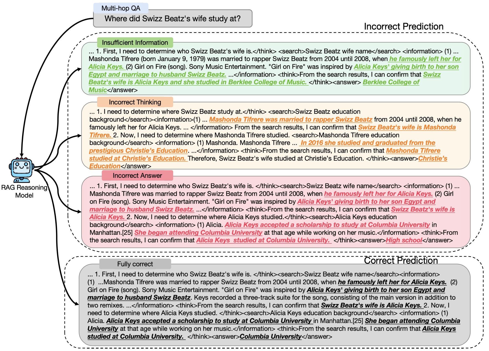
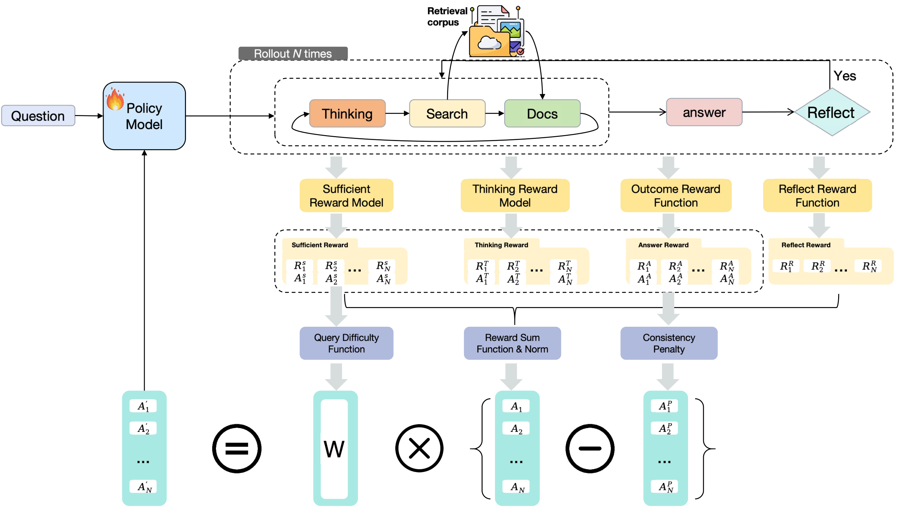

# 关键图表索引：From Sufficiency to Reflection: Reinforcement-Guided Thinking Quality in Retrieval-Augmented Reasoning for LLMs

- Note: `2025_TIRESRAG_R1.md`
- PDF: https://arxiv.org/pdf/2507.22716
- Total key artifacts: 4

## figure1 - page source

- File: `figure1_source_introduction.png`
- Priority: arxiv-source
- Source / matched caption: arXiv source: images/introduction.pdf
- Caption text: \vic{An example showing different reasoning trajectories for answering a multi-hop query. It compares insufficient information, incorrect predictions, and fully correct reasoning.}
- Size: 2335.0 KB

## figure2 - page source

- File: `figure2_source_method.png`
- Priority: arxiv-source
- Source / matched caption: arXiv source: images/method.pdf
- Caption text: Overall architecture of TIRESRAG-R1, which integrates search, reasoning, and reflection with a dynamic reward design to guide reinforcement learning.
- Size: 555.4 KB

## table1 - page 3

- File: `table1_pdfcrop_page03.png`
- Priority: pdf-caption-crop
- Source / matched caption: Table 1/TABLE 1
- Caption text: (empty)
- Size: 384.5 KB

## table2 - page 4

- File: `table2_pdfcrop_page04.png`
- Priority: pdf-caption-crop
- Source / matched caption: Table 2/TABLE 2
- Caption text: (empty)
- Size: 296.5 KB

