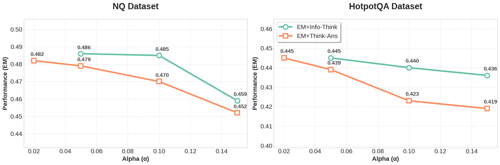
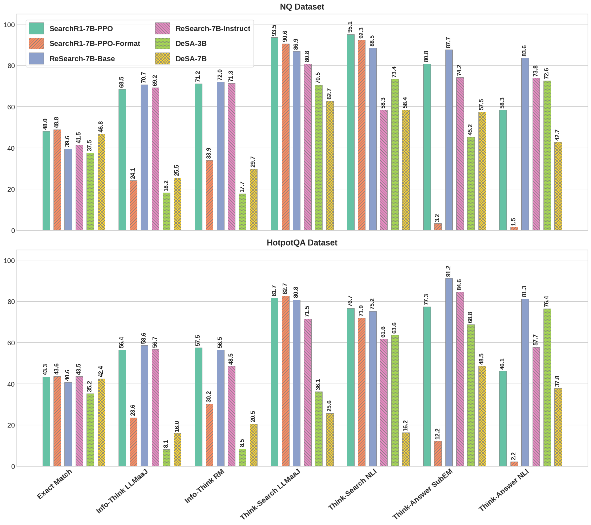
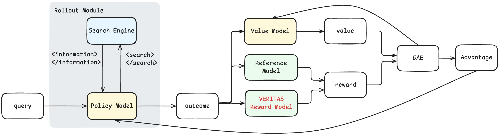
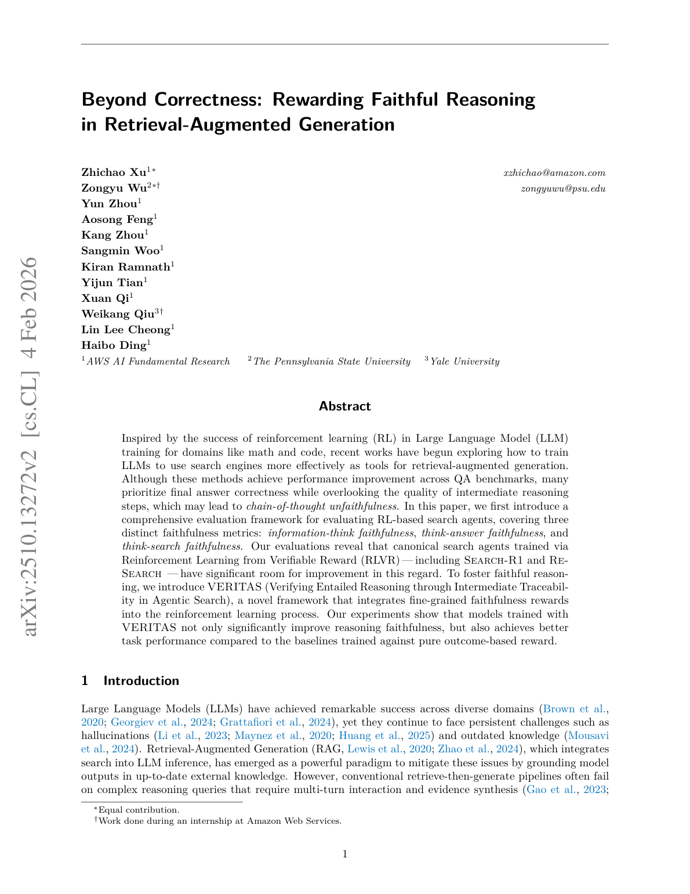
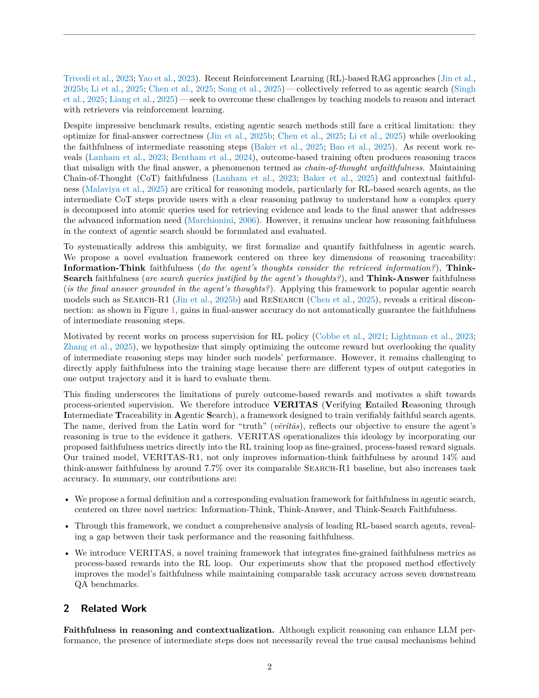

# 图片索引：Beyond Correctness: Rewarding Faithful Reasoning in Retrieval-Augmented Generation

- Note: `2025_VERITAS.md`
- PDF: https://arxiv.org/pdf/2510.13272
- Total images: 6

## source_01_faithfulness-results-main-latest.png

- Source: arxiv-source
- Note: faithfulness-results-main-latest.png
- Size: 289.4 KB

## source_02_hyperparam-sensitivity.png

- Source: arxiv-source
- Note: hyperparam-sensitivity.png
- Size: 111.4 KB

## source_03_searchr1-eval.png

- Source: arxiv-source
- Note: searchr1-eval.png
- Size: 414.8 KB

## source_04_VERITAS.png

- Source: arxiv-source
- Note: VERITAS.png
- Size: 188.8 KB

## page_01.png

- Source: pdf-page-render
- Note: page 1
- Size: 259.5 KB

## page_02.png

- Source: pdf-page-render
- Note: page 2
- Size: 384.3 KB

