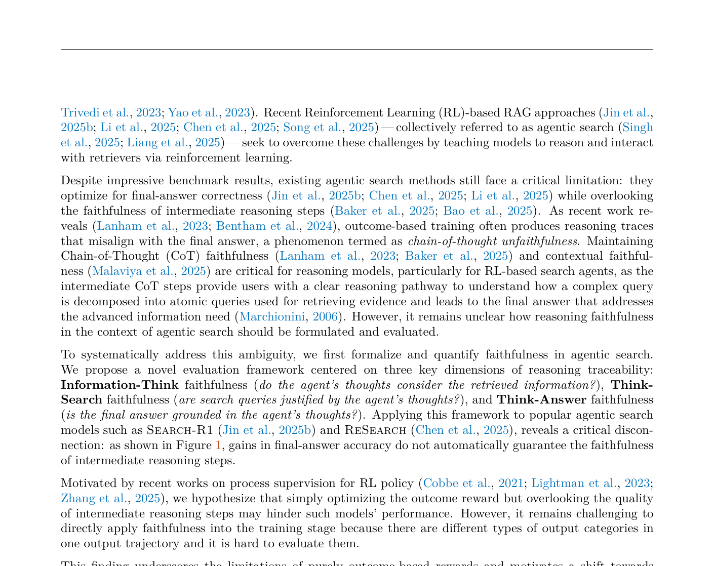
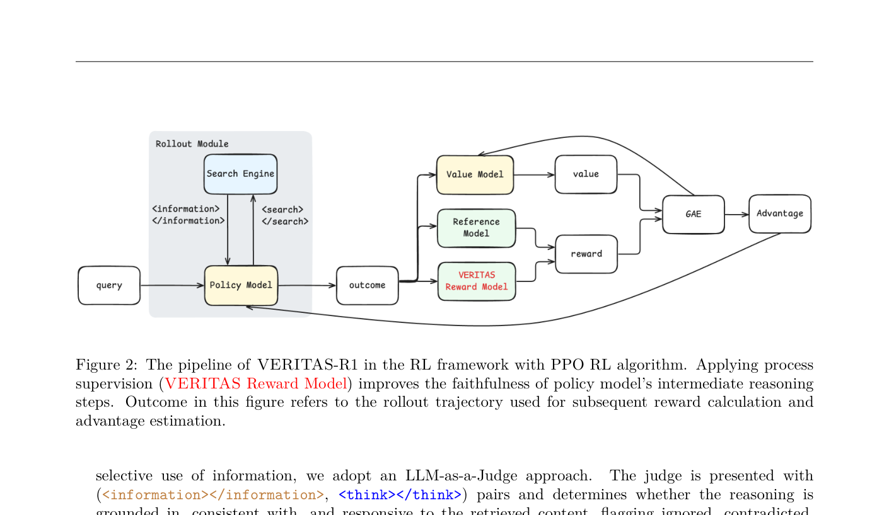
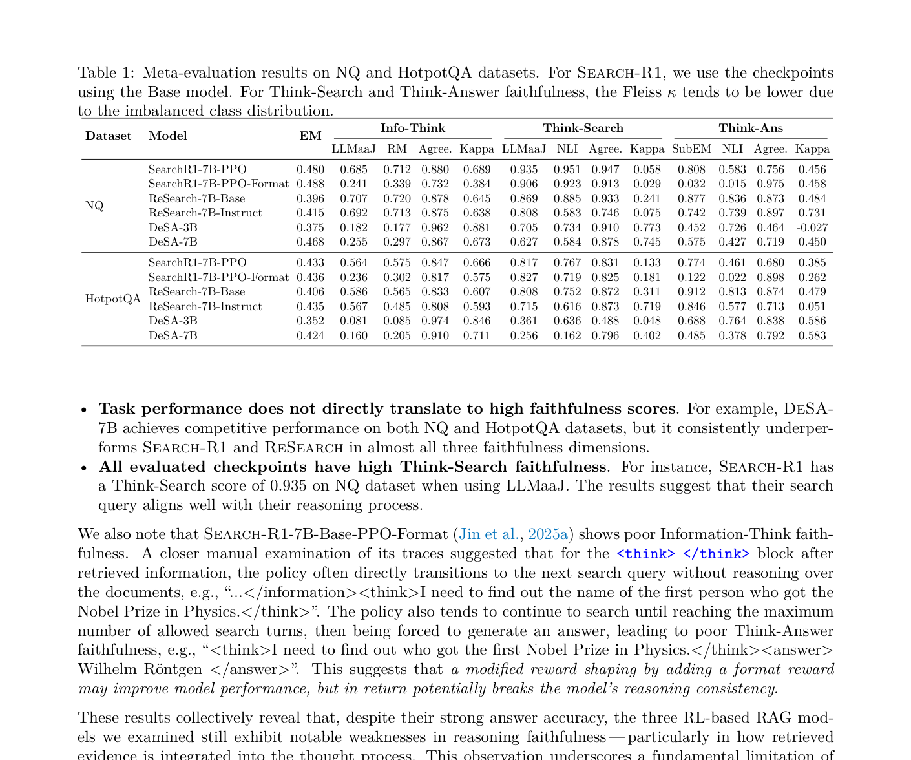

# 关键图表索引：Beyond Correctness: Rewarding Faithful Reasoning in Retrieval-Augmented Generation

- Note: `2025_VERITAS.md`
- PDF: https://arxiv.org/pdf/2510.13272
- Total key artifacts: 4

## figure1 - page 2

- File: `figure1_page02.png`
- Matched caption: Figure 1/Fig. 1/FIGURE 1/FIG. 1
- Size: 276.8 KB

## figure2 - page 6

- File: `figure2_page06.png`
- Matched caption: Figure 2/Fig. 2/FIGURE 2/FIG. 2
- Size: 137.9 KB

## table1 - page 7

- File: `table1_page07.png`
- Matched caption: Table 1/TABLE 1
- Size: 300.0 KB

## table2 - page 9

- File: `table2_page09.png`
- Matched caption: Table 2/TABLE 2
- Size: 247.2 KB

