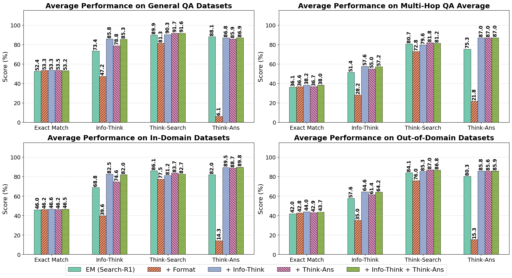
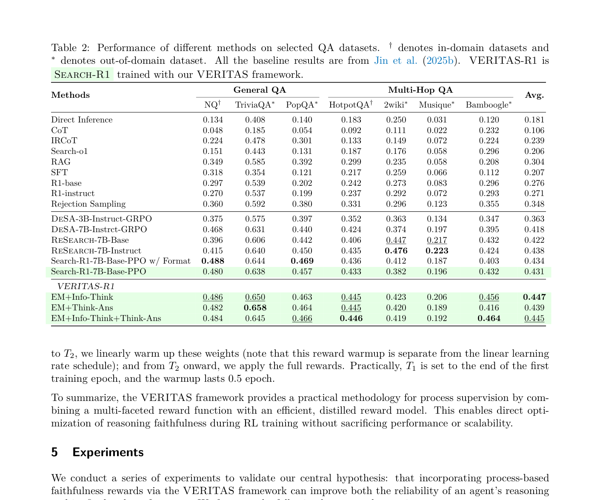

# 关键图表索引：Beyond Correctness: Rewarding Faithful Reasoning in Retrieval-Augmented Generation

- Note: `2025_VERITAS.md`
- PDF: https://arxiv.org/pdf/2510.13272
- Total key artifacts: 4

## figure1 - page source

- File: `figure1_source_faithfulness-results-main-latest.png`
- Priority: arxiv-source
- Source / matched caption: arXiv source: figures/faithfulness-results-main-latest.png
- Caption text: Faithfulness evaluation results comparing two variants of Search-R1 and our methods.
- Size: 289.4 KB

## figure2 - page source

- File: `figure2_source_hyperparam-sensitivity.png`
- Priority: arxiv-source
- Source / matched caption: arXiv source: figures/hyperparam-sensitivity.png
- Caption text: Hyperparameter sensitivity study.
- Size: 111.4 KB

## table1 - page 7

- File: `table1_pdfcrop_page07.png`
- Priority: pdf-caption-crop
- Source / matched caption: Table 1/TABLE 1
- Caption text: (empty)
- Size: 300.0 KB

## table2 - page 9

- File: `table2_pdfcrop_page09.png`
- Priority: pdf-caption-crop
- Source / matched caption: Table 2/TABLE 2
- Caption text: (empty)
- Size: 247.2 KB

