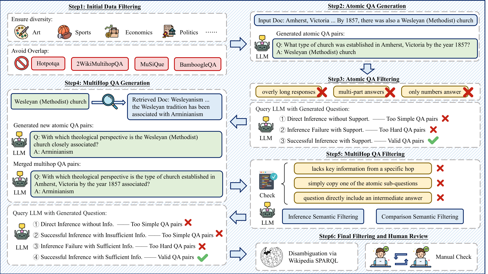
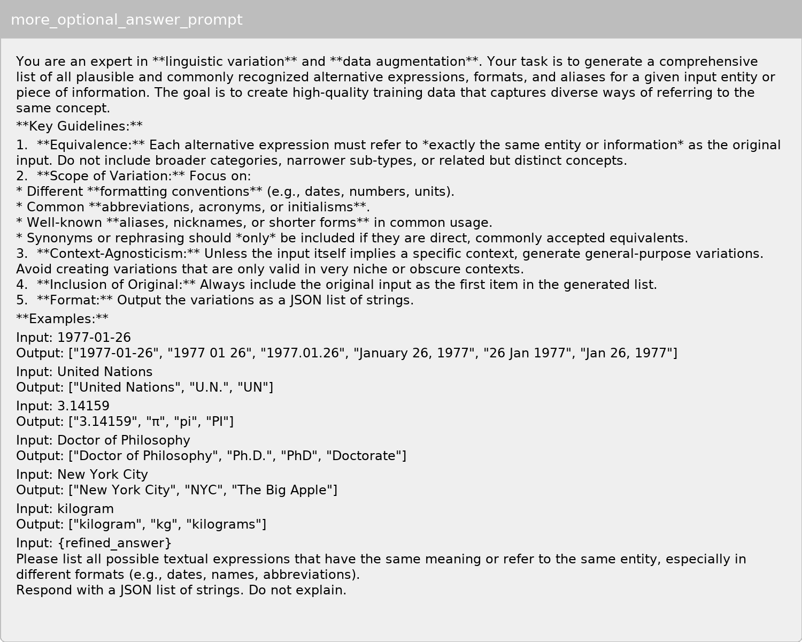
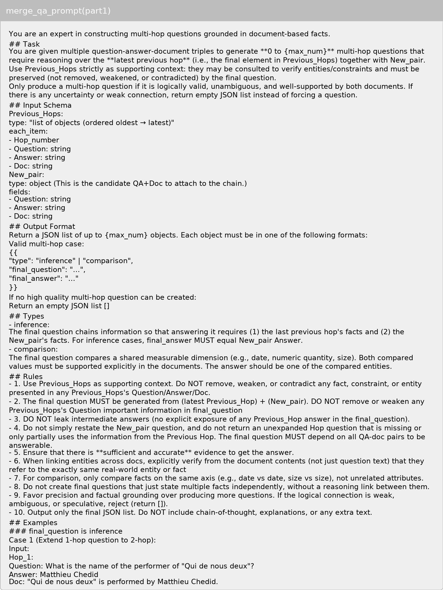
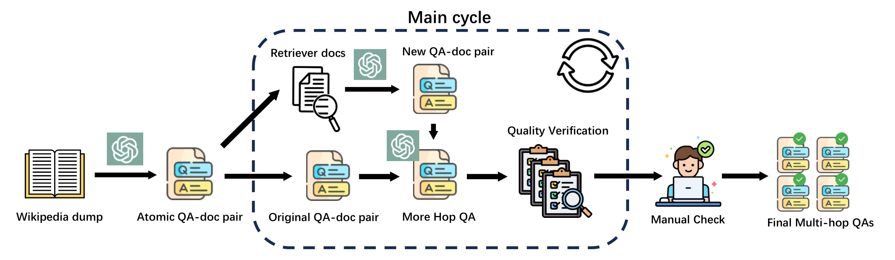
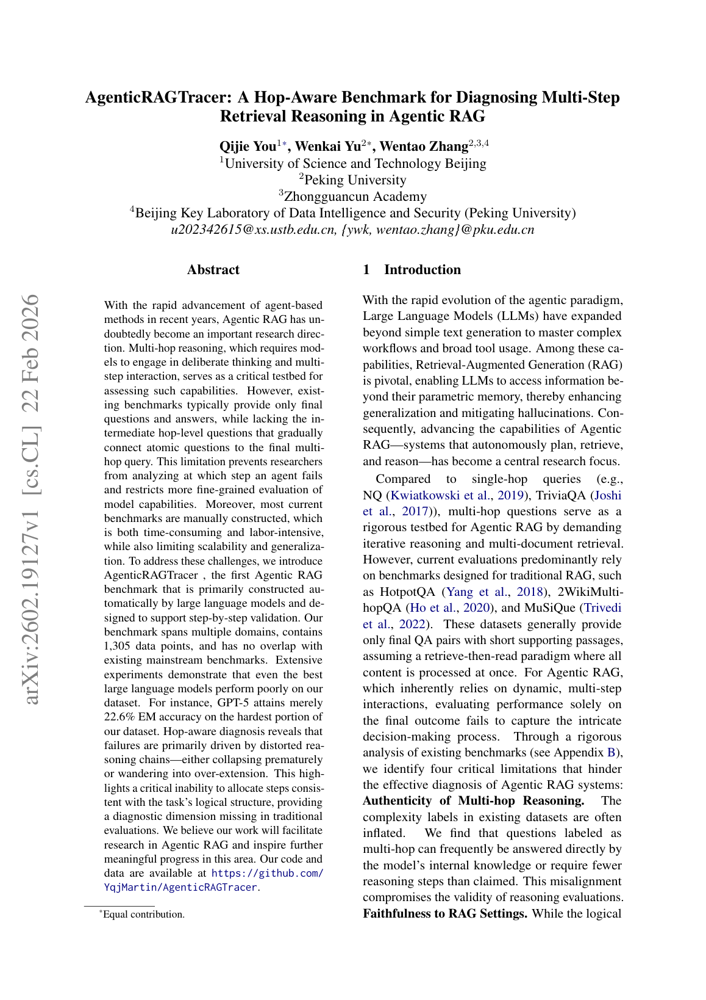
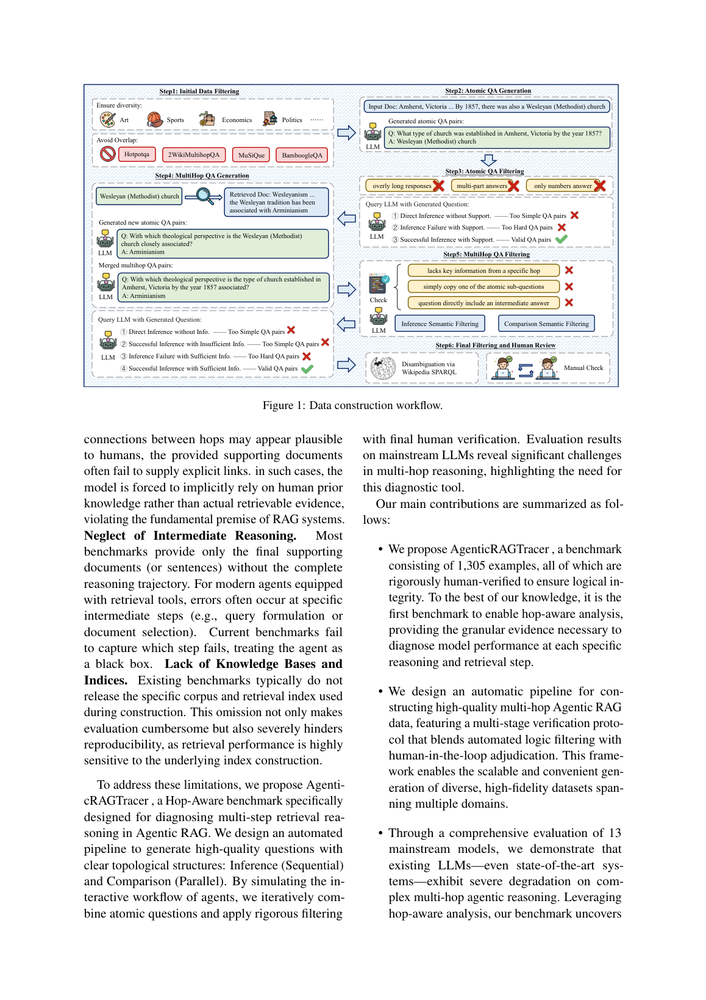

# 图片索引：AgenticRAGTracer: A Hop-Aware Benchmark for Diagnosing Multi-Step Retrieval Reasoning in Agentic RAG

- Note: `2026_AgenticRAGTracer.md`
- PDF: https://arxiv.org/pdf/2602.19127
- Total images: 6

## source_01_new_data_construction.png

- Source: arxiv-source
- Note: new_data_construction.pdf
- Size: 530.6 KB

## source_02_more_optional_answer_prompt.png

- Source: arxiv-source
- Note: more_optional_answer_prompt.png
- Size: 195.9 KB

## source_03_merge_qa_prompt_part1.png

- Source: arxiv-source
- Note: merge_qa_prompt_part1.png
- Size: 342.4 KB

## source_04_data_construction.png

- Source: arxiv-source
- Note: data_construction.pdf
- Size: 193.8 KB

## page_01.png

- Source: pdf-page-render
- Note: page 1
- Size: 429.1 KB

## page_02.png

- Source: pdf-page-render
- Note: page 2
- Size: 423.9 KB

