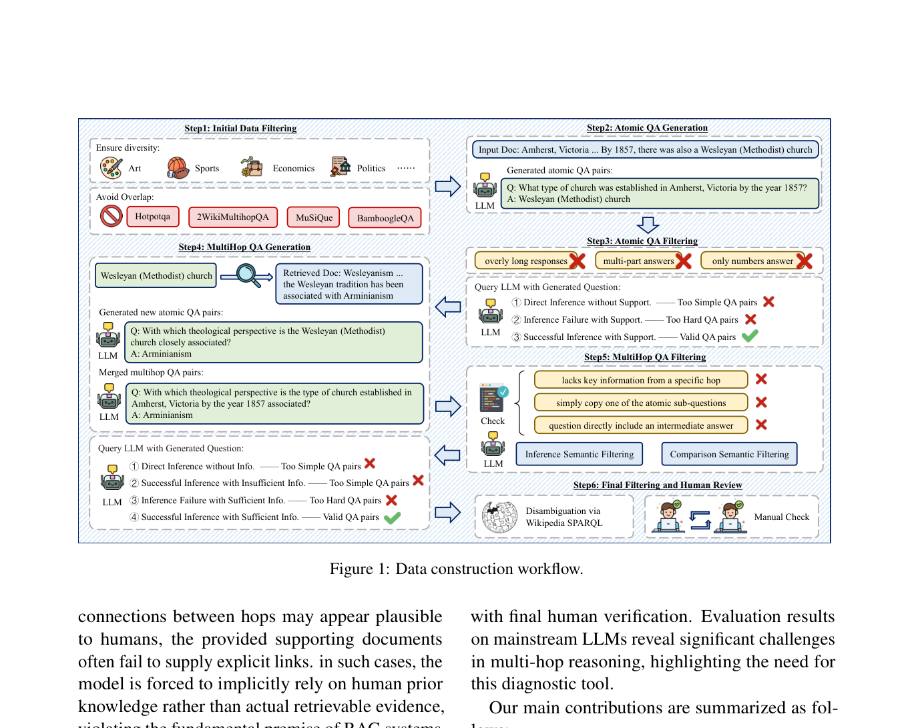
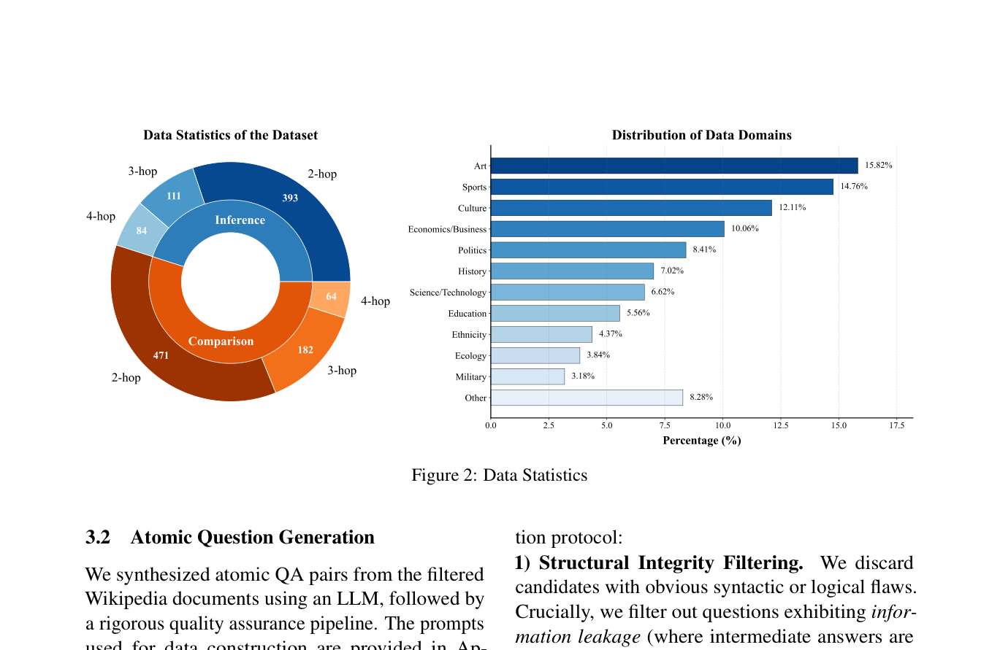
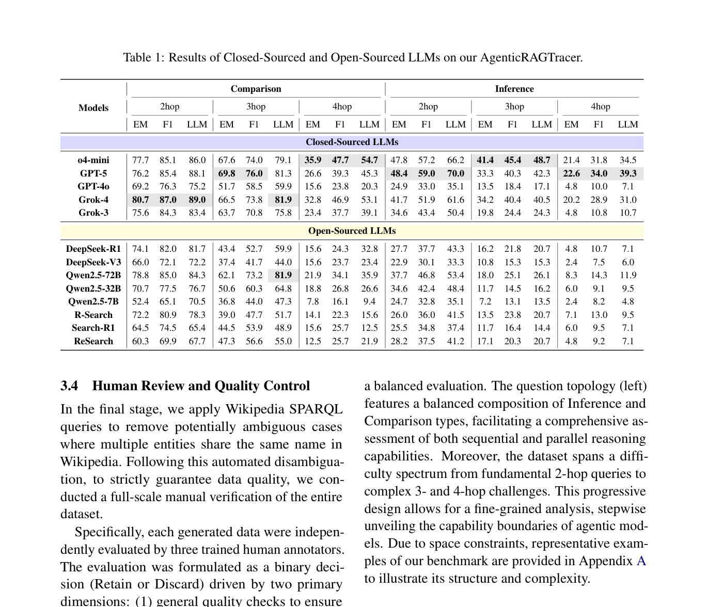
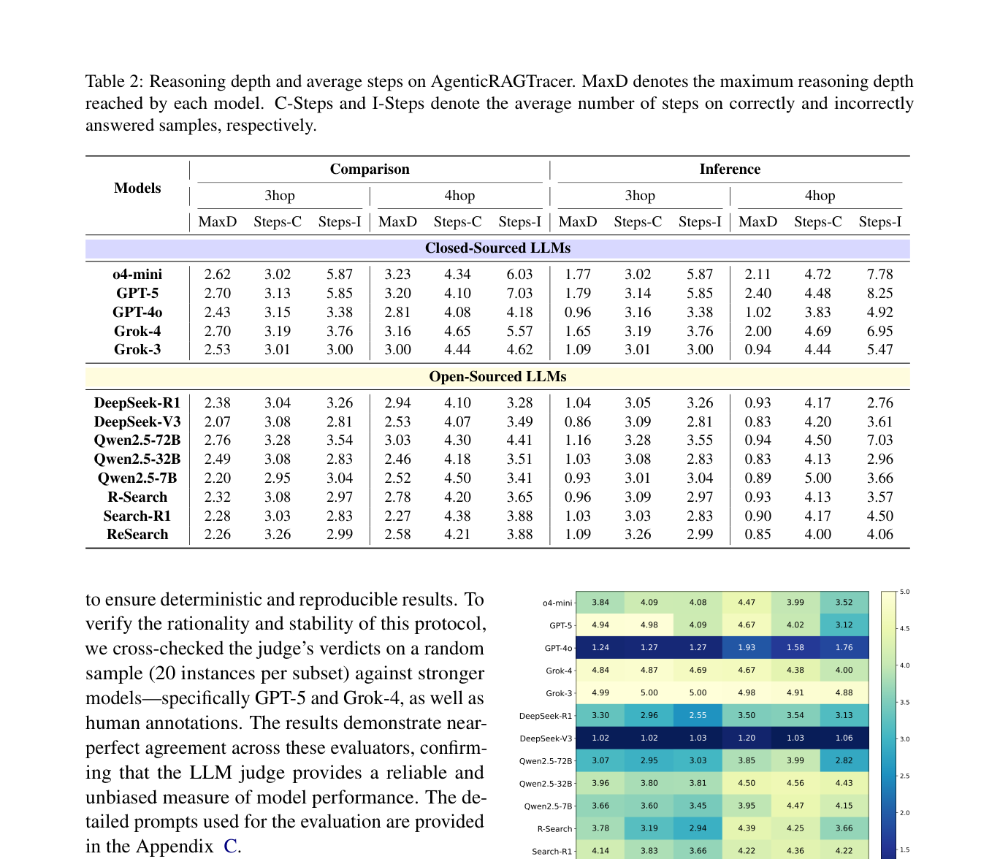

# 关键图表索引：AgenticRAGTracer: A Hop-Aware Benchmark for Diagnosing Multi-Step Retrieval Reasoning in Agentic RAG

- Note: `2026_AgenticRAGTracer.md`
- PDF: https://arxiv.org/pdf/2602.19127
- Total key artifacts: 4

## figure1 - page 2

- File: `figure1_page02.png`
- Matched caption: Figure 1/Fig. 1/FIGURE 1/FIG. 1
- Size: 288.4 KB

## figure2 - page 4

- File: `figure2_page04.png`
- Matched caption: Figure 2/Fig. 2/FIGURE 2/FIG. 2
- Size: 132.0 KB

## table1 - page 5

- File: `table1_page05.png`
- Matched caption: Table 1/TABLE 1
- Size: 276.6 KB

## table2 - page 6

- File: `table2_page06.png`
- Matched caption: Table 2/TABLE 2
- Size: 255.7 KB

