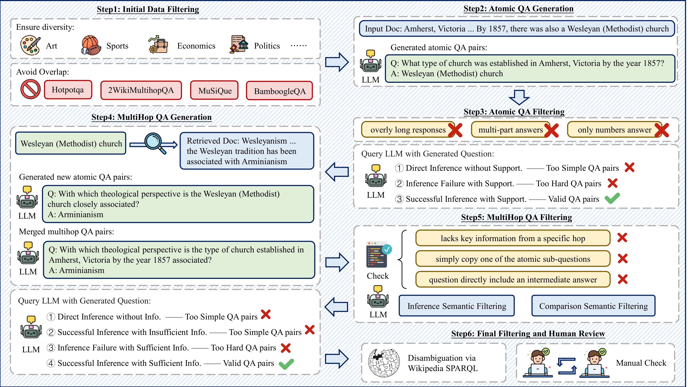
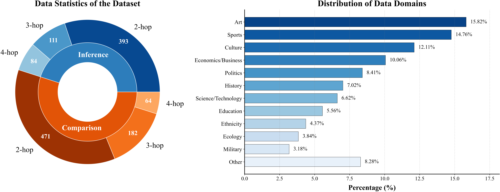

# 关键图表索引：AgenticRAGTracer: A Hop-Aware Benchmark for Diagnosing Multi-Step Retrieval Reasoning in Agentic RAG

- Note: `2026_AgenticRAGTracer.md`
- PDF: https://arxiv.org/pdf/2602.19127
- Total key artifacts: 4

## figure1 - page source

- File: `figure1_source_new_data_construction.png`
- Priority: arxiv-source
- Source / matched caption: arXiv source: new_data_construction.pdf
- Caption text: Data construction workflow.
- Size: 707.1 KB

## figure2 - page source

- File: `figure2_source_data_statistics.png`
- Priority: arxiv-source
- Source / matched caption: arXiv source: data_statistics.pdf
- Caption text: Data Statistics
- Size: 328.6 KB

## table1 - page 5

- File: `table1_pdfcrop_page05.png`
- Priority: pdf-caption-crop
- Source / matched caption: Table 1/TABLE 1
- Caption text: (empty)
- Size: 276.6 KB

## table2 - page 6

- File: `table2_pdfcrop_page06.png`
- Priority: pdf-caption-crop
- Source / matched caption: Table 2/TABLE 2
- Caption text: (empty)
- Size: 255.7 KB

