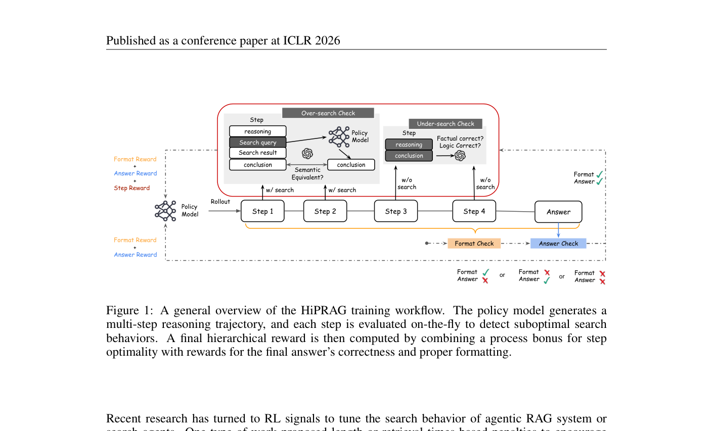
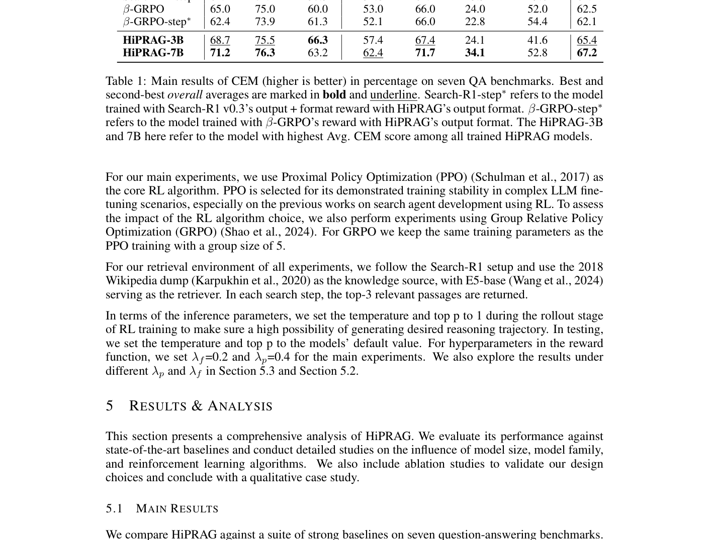
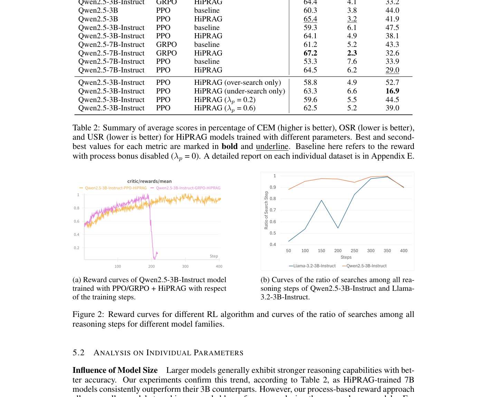
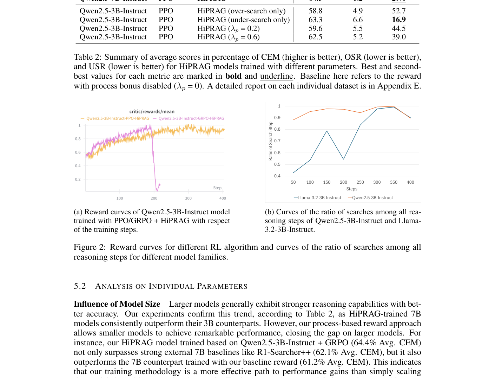

# 关键图表索引：HiPRAG: Hierarchical Process Rewards for Efficient Agentic Retrieval Augmented Generation

- Note: `2026_HiPRAG.md`
- PDF: https://openreview.net/pdf?id=Gt4v9WBPzm
- Total key artifacts: 4

## figure1 - page 2

- File: `figure1_pdfcrop_page02.png`
- Priority: pdf-caption-crop
- Source / matched caption: Figure 1/Fig. 1/FIGURE 1/FIG. 1
- Caption text: (empty)
- Size: 122.4 KB

## table1 - page 7

- File: `table1_pdfcrop_page07.png`
- Priority: pdf-caption-crop
- Source / matched caption: Table 1/TABLE 1
- Caption text: (empty)
- Size: 238.6 KB

## figure2 - page 8

- File: `figure2_pdfcrop_page08.png`
- Priority: pdf-caption-crop
- Source / matched caption: Figure 2/Fig. 2/FIGURE 2/FIG. 2
- Caption text: (empty)
- Size: 259.9 KB

## table2 - page 8

- File: `table2_pdfcrop_page08.png`
- Priority: pdf-caption-crop
- Source / matched caption: Table 2/TABLE 2
- Caption text: (empty)
- Size: 250.9 KB

