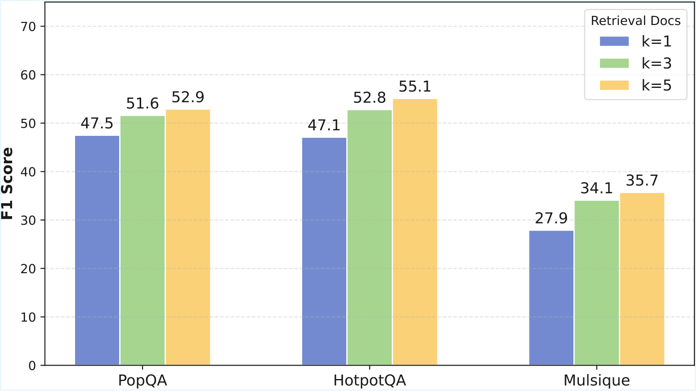
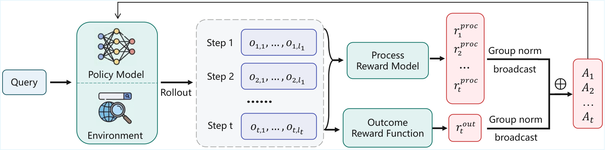
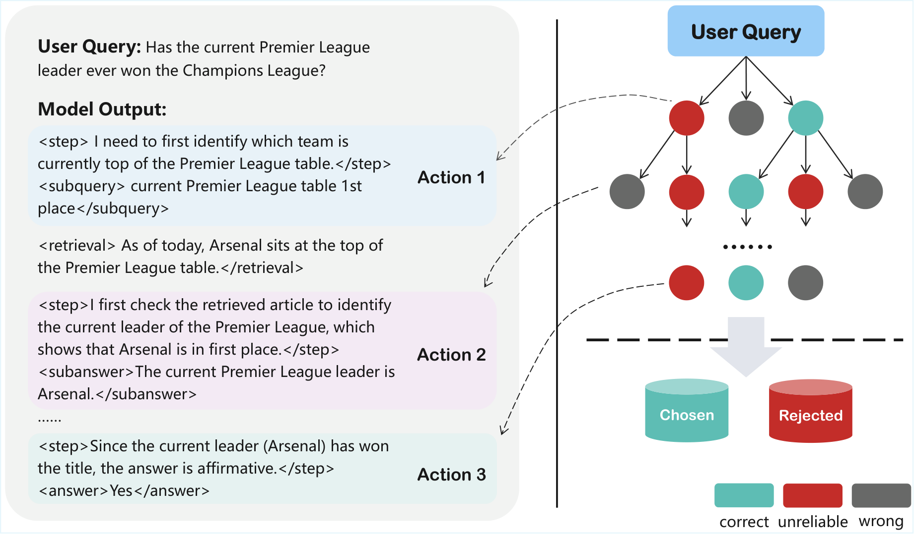
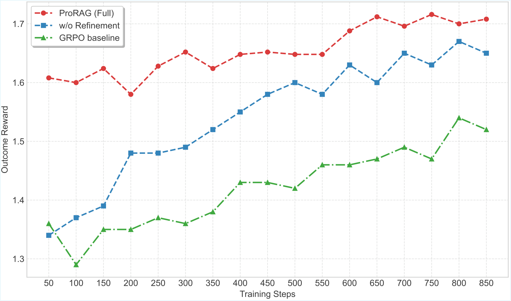
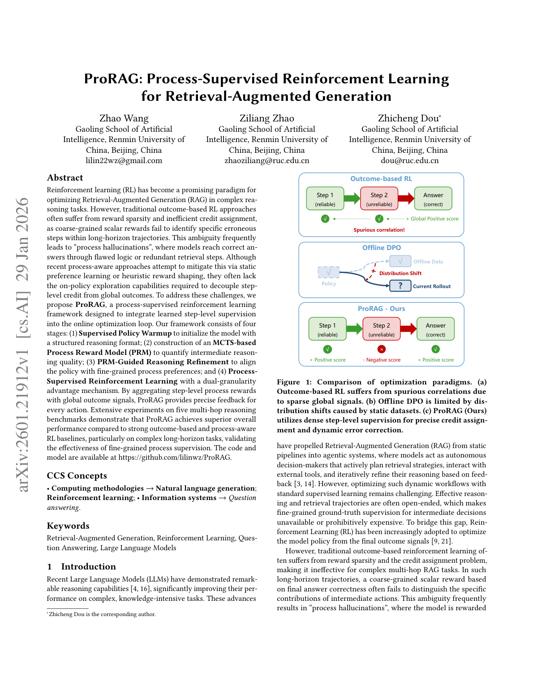
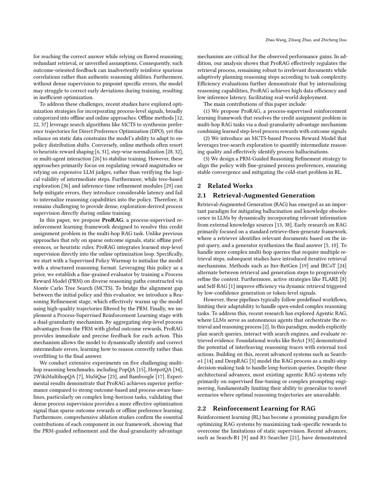

# 图片索引：ProRAG: Process-Supervised Reinforcement Learning for Retrieval-Augmented Generation

- Note: `2026_ProRAG.md`
- PDF: https://arxiv.org/pdf/2601.21912
- Total images: 6

## source_01_retrieval_k.png

- Source: arxiv-source
- Note: retrieval_k.pdf
- Size: 55.0 KB

## source_02_stage4.png

- Source: arxiv-source
- Note: stage4.pdf
- Size: 147.5 KB

## source_03_stage1.png

- Source: arxiv-source
- Note: stage1.pdf
- Size: 195.5 KB

## source_04_rl_reward_curve.png

- Source: arxiv-source
- Note: rl_reward_curve.pdf
- Size: 137.0 KB

## page_01.png

- Source: pdf-page-render
- Note: page 1
- Size: 406.7 KB

## page_02.png

- Source: pdf-page-render
- Note: page 2
- Size: 512.6 KB

