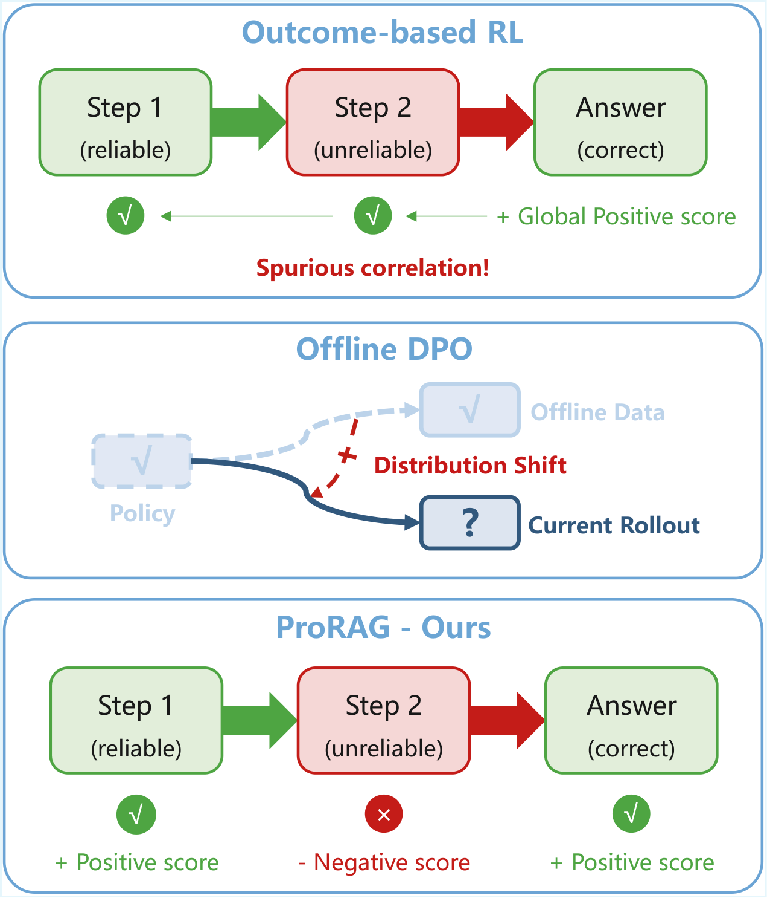
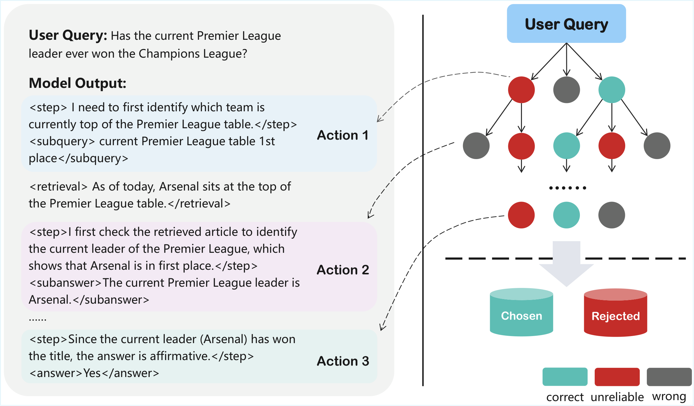
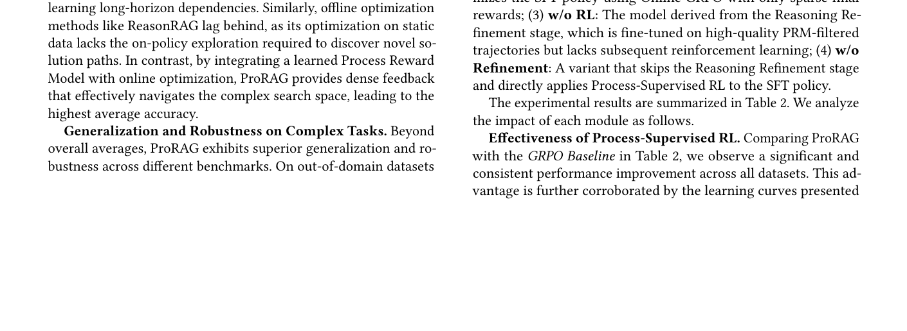

# 关键图表索引：ProRAG: Process-Supervised Reinforcement Learning for Retrieval-Augmented Generation

- Note: `2026_ProRAG.md`
- PDF: https://arxiv.org/pdf/2601.21912
- Total key artifacts: 4

## figure1 - page source

- File: `figure1_source_comparison.png`
- Priority: arxiv-source
- Source / matched caption: arXiv source: images/comparison.pdf
- Caption text: Comparison of optimization paradigms. \textbf{(a) Outcome-based RL} suffers from spurious correlations due to sparse global signals. \textbf{(b) Offline DPO} is limited by distribution shifts caused by static datasets. \textbf{(c) ProRAG (O
- Size: 136.3 KB

## figure2 - page source

- File: `figure2_source_stage1.png`
- Priority: arxiv-source
- Source / matched caption: arXiv source: images/stage1.pdf
- Caption text: The left panel presents the reasoning format of our model, while the right illustrates the Monte Carlo Tree Search (MCTS) mechanism used to train the Process Reward Model.
- Size: 247.0 KB

## table1 - page 3

- File: `table1_pdfcrop_page03.png`
- Priority: pdf-caption-crop
- Source / matched caption: Table 1/TABLE 1
- Caption text: (empty)
- Size: 356.7 KB

## table2 - page 7

- File: `table2_pdfcrop_page07.png`
- Priority: pdf-caption-crop
- Source / matched caption: Table 2/TABLE 2
- Caption text: (empty)
- Size: 144.7 KB

