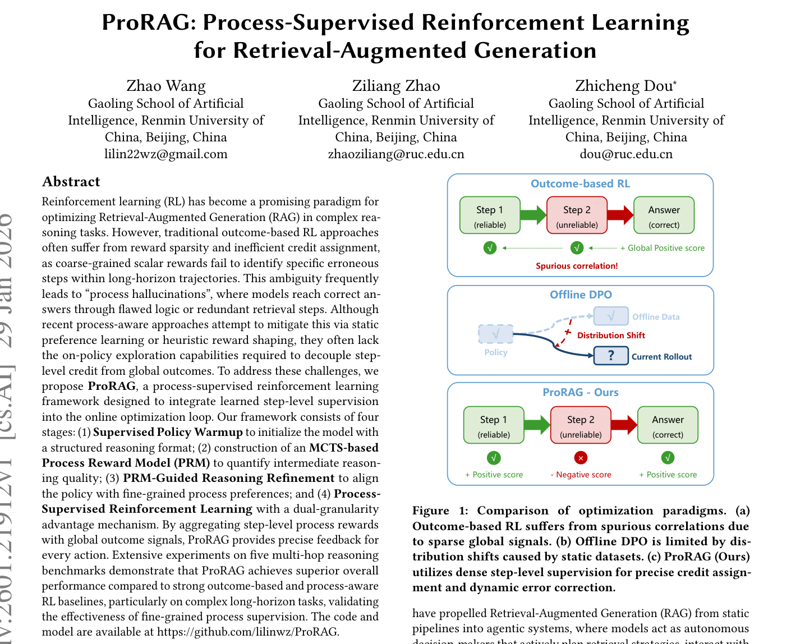
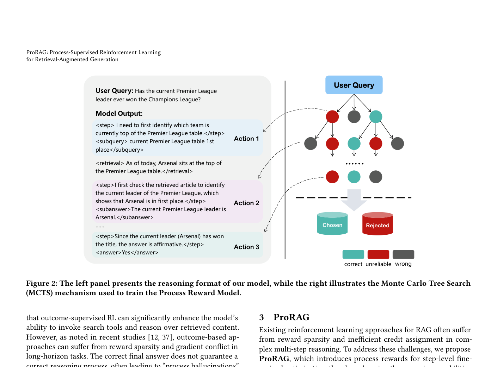
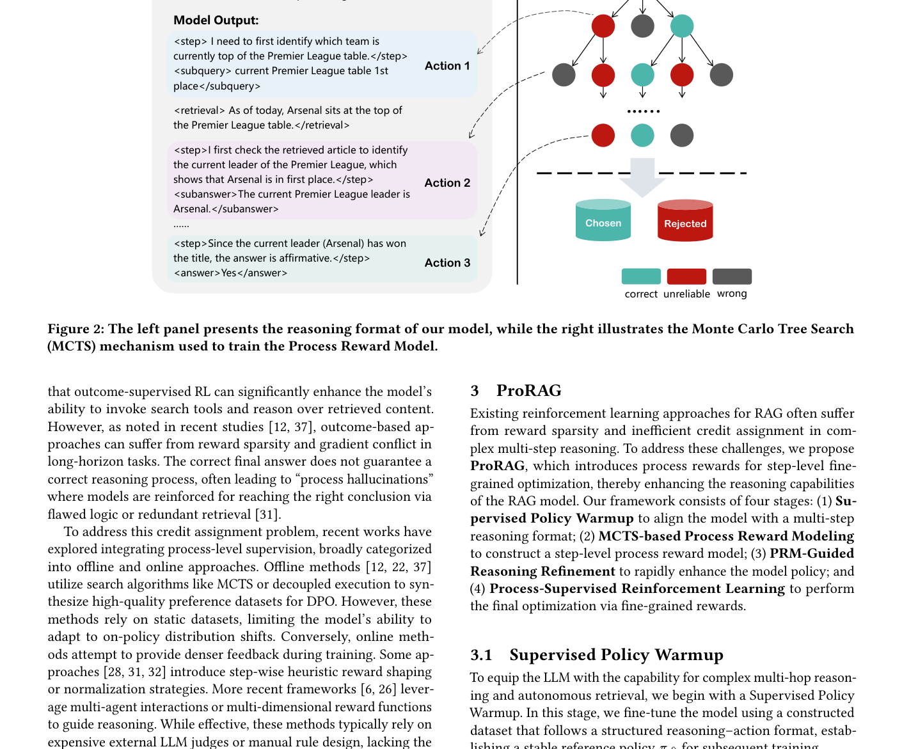

# 关键图表索引：ProRAG: Process-Supervised Reinforcement Learning for Retrieval-Augmented Generation

- Note: `2026_ProRAG.md`
- PDF: https://arxiv.org/pdf/2601.21912
- Total key artifacts: 4

## figure1 - page 1

- File: `figure1_page01.png`
- Matched caption: Figure 1/Fig. 1/FIGURE 1/FIG. 1
- Size: 377.5 KB

## figure2 - page 3

- File: `figure2_page03.png`
- Matched caption: Figure 2/Fig. 2/FIGURE 2/FIG. 2
- Size: 192.2 KB

## table1 - page 3

- File: `table1_page03.png`
- Matched caption: Table 1/TABLE 1
- Size: 356.7 KB

## table2 - page 7

- File: `table2_page07.png`
- Matched caption: Table 2/TABLE 2
- Size: 144.7 KB

