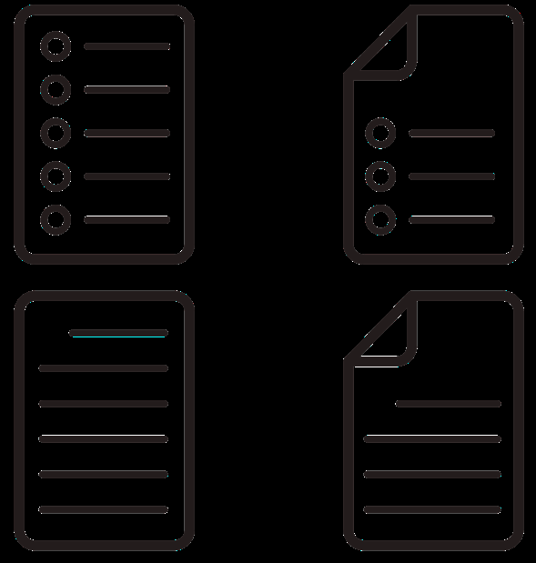
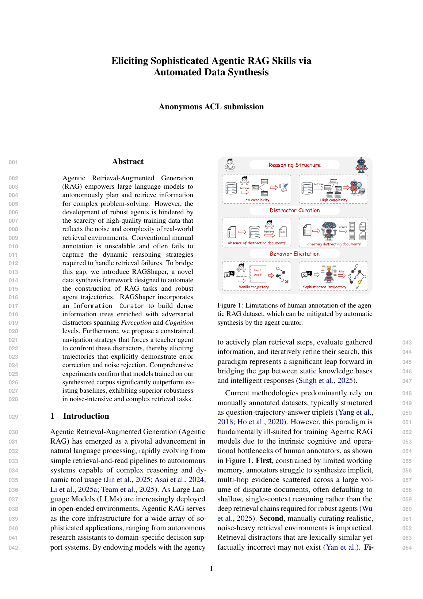
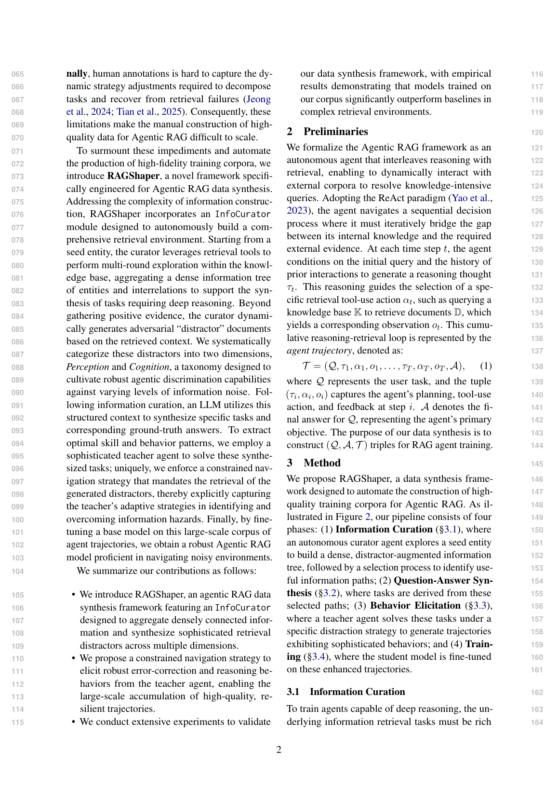

# 图片索引：RAGShaper: Eliciting Sophisticated Agentic RAG Skills via Automated Data Synthesis

- Note: `2026_RAGShaper.md`
- PDF: https://openreview.net/attachment?id=VnppICw50X&name=pdf
- Total images: 6

## pdf_p01_04.png

- Source: pdf-extraction
- Note: page 1
- Size: 19.3 KB

## pdf_p01_05.png

- Source: pdf-extraction
- Note: page 1
- Size: 64.6 KB

## pdf_p01_06.jpeg

- Source: pdf-extraction
- Note: page 1
- Size: 32.2 KB

## pdf_p01_07.jpeg

- Source: pdf-extraction
- Note: page 1
- Size: 17.0 KB

## page_01.png

- Source: pdf-page-render
- Note: page 1
- Size: 400.1 KB

## page_02.png

- Source: pdf-page-render
- Note: page 2
- Size: 480.7 KB

