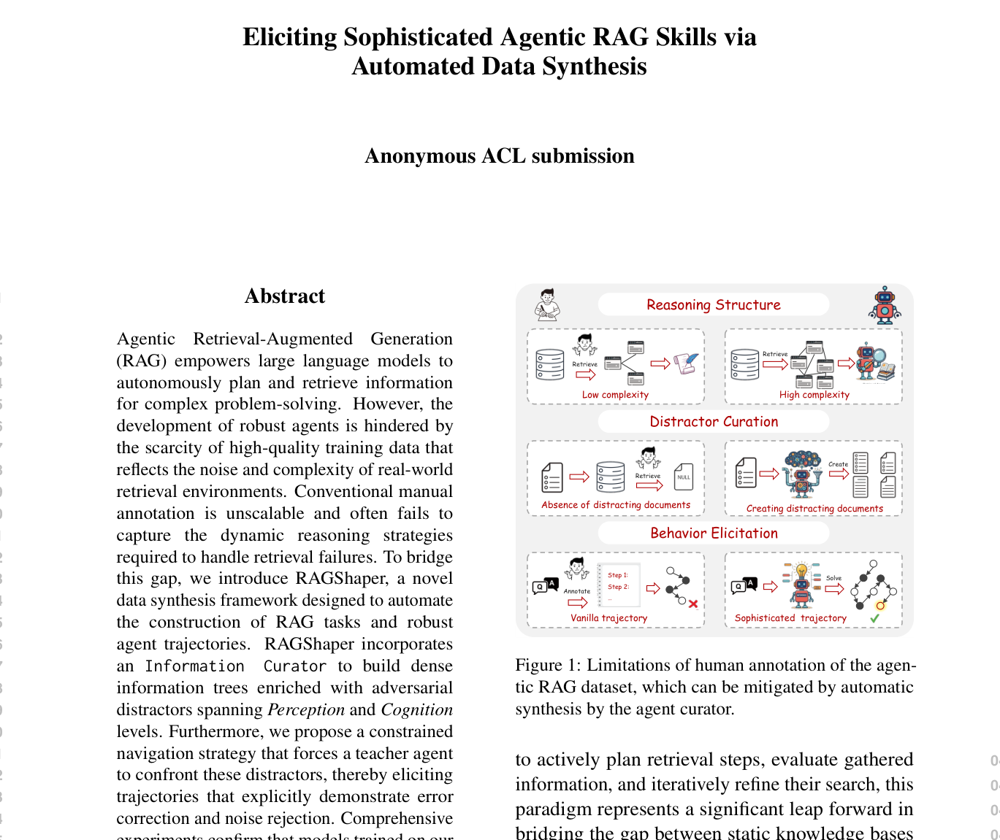
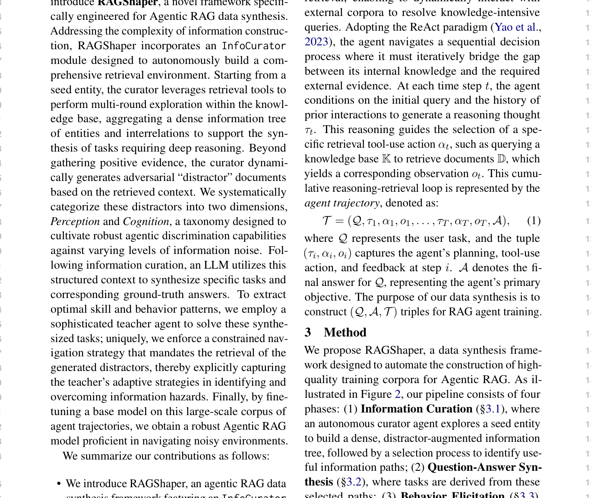
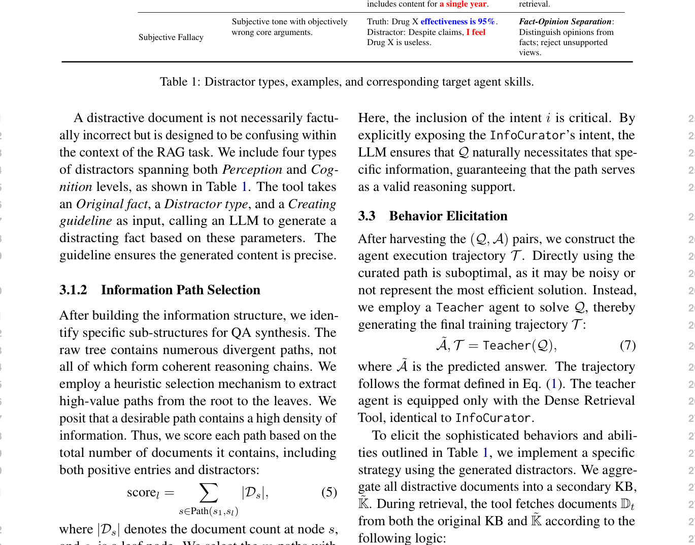
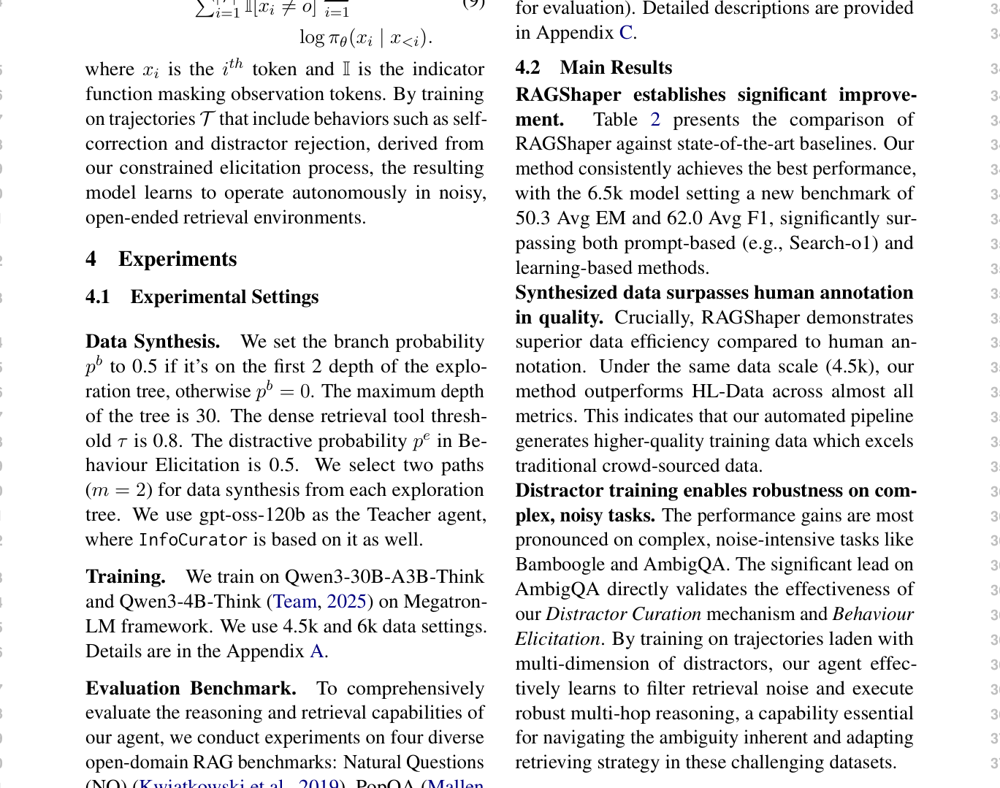

# 关键图表索引：RAGShaper: Eliciting Sophisticated Agentic RAG Skills via Automated Data Synthesis

- Note: `2026_RAGShaper.md`
- PDF: https://openreview.net/attachment?id=VnppICw50X&name=pdf
- Total key artifacts: 4

## figure1 - page 1

- File: `figure1_pdfcrop_page01.png`
- Priority: pdf-caption-crop
- Source / matched caption: Figure 1/Fig. 1/FIGURE 1/FIG. 1
- Caption text: (empty)
- Size: 284.1 KB

## figure2 - page 2

- File: `figure2_pdfcrop_page02.png`
- Priority: pdf-caption-crop
- Source / matched caption: Figure 2/Fig. 2/FIGURE 2/FIG. 2
- Caption text: (empty)
- Size: 383.8 KB

## table1 - page 4

- File: `table1_pdfcrop_page04.png`
- Priority: pdf-caption-crop
- Source / matched caption: Table 1/TABLE 1
- Caption text: (empty)
- Size: 290.7 KB

## table2 - page 5

- File: `table2_pdfcrop_page05.png`
- Priority: pdf-caption-crop
- Source / matched caption: Table 2/TABLE 2
- Caption text: (empty)
- Size: 334.1 KB

