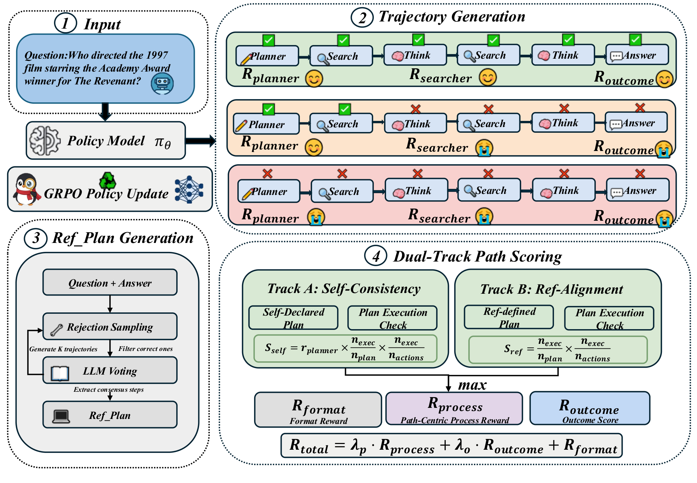
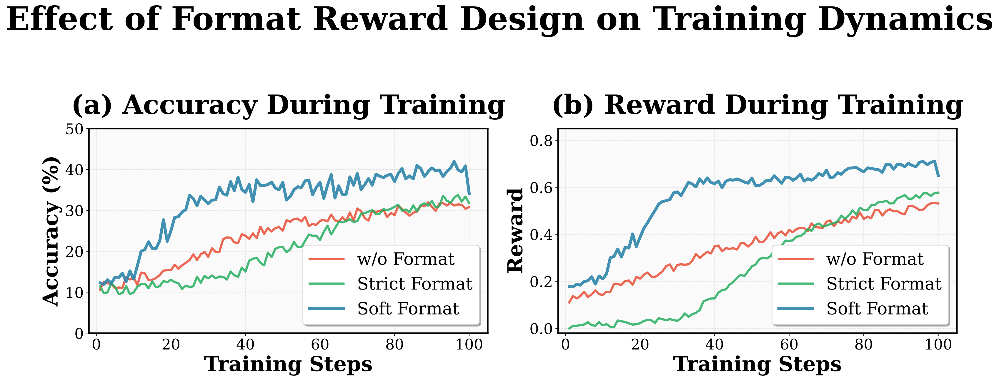
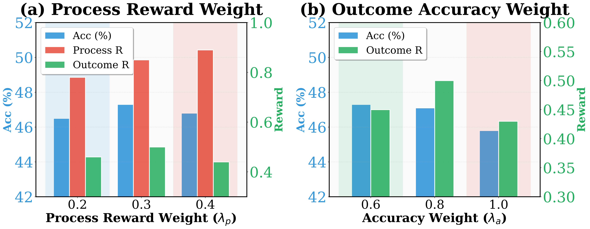
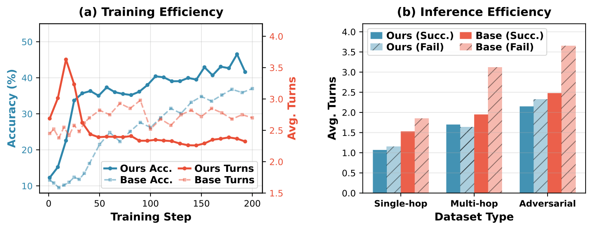
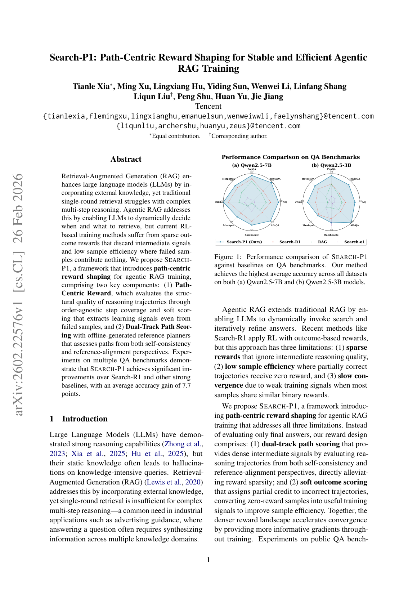
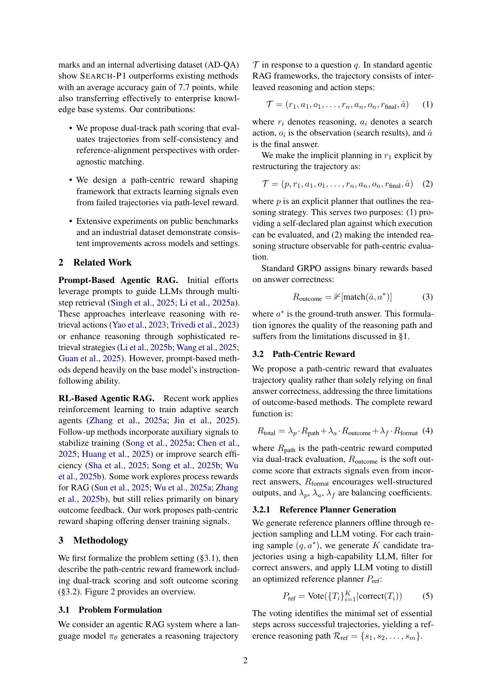

# 图片索引：Search-P1: Path-Centric Reward Shaping for Stable and Efficient Agentic RAG Training

- Note: `2026_Search_P1.md`
- PDF: https://arxiv.org/pdf/2602.22576
- Total images: 6

## source_01_ACL2026_main.png

- Source: arxiv-source
- Note: ACL2026_main.pdf
- Size: 475.9 KB

## source_02_format_reward_convergence.png

- Source: arxiv-source
- Note: format_reward_convergence.pdf
- Size: 350.6 KB

## source_03_hyperparameter_analysis.png

- Source: arxiv-source
- Note: hyperparameter_analysis.pdf
- Size: 322.2 KB

## source_04_efficiency_analysis.png

- Source: arxiv-source
- Note: efficiency_analysis.pdf
- Size: 116.8 KB

## page_01.png

- Source: pdf-page-render
- Note: page 1
- Size: 408.8 KB

## page_02.png

- Source: pdf-page-render
- Note: page 2
- Size: 412.7 KB

