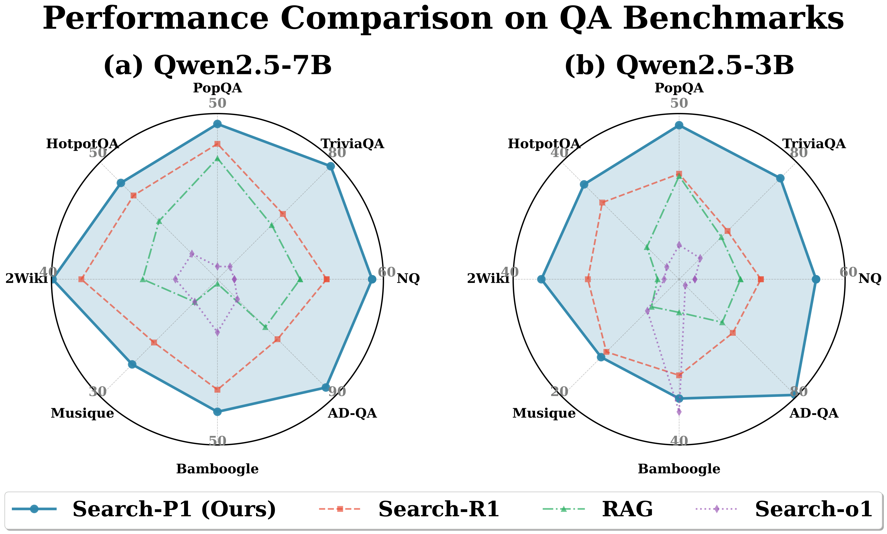
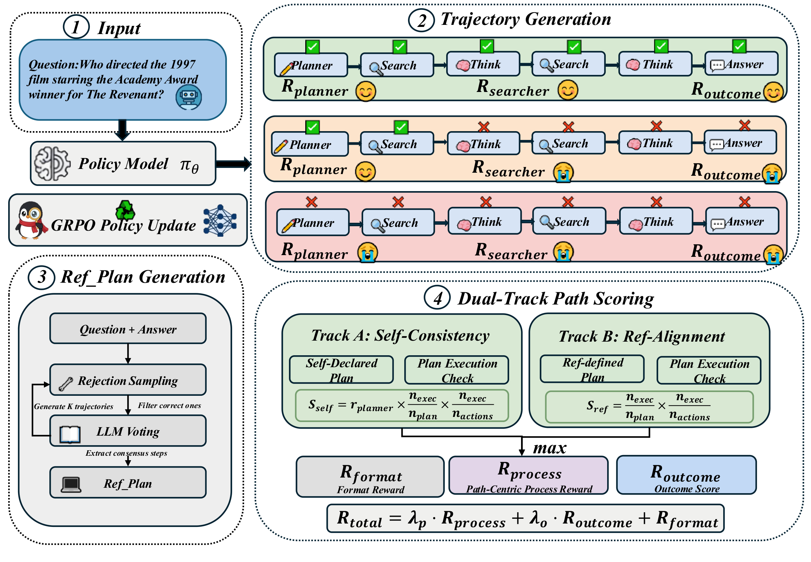
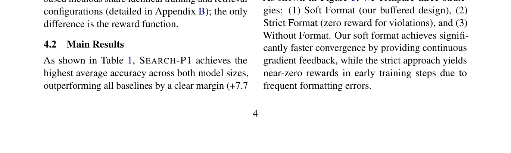
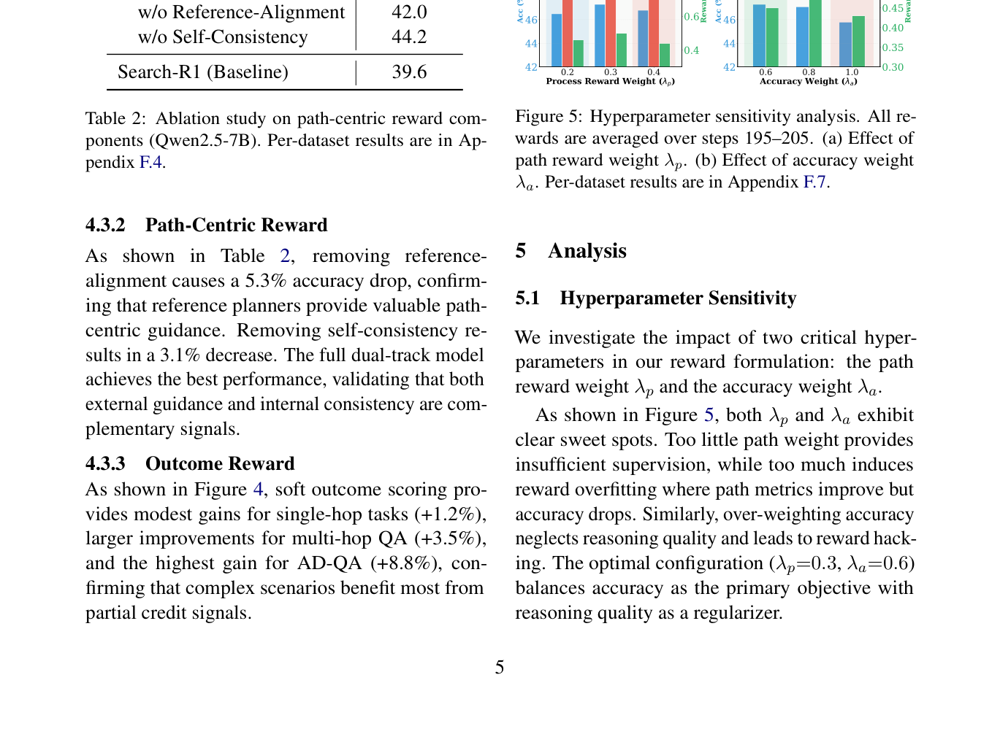

# 关键图表索引：Search-P1: Path-Centric Reward Shaping for Stable and Efficient Agentic RAG Training

- Note: `2026_Search_P1.md`
- PDF: https://arxiv.org/pdf/2602.22576
- Total key artifacts: 4

## figure1 - page source

- File: `figure1_source_radar_comparison.png`
- Priority: arxiv-source
- Source / matched caption: arXiv source: figures/radar_comparison.pdf
- Caption text: Performance comparison of \method against baselines on QA benchmarks. Our method achieves the highest average accuracy across all datasets on both (a) Qwen2.5-7B and (b) Qwen2.5-3B models.
- Size: 670.8 KB

## figure2 - page source

- File: `figure2_source_ACL2026_main.png`
- Priority: arxiv-source
- Source / matched caption: arXiv source: ACL2026_main.pdf
- Caption text: Overview of \method framework. Our approach introduces path-centric reward shaping for agentic RAG training, comprising: (1) Dual-Track Path Scoring that evaluates trajectories from both self-consistency and reference-alignment perspectives
- Size: 501.7 KB

## table1 - page 4

- File: `table1_pdfcrop_page04.png`
- Priority: pdf-caption-crop
- Source / matched caption: Table 1/TABLE 1
- Caption text: (empty)
- Size: 77.0 KB

## table2 - page 5

- File: `table2_pdfcrop_page05.png`
- Priority: pdf-caption-crop
- Source / matched caption: Table 2/TABLE 2
- Caption text: (empty)
- Size: 228.4 KB

