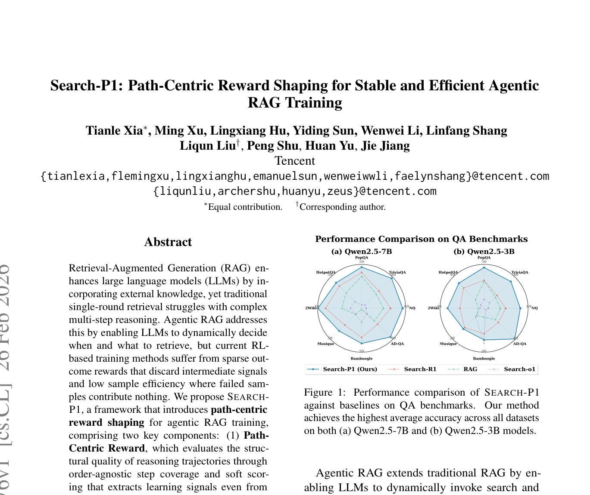
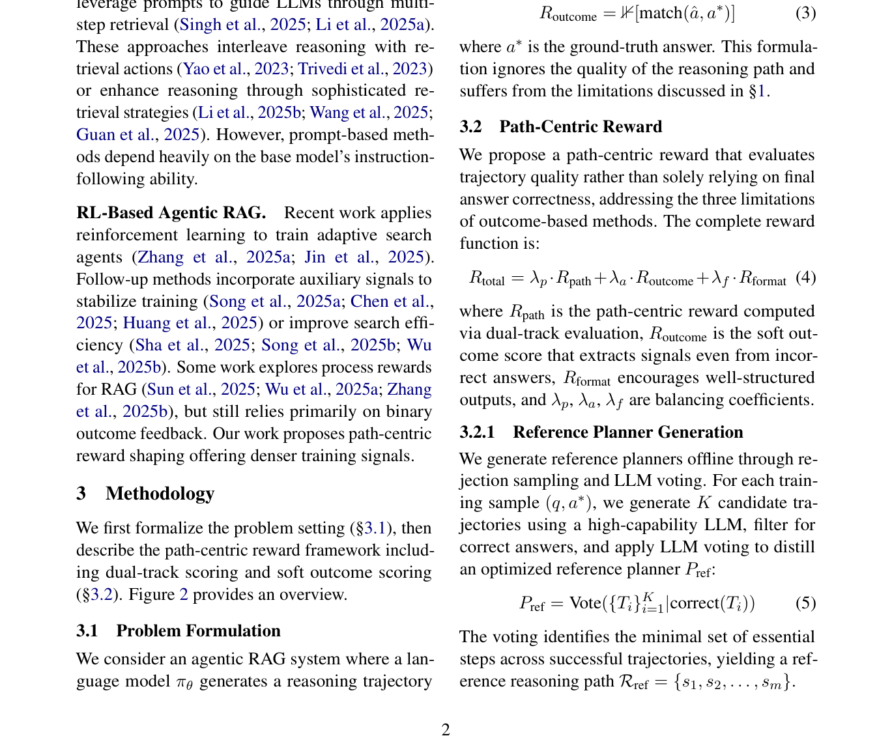

# 关键图表索引：Search-P1: Path-Centric Reward Shaping for Stable and Efficient Agentic RAG Training

- Note: `2026_Search_P1.md`
- PDF: https://arxiv.org/pdf/2602.22576
- Total key artifacts: 4

## figure1 - page 1

- File: `figure1_page01.png`
- Matched caption: Figure 1/Fig. 1/FIGURE 1/FIG. 1
- Size: 257.1 KB

## figure2 - page 2

- File: `figure2_page02.png`
- Matched caption: Figure 2/Fig. 2/FIGURE 2/FIG. 2
- Size: 330.9 KB

## table1 - page 4

- File: `table1_page04.png`
- Matched caption: Table 1/TABLE 1
- Size: 77.0 KB

## table2 - page 5

- File: `table2_page05.png`
- Matched caption: Table 2/TABLE 2
- Size: 228.4 KB

