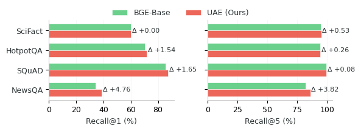
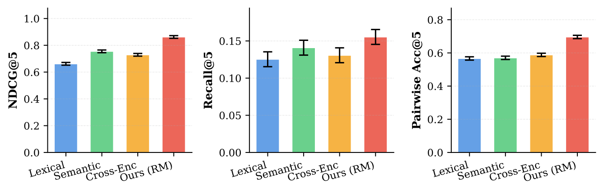
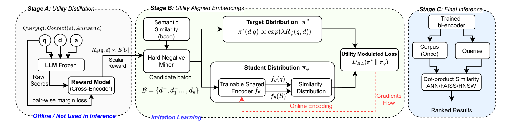
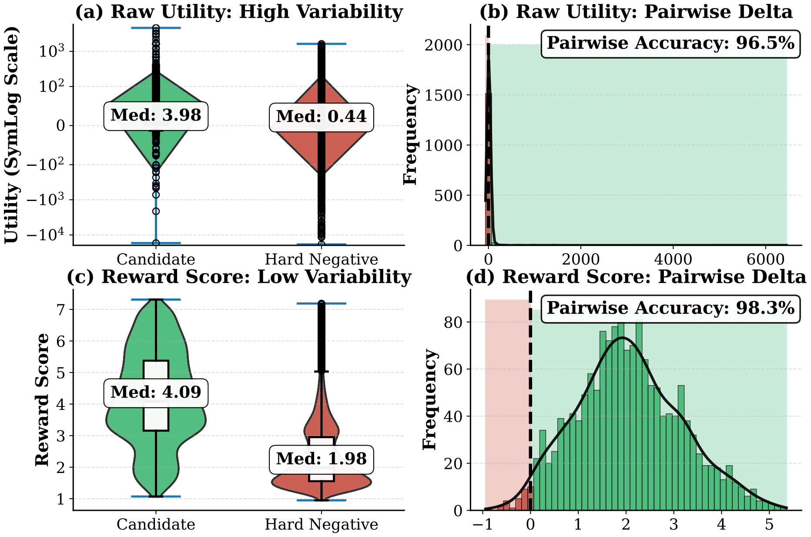
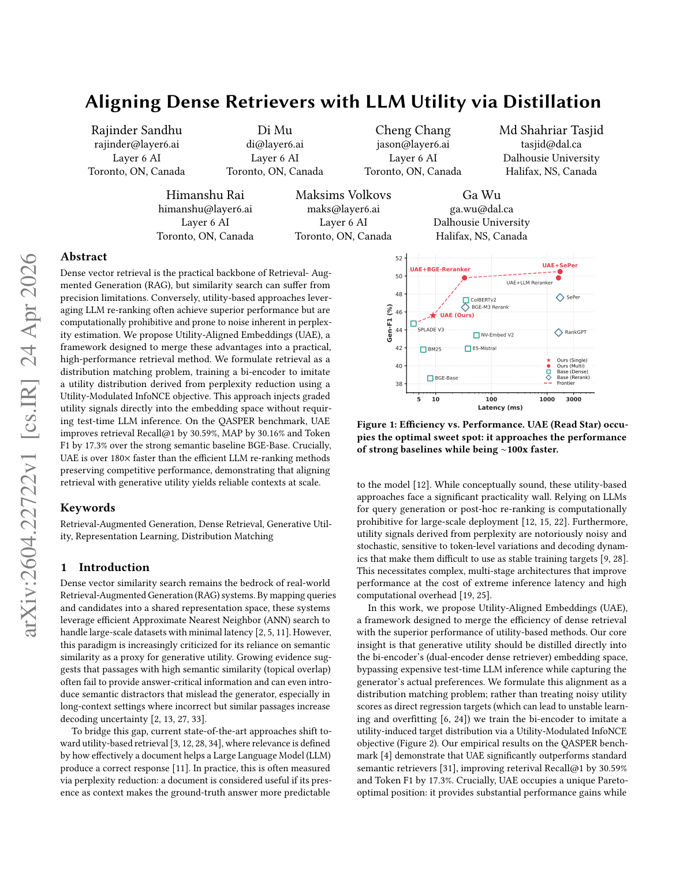
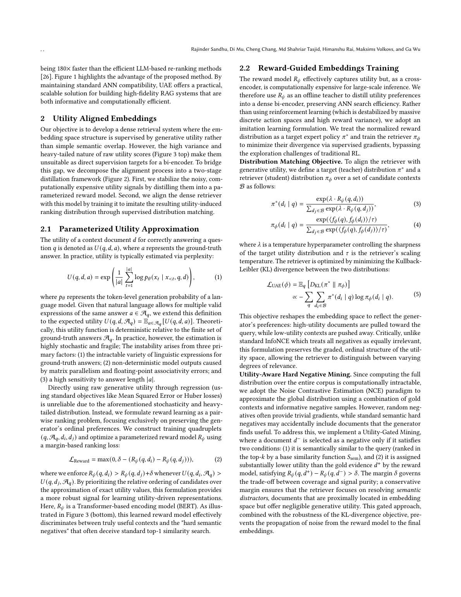

# 图片索引：Aligning Dense Retrievers with LLM Utility via Distillation

- Note: `2026_Utility_Aligned_Embeddings.md`
- PDF: https://arxiv.org/pdf/2604.22722
- Total images: 6

## source_01_transfer.png

- Source: arxiv-source
- Note: transfer.png
- Size: 18.5 KB

## source_02_reward_alignment.png

- Source: arxiv-source
- Note: reward_alignment.pdf
- Size: 61.9 KB

## source_03_component.png

- Source: arxiv-source
- Note: component.pdf
- Size: 113.1 KB

## source_04_utility_stabilization_comparison_newsqa.png

- Source: arxiv-source
- Note: utility_stabilization_comparison_newsqa.pdf
- Size: 251.2 KB

## page_01.png

- Source: pdf-page-render
- Note: page 1
- Size: 421.7 KB

## page_02.png

- Source: pdf-page-render
- Note: page 2
- Size: 475.9 KB

