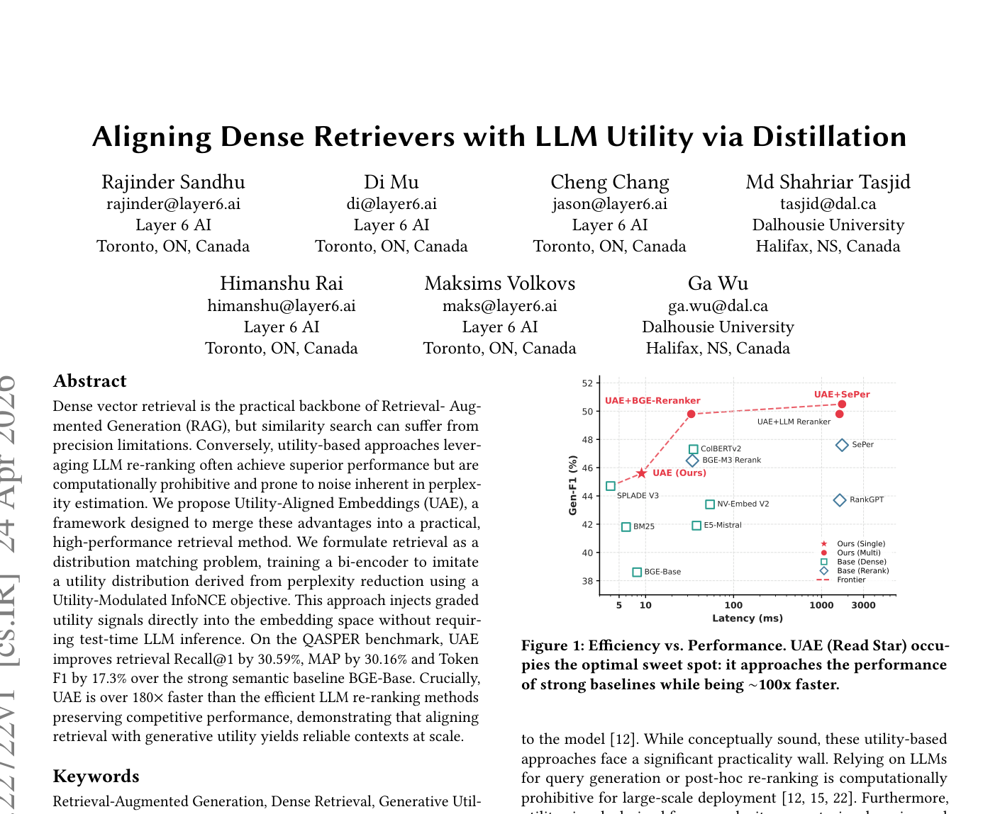
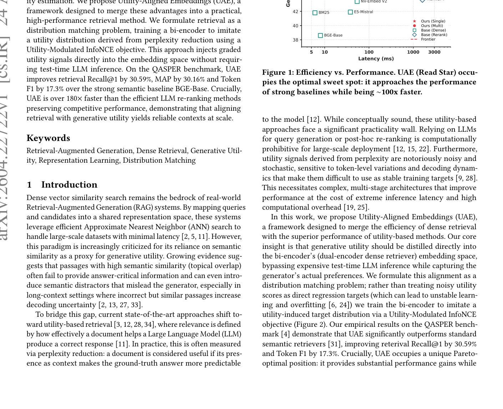

# 关键图表索引：Aligning Dense Retrievers with LLM Utility via Distillation

- Note: `2026_Utility_Aligned_Embeddings.md`
- PDF: https://arxiv.org/pdf/2604.22722
- Total key artifacts: 3

## figure1 - page 1

- File: `figure1_page01.png`
- Matched caption: Figure 1/Fig. 1/FIGURE 1/FIG. 1
- Size: 296.6 KB

## figure2 - page 1

- File: `figure2_page01.png`
- Matched caption: Figure 2/Fig. 2/FIGURE 2/FIG. 2
- Size: 424.7 KB

## table1 - page 4

- File: `table1_page04.png`
- Matched caption: Table 1/TABLE 1
- Size: 341.2 KB

