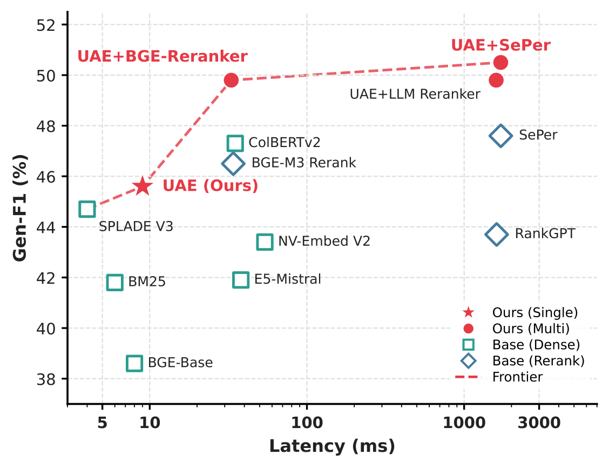
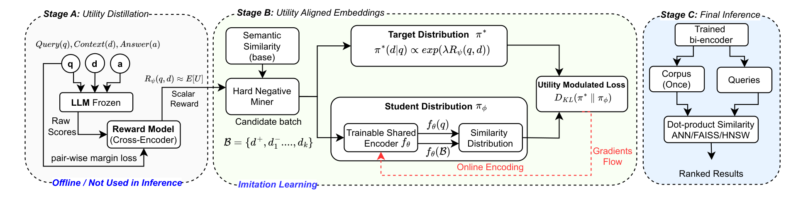
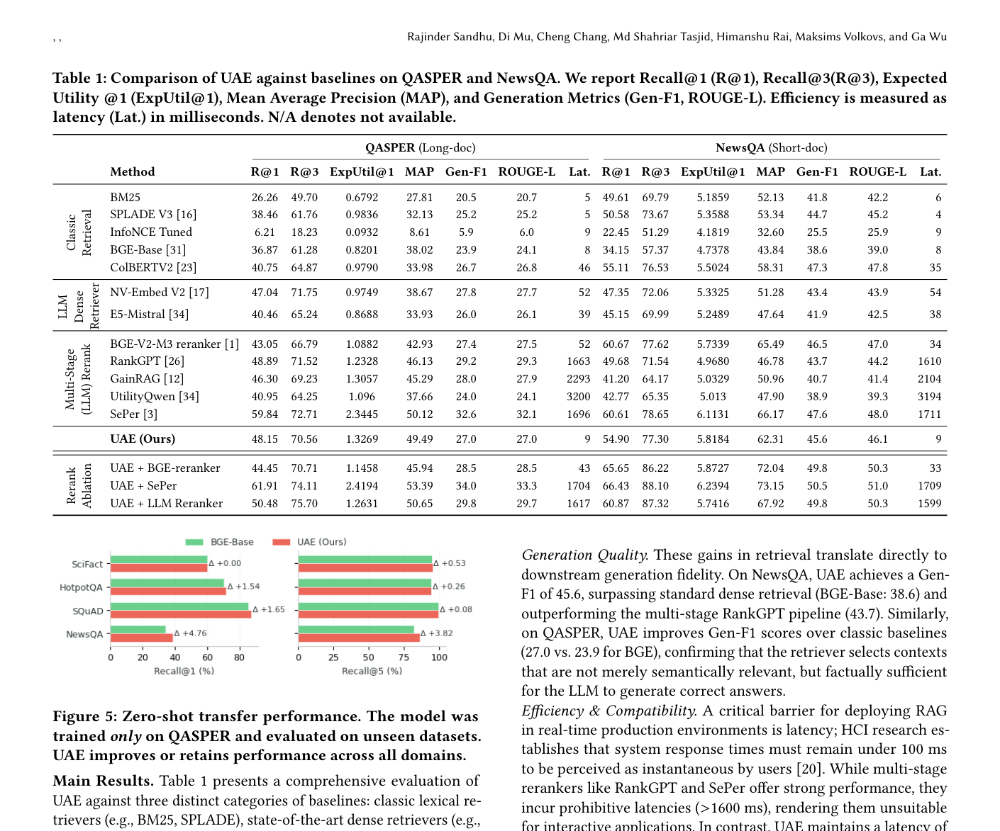

# 关键图表索引：Aligning Dense Retrievers with LLM Utility via Distillation

- Note: `2026_Utility_Aligned_Embeddings.md`
- PDF: https://arxiv.org/pdf/2604.22722
- Total key artifacts: 3

## figure1 - page source

- File: `figure1_source_efficiency_pareto.png`
- Priority: arxiv-source
- Source / matched caption: arXiv source: efficiency_pareto.pdf
- Caption text: \textbf{Efficiency vs. Performance.} UAE (Read Star) occupies the optimal sweet spot: it approaches the performance of strong baselines while being $\sim$100x faster.
- Size: 90.6 KB

## figure2 - page source

- File: `figure2_source_component.png`
- Priority: arxiv-source
- Source / matched caption: arXiv source: component.pdf
- Caption text: Overview of Utility-Aligned Embeddings (UAE). Utility is distilled offline into a reward model (Stage A), which defines a target utility distribution used to align a dense retriever via distribution matching (Stage B). At inference time, th
- Size: 149.6 KB

## table1 - page 4

- File: `table1_pdfcrop_page04.png`
- Priority: pdf-caption-crop
- Source / matched caption: Table 1/TABLE 1
- Caption text: (empty)
- Size: 341.2 KB

